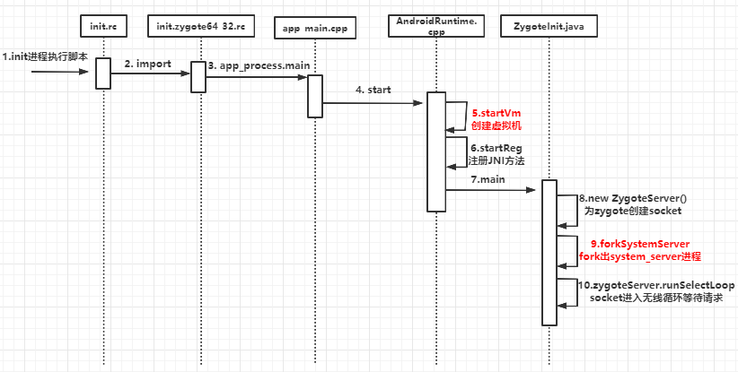

**基于[Android 10](https://www.androidos.net.cn/android/10.0.0_r6/xref)源码分析**

## Android系统启动架构图


Loader层Boot ROM：手机关机状态长按电源键，引导芯片从固化在ROM里的预设代码开始执行，然后加载引导程序到RAM。Boot Loader是启动Android系统之前的引导程序，用于检查RAM，初始化硬件参数等。

然后会启动Linux内核层的swapper进程(pid=0)，这个进程又称为idle进程，是系统初始化过程Kernel从无到有创建的第一个进程，用于初始化进程管理、内存管理、加载各种驱动等相关工作。swapper进程会启动kthreadd进程(pid=2)，它会创建内核工作线程kworkder，软中断线程ksoftirqd，thermal等内核守护进程。kthreadd进程是所有内核进程的鼻祖。

硬件抽象层(HAL)为内核驱动程序提供标准的访问接口，它包含多个库模块，每个模块为特定类型硬件组件实现一组接口，当框架API请求访问设备硬件时，Android系统将为该硬件加载相应的库模块。

Native系统库主要包括init孵化来的用户空间的守护进程、HAL层以及开机动画等。启动init进程(pid=1)，是Linux系统的第一个用户空间进程，init进程是所有用户进程的鼻祖。

init进程会孵化出ueventd、logd、healthd、installd、adbd、lmkd等用户守护进程；还会启动ServiceManager(binder服务管家)、bootanim(开机动画)等重要服务；Zygote进程也是由init孵化的，Zygote进程是Android系统的第一个Java进程(即虚拟机进程)，Zygote是所有Java进程的父进程。

Zygote进程启动后会马上将SystemService进程启动起来，SystemService进程负责启动和管理整个Java Framework的服务，包括ActivityManagerService、WindowManagerService、PackageManagerService、PowerManager等服务。而Media Server进程，是由init进程fork而来，负责启动和管理整个C++ framework，包含AudioFlinger，Camera Service等服务。


这篇文章主要记录Zygote进程的启动过程。

## Zygote启动

Android系统中所有的应用程序进程，以及用来运行系统关键服务的SystemService进程都是由Zygote(受精卵)进程负责创建的，Zygote称之为进程孵化器。它是通过复制自身的方式来创建SystemService进程和应用程序进程的，由于Zygote进程在启动时会在内部创建一个虚拟机实例，因此通过复制Zygote进程得到的SystemService进程和应用程序进程可以快速的在内部获得一个虚拟机实例拷贝。

```xml
//查看进程 windows使用findstr，linux使用grep
C:\Users\admin>adb shell ps|findstr zygote
root           485     1 2227192  33092 0                   0 S zygote64
root           486     1 1707120  25940 0                   0 S zygote
webview_zygote 1656    1 1465452  13916 0                   0 S webview_zygote32

//查看所以进程
C:\Users\admin>adb shell ps
root             1     0   22196   1020 0                   0 S init
root           485     1 2227192  33092 0                   0 S zygote64
//由zygote64孵化的system_server进程
system        1149   485 2874972 212024 0                   0 S system_server
//自己开发的应用进程，其父pid为485，说明是由zygote64进程启动的
u0_a645      24419   485 2995984 104748 0                   0 S syberos.sdisclient

```

### 1. 启动脚本

Zygote进程是由Android系统第一个进程init启动起来的，init进程在内核加载完成后就启动了，它在启动过程中会读取根目录下的init.rc脚本文件（rc是run command缩写，是一种脚本文件后缀，这些脚本通常在程序启动阶段被调用），以便可以将其他需要开机启动的进程一起启动起来，其中就包括zygote进程。init.rc脚本内容如下：

**[system/core/rootdir/init.rc](https://www.androidos.net.cn/android/10.0.0_r6/xref/system/core/rootdir/init.rc)**

```xml
//引入zygote启动脚本
import /init.${ro.zygote}.rc   

    # 启动必要的重要服务
    start servicemanager   //Binder服务管家
    start hwservicemanager
    start vndservicemanager

    trigger zygote-start  //触发zygote启动
```

init.rc脚本中引入了zygote启动脚本，其中`${ro.zygote}`是由各个厂家根据手机CPU型号指定，现在主流机型基本使用zygote64_32，它是指以64位模式为主，32位模式为辅。在rootdir目录下有`init.zygote64_32.rc`脚本

**[system/core/rootdir/init.zygote64_32.rc](https://www.androidos.net.cn/android/10.0.0_r6/xref/system/core/rootdir/init.zygote64_32.rc)**

```xml
//以service的形式启动zygote
service zygote /system/bin/app_process64 -Xzygote /system/bin --zygote --start-system-server --socket-name=zygote
    class main
    priority -20
    user root
    group root readproc reserved_disk
    //创建一个名为zygote的socket
    socket zygote stream 660 root system
    socket usap_pool_primary stream 660 root system
    onrestart write /sys/android_power/request_state wake
    //onrestart指当进程重启时执行后面的命令
    onrestart write /sys/power/state on
    onrestart restart audioserver
    onrestart restart cameraserver
    onrestart restart media
    onrestart restart netd
    onrestart restart wificond
    writepid /dev/cpuset/foreground/tasks

//为了兼容32位的程序，需要启动zygote_secondary
service zygote_secondary /system/bin/app_process32 -Xzygote /system/bin --zygote --socket-name=zygote_secondary --enable-lazy-preload
    class main
    priority -20
    user root
    group root readproc reserved_disk
    socket zygote_secondary stream 660 root system
    socket usap_pool_secondary stream 660 root system
    onrestart restart zygote
    writepid /dev/cpuset/foreground/tasks
```

zygote启动脚本中指定zygote以服务的形式启动，它对应的应用程序文件为`/system/bin/app_process64`和`/system/bin/app_process32`，分别表示64位和32位的zygote。`/system/bin/`指定程序运行的目录，`--start-system-server`表示zygote启动后马上将System进程启动起来。System进程中的ActivityManagerService就是通过这个socket来请求zygote进程创建新的应用程序进程的。

`--zygote`表示是启动zygote，它将通过虚拟机调用固定的`ZygoteInit.main()`。如果要运行某个带main()方法的java类，可指定参数"--application"，表示以普通进程的方式执行java代码。

socket指定为zygote创建server端的socket，用于执行进程间通信，访问权限为666(所有用户都可以对它进行读写)，可以在`/dev/socket`文件夹下查看到对应的socket。

Init进程解析init.rc时就会解析并启动zygote服务，然后通过系统调用exec()去执行zygote进程对应的应用程序。从脚本中可以看到zygote进程加载的应用程序文件为`/system/bin/app_process64`和`/system/bin/app_process32`，接下来我们从这个应用程序文件的入口函数main开始分析zygote进程的启动过程。

### 2. app_process.main

[frameworks/base/cmds/app_process/app_main.cpp](https://www.androidos.net.cn/android/10.0.0_r6/xref/frameworks/base/cmds/app_process/app_main.cpp)

```cpp
static const char ZYGOTE_NICE_NAME[] = "zygote64";
static const char ZYGOTE_NICE_NAME[] = "zygote";
int main(int argc, char* const argv[])
{
	...
	// 创建一个AppRuntime对象runtime，接下来的zygote进程就是通过它来进一步启动的
    AppRuntime runtime(argv[0], computeArgBlockSize(argc, argv));
    ...
    bool zygote = false;
    bool startSystemServer = false;
    ...
    while (i < argc) {
        const char* arg = argv[i++];
        //遍历argv参数，如果app_process的启动参数中包含--zygote，则说明这个应用程序app_process是zygote
        if (strcmp(arg, "--zygote") == 0) {
            zygote = true;
            //64位系统nice_name为zygote64; 32位系统为zygote
            niceName = ZYGOTE_NICE_NAME;
        } else if (strcmp(arg, "--start-system-server") == 0) {
        	//启动参数中包含--start-system-server
            startSystemServer = true;
        } ...
    }
    ...
     if (startSystemServer) {
     		//启动参数中包含--start-system-server，将参数添加到zygote启动参数中，表示zygote进程在启动完成后，需要将System进程启动起来
            args.add(String8("start-system-server"));
        }
    ...
    if (!niceName.isEmpty()) {
    	//设置进程名称为zygote\zygote64，之前的名称是app_process
        runtime.setArgv0(niceName.string(), true /* setProcName */);
    }
    if (zygote) {
    	// ★ 调用AppRuntime对象runtime的成员函数start进一步启动zygote进程（Java层）
        runtime.start("com.android.internal.os.ZygoteInit", args, zygote);
    } else if (className) {
        runtime.start("com.android.internal.os.RuntimeInit", args, zygote);
    } else {
        fprintf(stderr, "Error: no class name or --zygote supplied.\n");
        app_usage();
        LOG_ALWAYS_FATAL("app_process: no class name or --zygote supplied.");
    }
}
```

main函数中首先创建一个AppRuntime对象runtime，然后解析app_process的启动参数是否包含"--zygote"，如果包含则说明这个应用程序app_process是在zygote进程中启动，如果包含"--start-system-server"参数，则添加到runtime的start函数参数中，表示zygote进程启动完成后需要将System进程启动起来。最后调用runtime的start函数进一步启动zygote进程。

AppRuntime类的成员函数start是从其父类AndroidRuntime继承下来的，下面继续分析AndroidRuntime的start实现。

### 3. AndroidRuntime.start

[frameworks/base/core/jni/AndroidRuntime.cpp](https://www.androidos.net.cn/android/10.0.0_r6/xref/frameworks/base/core/jni/AndroidRuntime.cpp)

```cpp
/*
 * 启动android运行时，涉及到虚拟机的启动并调用参数中className对应类中的main方法。从前面调用过程中可以得知className为com.android.internal.os.ZygoteInit，参数中包含start-system-server
 */
void AndroidRuntime::start(const char* className, const Vector<String8>& options, bool zygote)
{
    ...
    JNIEnv* env;
    // ★ 调用成员函数startVm在zygote进程中创建一个虚拟机实例，这里主要是设置虚拟机的一些参数
    if (startVm(&mJavaVM, &env, zygote) != 0) {
        return;
    }
    onVmCreated(env);

    // ★ startReg函数在这个虚拟机实例中注册一系列JNI方法
    if (startReg(env) < 0) {
        ALOGE("Unable to register all android natives\n");
        return;
    }
    ...

    /*启动虚拟机，将当前线程作为虚拟机的主线程*/

	//将"com.android.internal.os.ZygoteInit"转换为"com/android/internal/os/ZygoteInit"
    char* slashClassName = toSlashClassName(className != NULL ? className : "");
    //获取ZygoteInit类
    jclass startClass = env->FindClass(slashClassName);
    if (startClass == NULL) {
        ALOGE("JavaVM unable to locate class '%s'\n", slashClassName);
        /* keep going */
    } else {
    	//获取类中static的main方法的Method ID
        jmethodID startMeth = env->GetStaticMethodID(startClass, "main",
            "([Ljava/lang/String;)V");
        if (startMeth == NULL) {
            ALOGE("JavaVM unable to find main() in '%s'\n", className);
            /* keep going */
        } else {
        	// ★ 通过JNI方式调用Java层 ZygoteInit.main()
            env->CallStaticVoidMethod(startClass, startMeth, strArray);

#if 0
            if (env->ExceptionCheck())
                threadExitUncaughtException(env);
#endif
        }
    }
    free(slashClassName);
}
```

AndroidRuntime.start函数首先调用startVm在zygote进程中创建一个虚拟机实例，然后通过startReg函数在虚拟机实例中注册一系列JNI方法（虚拟机最终调用底层Linux内核来执行功能），最后通过JNI方式调用Java层ZygoteInit类的main()函数进一步初始化zygote，第一次进入Java世界。

### 4. ZygoteInit.main

[frameworks/base/core/java/com/android/internal/os/ZygoteInit.java](https://www.androidos.net.cn/android/10.0.0_r6/xref/frameworks/base/core/java/com/android/internal/os/ZygoteInit.java)

```java
public class ZygoteInit {
	public static void main(String argv[]) {
		...
	    try {
	        ...
	        //开启DDMS(Dalvik Debug Monitor Service)功能
	        //注册所有已知的Java VM的处理块的监听器。线程监听、内存监听、native堆内存监听、debug模式监听等等
	        RuntimeInit.enableDdms();
	        ...
	        ZygoteHooks.stopZygoteNoThreadCreation();   
	        //1. ★创建ZygoteServer，构造方法中会创建Server端的Socket，用于等待ActivityManagerService请求zygote创建新的应用程序进程
	        zygoteServer = new ZygoteServer(isPrimaryZygote);

	        if (startSystemServer) {
	        	//2. ★★★ fork出system_server进程，它将启动JavaFramework层的各种服务比如ActivityManagerService
	            Runnable r = forkSystemServer(abiList, zygoteSocketName, zygoteServer);
                //{@code r == null} in the parent (zygote) process, and {@code r != null} in the
                // child (system_server) process.
	            if (r != null) {
	                r.run();  //启动SystemServer.java的main()
	                return;
	            }
	        }

	        //★ zygote进程进入无限循环，处理请求
	        caller = zygoteServer.runSelectLoop(abiList);
	    } catch (Throwable ex) {
	       
	    } finally {
	        if (zygoteServer != null) {
	            zygoteServer.closeServerSocket();
	        }
	    }
	    ...
	}
}
```

ZygoteInit.main()方法中首先通过创建一个ZygoteServer对象来创建Server端Socket，用于等待ActivityManagerService请求zygote创建新的应用程序进程。然后fork出SystemServer进程，最后让zygote进程进入无限循环，处理请求。

接下来我们对new ZygoteServer()、forkSystemServer()分别进行分析。


### 5. ZygoteServer为zygote创建Server端socket

[frameworks/base/core/java/com/android/internal/os/ZygoteServer.java](https://www.androidos.net.cn/android/10.0.0_r6/xref/frameworks/base/core/java/com/android/internal/os/ZygoteServer.java)

```java
/**
 * ZygoteServer是zygote进程的Server端socket类
 * 它提供了等待Client端socket发送命令的函数，用于fork出继承了zygote的VM虚拟机初始状态的子进程
 */
class ZygoteServer {
 	private LocalServerSocket mZygoteSocket;
    private LocalServerSocket mUsapPoolSocket;
    ZygoteServer(boolean isPrimaryZygote) {
        mUsapPoolEventFD = Zygote.getUsapPoolEventFD();
        //分别为64位和32位zygote进程创建对应的socket    
        if (isPrimaryZygote) {
       		//创建socket，socketname：zygote
            mZygoteSocket = Zygote.createManagedSocketFromInitSocket(Zygote.PRIMARY_SOCKET_NAME);
            //创建socket，socketname：usap_pool_primary
            mUsapPoolSocket =
                    Zygote.createManagedSocketFromInitSocket(
                            Zygote.USAP_POOL_PRIMARY_SOCKET_NAME);
        } else {
        	//创建socket，socketname： zygote_secondary
            mZygoteSocket = Zygote.createManagedSocketFromInitSocket(Zygote.SECONDARY_SOCKET_NAME);
            //创建socket，socketname： usap_pool_secondary
            mUsapPoolSocket =
                    Zygote.createManagedSocketFromInitSocket(
                            Zygote.USAP_POOL_SECONDARY_SOCKET_NAME);
        }

        fetchUsapPoolPolicyProps();

        mUsapPoolSupported = true;
    }
}
```

ZygoteServer是zygote进程的Server端socket类，它提供了等待Client端socket发送命令的函数，用于fork出继承了zygote的VM虚拟机初始状态的子进程。构造方法中根据传入的参数判断是为那个zygote进程创建socket，并创建对应名称的socket对象。

### 6. ZygoteInit.forkSystemServer()创建SystemServer进程

[frameworks/base/core/java/com/android/internal/os/ZygoteInit.java](https://www.androidos.net.cn/android/10.0.0_r6/xref/frameworks/base/core/java/com/android/internal/os/ZygoteInit.java)

```java
private static Runnable forkSystemServer(String abiList, String socketName,  ZygoteServer zygoteServer) {
    ...

    /* 用于启动system server的硬编码命令行*/
    String args[] = {
            "--setuid=1000",
            "--setgid=1000",
            "--setgroups=1001,1002,1003,1004,1005,1006,1007,1008,1009,1010,1018,1021,1023,"
                    + "1024,1032,1065,3001,3002,3003,3006,3007,3009,3010",
            "--capabilities=" + capabilities + "," + capabilities,
            "--nice-name=system_server",
            "--runtime-args",
            "--target-sdk-version=" + VMRuntime.SDK_VERSION_CUR_DEVELOPMENT,
            "com.android.server.SystemServer",
    };
    ZygoteArguments parsedArgs = null;
    int pid;
    try {
        //对命令行参数进行封装
        parsedArgs = new ZygoteArguments(args);
        Zygote.applyDebuggerSystemProperty(parsedArgs);
        Zygote.applyInvokeWithSystemProperty(parsedArgs);

        boolean profileSystemServer = SystemProperties.getBoolean(
                "dalvik.vm.profilesystemserver", false);
        if (profileSystemServer) {
            parsedArgs.mRuntimeFlags |= Zygote.PROFILE_SYSTEM_SERVER;
        }

        //通过fork分裂出子进程system_server
        pid = Zygote.forkSystemServer(
                parsedArgs.mUid, parsedArgs.mGid,
                parsedArgs.mGids,
                parsedArgs.mRuntimeFlags,
                null,
                parsedArgs.mPermittedCapabilities,
                parsedArgs.mEffectiveCapabilities);
    } catch (IllegalArgumentException ex) {
        throw new RuntimeException(ex);
    }

    /* For child process */
    if (pid == 0) { //pid==0表示是子进程
        if (hasSecondZygote(abiList)) {
            //等待zygote_second启动
            waitForSecondaryZygote(socketName);
        }
        //由于System进程复制了zygote进程的socket，而System进程不需要使用socket，所以关闭它
        zygoteServer.closeServerSocket();
        //system server进程处理自己的工作
        return handleSystemServerProcess(parsedArgs);
    }

    return null;
}
```

### 时序图



### 思考： 为什么SystemServer和Zygote之间通信要采用Socket

Android中进程间通信常用binder机制，为什么这里要采用socket呢？

主要是为了解决fork的问题。UNIX上C++程序设计守则3规定多线程程序里不准使用fork，而Binder机制是需要多线程操作的，如果Zygote采用Binder机制，则不能通过fork的方式创建其他进程，包括应用程序进程。

> 代理对象对Binder的调用是在Binder线程，需要再通过Handler调用主线程来操作。比如AMS与应用进程通讯，AMS的本地代理IApplicationThread通过调用ScheduleLaunchActivity，调用到的应用进程ApplicationThread的ScheduleLaunchActivity是在Binder线程，需要再把参数封装为一个ActivityClientRecord，sendMessage发送给H类（主线程Handler，ActivityThread内部类）
主要原因：害怕父进程binder线程有锁，然后子进程的主线程一直在等其子线程(从父进程拷贝过来的子进程)的资源，但是其实父进程的子进程并没有被拷贝过来，造成死锁。


