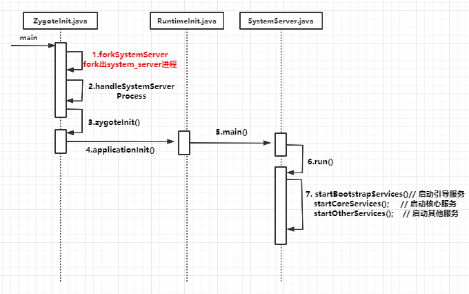

## SystemServer进程

上一篇文章分析了zygote进程的启动过程，zygote进程是所有应用进程的鼻祖，SystemService进程和所有虚拟机进程都是由zygote进程fork出来的。而SystemService是在zygote进程启动后第一个fork出的进程，其进程名为`system_server`。

zygote进程启动后调用ZygoteInit的forkSystemServer()方法fork出SystemService进程，这个方法是通过JNI调用Native层函数实现的，关于进程的创建和初始化操作这里就不跟踪了。然后调用handleSystemServerProcess()处理进程相关的操作，主要看一下system_server进程在启动后做了什么事情

### 1. ZygoteInit.handleSystemServerProcess()

[frameworks/base/core/java/com/android/internal/os/ZygoteInit.java](https://www.androidos.net.cn/android/10.0.0_r6/xref/frameworks/base/core/java/com/android/internal/os/ZygoteInit.java)

```java
private static Runnable handleSystemServerProcess(ZygoteArguments parsedArgs) {
     /*String args[] = {
                "--setuid=1000",
                "--setgid=1000",
                "--setgroups=1001,1002,1003,1004,1005,1006,1007,1008,1009,1010,1018,1021,1023,"
                        + "1024,1032,1065,3001,3002,3003,3006,3007,3009,3010",
                "--capabilities=" + capabilities + "," + capabilities,
                "--nice-name=system_server",
                "--runtime-args",
                "--target-sdk-version=" + VMRuntime.SDK_VERSION_CUR_DEVELOPMENT,
                "com.android.server.SystemServer",
        };
        */
    if (parsedArgs.mNiceName != null) {
    	//设置当前进程名为"system_server"，从forkSystemServer()方法中System进程的启动命令参数可知parsedArgs.mNiceName=system_server
        Process.setArgV0(parsedArgs.mNiceName);
    }
    ...
    if (parsedArgs.mInvokeWith != null) {
        ...
    } else {
    	// 创建类加载器
        createSystemServerClassLoader();
        ClassLoader cl = sCachedSystemServerClassLoader;
        if (cl != null) {
            Thread.currentThread().setContextClassLoader(cl);
        }
        // ★ 将其余参数传递给SystemServer
        return ZygoteInit.zygoteInit(parsedArgs.mTargetSdkVersion,
                parsedArgs.mRemainingArgs, cl);
    }
}
```

### 2. ZygoteInit.zygoteInit()

[frameworks/base/core/java/com/android/internal/os/ZygoteInit.java](https://www.androidos.net.cn/android/10.0.0_r6/xref/frameworks/base/core/java/com/android/internal/os/ZygoteInit.java)

```java
public static final Runnable zygoteInit(int targetSdkVersion, String[] argv, ClassLoader classLoader) {
    if (RuntimeInit.DEBUG) {
    Trace.traceBegin(Trace.TRACE_TAG_ACTIVITY_MANAGER, "ZygoteInit");
    RuntimeInit.redirectLogStreams();//重定向log输出

    RuntimeInit.commonInit();  //通用的一些初始化
    ZygoteInit.nativeZygoteInit(); // zygote初始化
    // ★ 应用初始化
    return RuntimeInit.applicationInit(targetSdkVersion, argv, classLoader);
}
```

### 3. RuntimeInit.applicationInit()

[frameworks/base/core/java/com/android/internal/os/RuntimeInit.java](https://www.androidos.net.cn/android/10.0.0_r6/xref/frameworks/base/core/java/com/android/internal/os/RuntimeInit.java)

```java
protected static Runnable applicationInit(int targetSdkVersion, String[] argv,  ClassLoader classLoader) {
       
        nativeSetExitWithoutCleanup(true);
        //设置虚拟机的一些参数
        VMRuntime.getRuntime().setTargetHeapUtilization(0.75f);
        VMRuntime.getRuntime().setTargetSdkVersion(targetSdkVersion);

        final Arguments args = new Arguments(argv);
        ...
        //调用startClass的main方法，从上面systemserver启动命令参数配置中可以知道startClass=com.android.server.SystemServer
        return findStaticMain(args.startClass, args.startArgs, classLoader);
}

protected static Runnable findStaticMain(String className, String[] argv, ClassLoader classLoader) {
        Class<?> cl;
        try {
        	//得到com.android.server.SystemServer的class对象
            cl = Class.forName(className, true, classLoader);
        } catch (ClassNotFoundException ex) {
        }
        Method m;
        try {
        	//得到main方法
            m = cl.getMethod("main", new Class[] { String[].class });
        } 
        ...
        //把MethodAndArgsCaller的对象返回给ZygoteInit.main()。这样做好处是能清空栈帧，提高栈帧利用率
        return new MethodAndArgsCaller(m, argv);
    }

static class MethodAndArgsCaller implements Runnable {
    /** method to call */
    private final Method mMethod;
    /** argument array */
    private final String[] mArgs;
    public MethodAndArgsCaller(Method method, String[] args) {
        mMethod = method;
        mArgs = args;
    }
    public void run() {
        try {
        	//返回到ZygoteInit的main方法中会调用r.run()从而开始调用com.android.server.SystemServer的main方法
            mMethod.invoke(null, new Object[] { mArgs });
        }
        ...
    }
}
```

### 4. SystemServer.main() SystemServer启动后的流程

[frameworks/base/services/java/com/android/server/SystemServer.java](https://www.androidos.net.cn/android/10.0.0_r6/xref/frameworks/base/services/java/com/android/server/SystemServer.java)

```java
public final class SystemServer {
  public static void main(String[] args) {
        new SystemServer().run();
    }

    private void run() {
        try {
            ...

 
	        //准备主线程lopper，即在当前线程运行
	        android.os.Process.setThreadPriority(
	                android.os.Process.THREAD_PRIORITY_FOREGROUND);
	        android.os.Process.setCanSelfBackground(false);
	        Looper.prepareMainLooper();
	        Looper.getMainLooper().setSlowLogThresholdMs(
	                SLOW_DISPATCH_THRESHOLD_MS, SLOW_DELIVERY_THRESHOLD_MS);
	 
	        //加载libandroid_servers.so库，初始化native service
	        System.loadLibrary("android_servers");

            // 初始化系统上下文
        	createSystemContext();
            // ★ 创建系统服务管理器 SystemServiceManager
            mSystemServiceManager = new SystemServiceManager(mSystemContext);
            mSystemServiceManager.setStartInfo(mRuntimeRestart,
                    mRuntimeStartElapsedTime, mRuntimeStartUptime);
            //将mSystemServiceManager添加到本地服务的成员sLocalServiceObjects
            LocalServices.addService(SystemServiceManager.class, mSystemServiceManager);
            // 创建一个线程池用于执行初始化任务
            SystemServerInitThreadPool.get();
        } finally {
            traceEnd();  // InitBeforeStartServices
        }

        // Start services.
        try {
            traceBeginAndSlog("StartServices");
            //★ ★ ★ 启动各种服务
            startBootstrapServices();// 启动引导服务
            startCoreServices();     // 启动核心服务
            startOtherServices();    // 启动其他服务
            SystemServerInitThreadPool.shutdown(); //停止线程池
        } catch (Throwable ex) {
            Slog.e("System", "******************************************");
            Slog.e("System", "************ Failure starting system services", ex);
            throw ex;
        } finally {
            traceEnd();
        }
        ...
        // Loop forever.
        Looper.loop();
        throw new RuntimeException("Main thread loop unexpectedly exited");
    }

	//初始化系统上下文， 该过程会创建对象有ActivityThread，Instrumentation, ContextImpl，LoadedApk，Application
    private void createSystemContext() {
	    ActivityThread activityThread = ActivityThread.systemMain();
	    mSystemContext = activityThread.getSystemContext();
	    mSystemContext.setTheme(DEFAULT_SYSTEM_THEME);

	    final Context systemUiContext = activityThread.getSystemUiContext();
	    systemUiContext.setTheme(DEFAULT_SYSTEM_THEME);
	}
}
```

SystemServer的main方法创建了一个SystemServer对象并调用其run方法，在里面创建了系统服务管理器`SystemServiceManager`的对象mSystemServiceManager，后面的一些服务都是由该对象创建的。然后调用`startBootstrapServices()`、`startCoreServices()`、`startOtherServices()`启动各种服务。

### 5. SystemServer.startBootstrapServices() 

```java

 private void startBootstrapServices() {
    ...
    traceBeginAndSlog("StartInstaller");
    Installer installer = mSystemServiceManager.startService(Installer.class);
    traceEnd();
	...
    // 启动服务ActivityManagerService,并为其设置mSystemServiceManager和installer
    traceBeginAndSlog("StartActivityManager");
    ActivityTaskManagerService atm = mSystemServiceManager.startService(
            ActivityTaskManagerService.Lifecycle.class).getService();
    mActivityManagerService = ActivityManagerService.Lifecycle.startService(
            mSystemServiceManager, atm);
    mActivityManagerService.setSystemServiceManager(mSystemServiceManager);
    mActivityManagerService.setInstaller(installer);
    mWindowManagerGlobalLock = atm.getGlobalLock();
    traceEnd();

    //启动服务PowerManagerService，Power manager需要尽早启动，因为其他服务需要它。
    traceBeginAndSlog("StartPowerManager");
    mPowerManagerService = mSystemServiceManager.startService(PowerManagerService.class);
    traceEnd();
    ...
    // Display manager is needed to provide display metrics before package manager
    // starts up.
    traceBeginAndSlog("StartDisplayManager");
    mDisplayManagerService = mSystemServiceManager.startService(DisplayManagerService.class);
    traceEnd();
	...
}
```
`startBootstrapServices()`、`startCoreServices()`、`startOtherServices()`三个方法主要是启动了90多个服务，有些服务可能被另外的服务使用，所以需要先启动。

## 时序图

SystemServer进程被fork后，在系统中进程别名为`system_server`，这个进程主要用来启动各种系统服务。通过启动参数找到`SystemServer`类，然后调用其main方法，主要的任务就是通过三个startXXXServices()启动各种Java Framework层的服务。这些被启动的服务都段都运行在SystemServer进程中的各自线程中，都属于SystemServer进程




