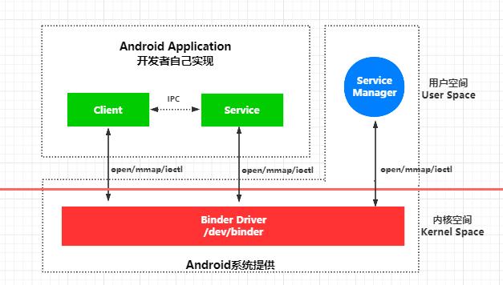

# 1. 进程间通信

## 1.1 进程间通信原理


Android系统是基于Linux内核的，在Linux中，两个进程之间是隔离的，进程间内存是不共享的，两个进程就像两个平行的世界，它们无法直接访问对方的数据。如果两个进程需要进行数据交互，就得采用特殊的通信机制：进程间通信(IPC)。

Linux操作系统内核独立于普通应用程序，可以访问受保护的内存地址，具有访问底层硬件设备权限，**为了让用户进程不能直接操作内核，保护内核的安全，操作系统将内存虚拟空间从逻辑上划分为用户空间(user space)和内核空间(kernel space)**，内核空间是系统内核运行的空
间，用户空间是用户程序运行的空间，用户空间和内核空间是互相隔离的。对于32位系统，内存的寻址空间最大为2^32次方(4GB)，系统将1GB划分为内核空间用于运行操作系统和驱动程序，3GB划分为用户空间用于运行各种应用进程。内核空间是一个整体，用户空间被各种进程划分为多个隔离的小块。

虽然从逻辑上进行了用户空间和内核控件的划分，但是不可避免用户程序需要访问内核资源，比如文件操作、访问网络等，为了突破隔离限制，就需要借用**系统调用**来实现，系统调用是用户空间访问内核空间的唯一方式，保证了所有资源访问都是内核控制的，避免用户程序对系统资源越权访问，提升系统安全性和稳定性。

> Linux使用两级保护机制：0级供系统内核使用，3 级供用户程序使用。当一个任务（进程）执行系统调用而陷入内核代码中执行时，称进程处于内核运行态（内核态），此时处理器处于特权级最高的（0 级）内核代码中执行。当进程处于内核态时，执行的内核代码会使用当前进程的内核栈。每个进程都有自己的内核栈。当进程在执行用户自己的代码的时候，我们称其处于用户运行态（用户态），此时处理器在特权级最低的（3 级）用户代码中运行。

系统调用主要通过下面两个函数实现：

```cpp
copy_from_user()  //将数据从用户空间拷贝到内核空间
copy_to_user()    //将数据从内核空间拷贝到用户空间
```

既然可以通过系统调用实现用户空间和内核空间的数据通信，而所有用户进程是共享内核空间的，A进程想要给B进程发送数据，通常的做法是A进程将要发送的数据存放在内存缓存区中，通过系统调用进入内核态。然后内核程序在内核空间分配内存开辟一块内核缓存区，调用`copy_from_user()` 函数将数据从用户空间的内存缓存区拷贝到内核空间的内核缓存区中。同样的，接收方进程在接收数据时在自己的用户空间开辟一块内存缓存区，然后内核程序调用`copy_to_user()`函数将数据从内核缓存区拷贝到接收进程的内存缓存区。这样两个进程就完成了一次数据传输，也就是完成了一次进程间通信。这也是传统IPC通信原理。


## 1.2 IPC(Inter-Process Communication，进程间通信)方案对比

Linux内核提供了丰富的进程间通信机制，如Socket(分为TCP/IP网络Socket、unix domain本地Socket)、Pipe管道、消息队列、共享内存等。然而基于Linux内核的Android系统的主要IPC并没有使用这些传统的方案，而是开发了一套新的进程间通信机制Binder，这是为什么呢？

- 管道和消息队列采用存储-转发方式，数据先从发送方缓存区拷贝到内核缓存区，然后再从内核缓存区拷贝到接收方缓存区，需要2次拷贝过程。而且接受数据的缓存区由接受进程提供，它并不知道需要多大空间来存放要传递过来的数据，只能开辟尽可能大的内存空间或者先API接受消息头来获取数据大小，这两种做法不是浪费空间就是浪费时间。

- Socket作为一款通用接口，其传输效率低、开销大，主要用于跨网络的进程间通信和本机进程间的低速通信。unix domain socket实现进程通信是基于文件IO的，它也需要2次拷贝。

- 共享内存允许两个进程访问同一个逻辑内存，虽然无需拷贝，但是存在多进程同步问题，控制复杂，难以使用。

正是由于传统IPC方案的各种弊端，Android需要建立一套新的IPC机制来满足系统对传输性能、稳定性和安全性方面的要求，所以就出现了Binder机制，下面对集中通信方式进行对比：

||Binder|共享内存|Socket|
|:--|:--|:--|:--|
|性能|一次拷贝|无需拷贝|两次拷贝|
|稳定性|基于C/S架构，结构清晰职责分明，Client和Service相对独立，稳定性好|实现与控制复杂，需要自行处理并发同步等问题|基于C/S架构|
|安全性|内核添加身份标识(Android UID)安全可靠|依赖上层协议，访问接入点开放不安全|依赖上层协议，访问接入点开放不安全|


**性能**

Binder采用**mmap**内存映射将数据接收方用户空间的内存缓存区和内核缓存区建立映射关系，省去了copytouser()步骤，只需要copyfromuser()一次数据拷贝，性能上优于其他需要2次拷贝的方案

**稳定性**

Binder基于C/S架构，结构清晰、职责明确并且相互独立，所以稳定性更好，内存共享需要充分考虑临界资源（一个资源只能同时供一个进程使用）的访问问题，很容易出现死锁问题。

**安全性**

Android作为一个开放性平台，市场上有海量应用供用户安装，用户当然是不希望某一个app偷偷读取我的通信录、上传隐私数据、后台偷跑流量、消耗手机电量。传统IPC没有任何安全措施，完全依赖于上层协议来确保。首先传统IPC在数据包中填入进程用户ID/进程ID(UID/PID)不可靠，容易被恶意程序篡改，从而无法鉴别对方身份。只有由IPC机制在内核中添加身份标识才是可靠的。其次传统IPC访问接入点是开放的，只要知道这些接入点的程序都可以和对端建立连接，这样就无法阻止恶意程序猜测接收方地址获得连接。**Android端会为每个已安装的应用程序分配一个UID，Binder只对外暴露Client端，Client端会将任务发送给Server端，Server端会根据权限控制策略对UID进行甄别是否满足访问权限。**

但是传统的IPC就没有在Android中也有少量使用，比如Zygote进程的IPC就是采用Socket机制（用于解决有多线程的进程不允许fork的问题），Android中的Kill Process 采用的signa(信号)机制等等。而Binder更多则用在`system_server`进程与上层App层的IPC交互。

# 2. Binder原理

Binder是一种进程间通信机制，基于开源的OpenBinder实现。Binder可译为粘合剂，用于粘合不同的进程，使之实现通信。在学习Binder之前，我们应该明白我们为什么要学习Binder？Binder机制贯穿整个Android系统，我们平时开发所使用的Activity、Service、broadcast Receiver和Content Provider等组件有可能运行在同一个进程，也有可能运行在不同进程，此外各种系统组件也运行在独立的进程中，比如ActivityManagerService、PackageManagerService都运行在系统进程system_server(该进程由zygote fork出来的)中，这些不同进程中的组件是如何通信的呢？常见的`startActivity()`、`startService()`等都需要通过Binder实现与ActivityManagerService(AMS运行在的跨进程通信。还有Intent数据传递等都是通过Binder完成的。在插件化的实现中，我们也要使用到Binder。总之想要真正掌握android系统，Binder是必须要掌握的一个知识点，当然也是最难啃的知识点之一。接下来我们一步步学习它的原理。

## 2.1 动态内核可加载模块 

正如前面提到的，跨进程通信是基于共享内核空间的，传统IPC机制如管道、Socket都是内核的一部分，因此通过内核支持来实现进程通信自然没问题。但是Binder并不是Linux系统内核的一部分，这就需要借助Linux的**动态内核可加载模块(Loadable Kernel Module, LKM)**机制。模块是具有独立功能的程序，它可以被单独编译，但是不能独立运行，它在运行时被链接到内核作为内核的一部分运行，这样Android系统就可以通过动态添加一个**Binder驱动**内核模块(Binder Driver)运行在内核空间，用户进程之间通过这个内核模块作为桥梁实现通信。

## 2.2 mmap内存映射 

上面通过动态内核可加载模块往Linux内核控件添加了Binder驱动，Android系统的Binder通信是怎么通过Binder驱动实现通信的呢？Binder驱动做了些什么事情？难道还是通过传统的系统调用2次拷贝？这里要先了解一下mmap内存映射

mmap()是Linux操作系统中一种内存映射的方法，通过将一个虚拟内存区域与磁盘上的对象关联起来，以初始化这个虚拟内存区域的内容，当建立映射关系后，就可以采用指针的方式读写操作这一段内存，而系统会自动写回到对应的磁盘文件上。mmap()通常是用在有物理介质的文件系统上。比如某个用户进程想要操作磁盘上的文件数据，需要两次拷贝（磁盘-->内核空间-->用户空间），如果使用mmap()在物理介质(磁盘)和用户空间之间建立映射，就能实现内存读写直接反应到磁盘上从而代替I/O读写，减少拷贝次数提高文件读写效率。**我们可以通过这个思维编写一个日志系统，用于记录用户操作app的过程和crash信息，来实现bug复现，如果采用传统I/O，性能上肯定低于mmap的方式**。[微信开源MMKV](https://github.com/tencent/mmkv)

Binder机制中并不存在物理介质，是为了实现两个进程用户空间的通信，因此Binder驱动使用mmap()并不是为了在物理介质和用户空间之间建立映射。首先Binder驱动会在内核空间创建一个数据接受缓存区，接着在内核空间开辟一块内核缓存区，建立内核中数据接受缓存区和内核缓存区的映射关系，以及数据接受缓存区和接受进程用户空间地址的映射关系。数据发送进程首先通过系统调用`copy_from_user()`将数据copy到内核缓存区，由于内核缓存区和接受进程的用户空间都映射到了同一块物理内存，就相当于把数据发送到了接受进程的用户空间，这样是需要一次数据拷贝就完成了进程间的通信。

Binder对mmap的调用源码在frameworks/native/libs/binder/ProcessState.cpp中


那问题来了，既然通过mmap能将用户空间和内核空间建立映射，那直接将两个用户空间的内存区域都映射到同一块内核空间缓存区，这样两个进程对自己的用户空间内存的修改就能直接反应到对方了，一次拷贝都不需要了不更好吗？其实这就相当于是内存共享的IPC机制了，需要考虑到如果多个进程同时给某一个进程发送数据，由于它们操作的是自己的用户空间内存，所以不受限制，这就造成了数据接收方映射到的数据错乱。**而Binder中有线程池用于处理并发问题**，这会在后面Binder Driver解析中讲到。

## 2.3 mmap简单使用（日志系统）


## 2.4 Binder架构设计

Binder机制采用CS通信方式，提供服务的进程称为Server进程，访问服务的称为Client进程。同一个Server进程可同时运行多个组件来向Client进程提供服务，这些组件称为Service组件（不一定是Android应用程序中的Service组件），同时同一个Client进程也可以同时向多个Service组件请求服务，每个请求都对应一个Client组件，或称为Service代理对象。Binder机制的每个Server进程和Client进程都维护一个Binder线程池来处理通信请求，因此可以并发的提供和访问服务。Server进程和Client进程的通信要以考运行在内核空间的Binder驱动程序来进行，Binder驱动程序向用户空间暴露了一个设备文件/dev/binder，使得应用程序进程可以间接通过它来建立通信通道。Service组件在启动时，会将自己注册到一个ServiceManager组件中，以便Client组件可以通过ServiceManager组件找到它，ServiceManager称为Binder机制的上下文管理者，同时它也需要与普通的Server、Client进程通信(注册、查找)，所以它自身也是一个特殊的Service组件。

上面的阐述中涉及到四个角色：Client、Service、ServiceManager、Binder驱动，其中Client、Service、ServiceManager运行在用户空间，Binder驱动运行在内核空间。ServiceManager和Binder驱动由系统提供，Client和Service组件由应用程序实现。Client、Service和ServiceManager均是通过系统调用open、mmap和ioctl(io controller)来访问设备文件/dev/binder，从而实现与Binder驱动的交互来间接的实现跨进程通信。



**Binder驱动**

Binder驱动是整个通信机制的核心，驱动程序负责进程之间建立Binder通信的建立，Binder在进程之间的传递，Binder引用计数器管理，数据包在进程之间的传递和交互等一系列底层支持。它就相当于一个路由器，如果没有路由器，整个互联网通信就不能实现。

**ServiceManager和实名Binder**

ServiceManager的作用是将字符串形式的Binder名字转化成Client中对Binder的引用，使得Client能够通过Binder名获得对Binder实体的引用，注册了名字的Binder叫实名Binder。就像网站除了网址还有IP，ServiceManager就相当于一个DNS服务器。Service组件创建了Binder，并为它起了一个字符串形式的名字，将这个Binder实体连同名字一起以数据包的形式通过Binder驱动发送给ServiceManager，ServiceManager中就会注册一个对应名字的Binder并填入查找表。

ServiceManager也是一个进程，这个进程由init进程启动，而Service运行在另一个Server进程，所以Server向ServiceManager注册Binder也涉及到进程间通信。注册的动作就是为了实现进程间通信，但是注册过程又需要用到进程间通信，这就好像先有鸡还是先有蛋。ServiceManager和其他进程同样采用Binder通信，ServiceManager自身就是一个特殊的服务端，有自己的Binder实体，对于它来说，其他进程都是Client端，需要通过它的Binder引用来实现Binder的注册和获取。ServiceManager提供的Binder比较特殊，他没有名字也不需要注册，当进程使用`BINDER_SET_CONTEXT_MGR`命令将自己注册成ServiceManager时Binder驱动会自动为它创建Binder实体，这个Binder实体的引用在所有Client中都固定为0，不需要通过ServiceManager获取。也就是说一个Server端想要向ServiceManager注册自己的Binder就必须通过这个0号引用和ServiceManager通信。ServiceManager就好比互联网中的DNS域名服务器，客户端想要访问一个网站首先通过DNS获取网站的IP，然后才能通过IP请求服务器，但是DNS本身也是一个服务器，它的IP地址并不是在DNS上注册的，而是一个固定的地址（或者在host文件中配置）。

**Client获得Binder的引用**

Service组件向ServiceManager中注册Binder后，Client就可以通过名字获得Binder的引用。Client也是利用保留的0号引用向ServiceManager请求访问某个Binder:我申请访问名字叫张三的Binder引用。ServiceManager收到这个请求后从请求数据包中取出Binder名称在查找表里找到对应的条目，取出对应的Binder引用作为回复发送给发起请求的Client。从面向对象的角度看，Service组件中的Binder实体现在有两个引用：一个位于ServiceManager中，一个位于发起请求的Client中。如果接下来有更多的Client请求该Binder，系统中就会有更多的引用指向该Binder，就像Java中一个对象有多个引用一样。

## 2.5 Binder通信过程

从上面的概述中我们大致总结一下Binder通信的过程：

- 一个进程使用BINDER_SET_CONTEXT_MGR命令通过Binder驱动将自己注册为ServiceManager
- Service通过驱动向ServiceManager中注册Binder(Service中的Binder实体)，表明自己可以对外提供服务，驱动会为这个Binder创建位于内核中的实体节点以及ServiceManager对实体的引用，将名字和引用打包传给ServiceManager将其填入查找表
- Client通过名字在Binder驱动的帮助下从ServiceManager中获取到对Binder实体的引用，通过这个引用实现和Server进程的通信

Binder机制中的四个角色可以通过类比互联网中的客户端(Client)、服务器(Server)、DNS域名服务器(ServiceManager)和路由器(Binder驱动)。而一次Binder进程间通信就相当于一次网络请求：


## 2.6 Binder通信中的代理模式

现在我们知道Client、Server借助Binder驱动完成进程间通信，但是还有一个问题，Client进程想要得到Server进程中Binder对象是怎么实现的？不同的进程中，肯定无法拿到对方进程中的对象的。

Binder通信整个过程都有Binder驱动参与，在数据流经Binder驱动时驱动会对数据做一层转换，当Client进程想要得到Service的binder对象时，驱动并不会真的把binder对象给Client，而是返回一个跟binder看起来一摸一样的代理对象binderProxy，这个代理对象和binder对象有相同的方法，但是这些方法的实现并不是和binder对象方法实现一样，代理对象中的方法只需要把请求参数交给驱动，当Binder驱动收到Client通过binderProxy的请求（调用binder中的某个方法），驱动就会从自己维护的表单中查找代理对象对应的binder对象，然后通知Service中的binder执行对应的方法将结果发给自己，驱动拿到方法返回结果后转发给Client进程。

## 2.7 重新认识Binder

- 从进程间通信角度看，Binder是一种进程间通信机制
- 从Server进程角度，Binder是指Service组件中的Binder实体对象
- 从Client进程角度，Binder是指上述Binder实体对象的一个远程代理
- 从传输过程角度，Binder是一个可以跨进程传输的对象，Binder驱动会对这个跨进程的对象做特殊处理，自动完成代理代理对象和实体对象之间的转换

# 3. aidl实现Binder通信

对于多数开发者日常开发中能接触到的Binder通信都是通过AIDL(Android Interface Definition Language)来实现的。AIDL是一种接口定义语言，当定义好aidl文件后，gradle插件在构建项目时会借助`sdk\build-tools\version\aidl.exe`帮我们生成Java代码实现Binder通信。下面通过一个简单的aidl实现Binder跨进程通信。

## 3.1 aidl的使用

**aidl接口定义**

```java
//app\src\main\aidl\com\openxu\binder\IMyAidlInterface.aidl
package com.openxu.binder;
import com.openxu.binder.MyData;
//该接口定义了远程服务提供的功能
interface IMyAidlInterface {
    int getPid();       //获取remote service进程id
    MyData getMyData(int num);  //获取remote service传递过来的自定义对象
}

//app\src\main\aidl\com\openxu\binder\MyData.aidl
//自定义对象的aidl包名应该跟Java类包名相同
package com.openxu.binder;   
//如果需要传输自定义对象，自定义对象也需要定义aidl接口
parcelable MyData;
```

**aidl生成的Java类**

定义好aidl后，rebuild工程，会在`\build\generated\source\aidl`目录下生成对应Java文件，下面的java文件展示只保留了类结构。编译器为我们`IMyAidlInterface.aidl`文件生成了一个`IMyAidlInterface.java`文件，这个java文件中包含一个IMyAidlInterface接口、一个Stub静态抽象内部类和Proxy静态类，Proxy又是Stub的内部类，自动生成的java文件可读性很差，之所以把3个类以内部类的形式放到一个java文件，是为了避免多个aidl的时候Stub和Proxy重名。

```java
//\build\generated\source\aidl\debug\com\openxu\binder\IMyAidlInterface.java

package com.openxu.binder;
public interface IMyAidlInterface extends android.os.IInterface{
	public static abstract class Stub extends android.os.Binder implements com.openxu.binder.IMyAidlInterface{
		private static class Proxy implements com.openxu.binder.IMyAidlInterface{
			private android.os.IBinder mRemote;
			Proxy(android.os.IBinder remote){
				mRemote = remote;
			}
		}
	}
}
```

**Server端**

```java
public class RemoteService extends Service {

    private static final String TAG = "RemoteService";
    //创建一个Stub对象，Stub继承自android.os.Binder
    IMyAidlInterface.Stub binder = new IMyAidlInterface.Stub() {
    	//实现Stub的抽象方法，也就是aidl接口中的方法，表示该Service可对外（其他进程）提供的功能
        @Override
        public int getPid() throws RemoteException {
            return android.os.Process.myPid();
        }
 		@Override
        public MyData getMyData(int num) throws RemoteException {
            MyData data = new MyData();
            data.setNum(++num);
            data.setStr("我从远方来");
            return data;
        }
    };
    //重写onBind方法，当服务被绑定后返回binder对象
    @Nullable
    @Override
    public IBinder onBind(Intent intent) {
        //com.openxu.af.RemoteService$1@e933a62
        Log.i(TAG, "返回binder: "+binder);
        return binder;
    }
}
```

```xml
<!--注册远程服务，让其运行在remote子进程中-->
<service android:name=".RemoteService"
				android:process=":remote"/>
```

**Client端**

MainActivity运行在项目主进程中，它有两个按钮，点击连接按钮会调用`bindService()`绑定服务，服务绑定成功后会在`onServiceConnected()`回调中得到一个`IBinder`对象，然后通过`asInterface()`得到`Proxy`对象并用`IMyAidlInterface`引用，这样客户端就可以通过`Proxy`对象调用远程服务提供的方法了。

```java
public class MainActivity extends AppCompatActivity {
    private String TAG = "MainActivity";
    @Override
    protected void onCreate(Bundle savedInstanceState) {
        super.onCreate(savedInstanceState);
        ActivityMainBinding binding = DataBindingUtil.setContentView(this, R.layout.activity_main);
        /**绑定服务*/
        binding.btnConnect.setOnClickListener(v->{
            bindService(new Intent(this, RemoteService.class), connection, BIND_AUTO_CREATE);
        });
        /**调用服务*/
        binding.btnCall.setOnClickListener(v->{
            try {
                Log.d(TAG, "调用远程服务："+myAidlInterface.getPid());
                Log.d(TAG, "调用远程服务："+myAidlInterface.getMyData(1));
            } catch (RemoteException e) {
                e.printStackTrace();
            }
        });
    }
    IMyAidlInterface myAidlInterface;
    ServiceConnection connection = new ServiceConnection() {
        @Override
        public void onServiceConnected(ComponentName name, IBinder service) {
        	//通过asInterface()得到Proxy对象，Proxy实现了IMyAidlInterface接口，所以用IMyAidlInterface接受
            myAidlInterface = IMyAidlInterface.Stub.asInterface(service);
            //android.os.BinderProxy@70cfd0
            Log.w(TAG, "绑定服务成功:"+service);
//            com.openxu.af.IMyAidlInterface$Stub$Proxy@a3a0bc9
            Log.w(TAG, "绑定服务成功:"+myAidlInterface);
        }
        @Override
        public void onServiceDisconnected(ComponentName name) {
            Log.w(TAG, "服务已经断开");
        }
    };
}
```

## 3.2 aidl自动生成Java类结构分析

从Android系统架构分层中可将Binder机制分为3层（内核驱动层、native层Framework层、java Framework层），通常在开发中我们接触到的是java层，Android为我们提供了一些列API帮助我们实现Binder通信。


- **android.os.IInterface**

IInterface代表远程Service对象对外提供了哪些功能方法，它相当于是Client端和Server端的一个通信协议，aidl接口文件生成的java接口(IMyAidlInterface)继承自IInterface。

- **android.os.IBinder**

IBinder是一个接口，它代表一种跨进程通信的能力，只要实现了这个接口的类就能实现跨进程通信

- **android.os.Binder**

Binder类实现了IBinder接口，它是远程Binder对象的基类，所有远程Service中的Stub对象（远程binder实体）都继承自Binder类

- **IMyAidlInterface.Stub**

Stub类继承自Binder，表示它就是一个远程Binder本地对象，同时实现了IMyAidlInterface接口（需要在Service中创建Binder实体时实现），表明它具有Service承诺给Client的功能方法

- **android.os.BinderProxy**

BinderProxy类也实现了IBinder，它表示是远程Binder对象的代理对象，Client端就是通过这个代理对象实现与远程Binder对象通信的

- **IMyAidlInterface.Proxy**

Proxy通过持有BinderProxy的引用，从而可以通过代理实现与远程binder对象的通信，同时它实现了IMyAidlInterface接口，client端可以通过Proxy对象调用接口中的方法。

# 4. 手动实现Binder通信

**定义通信接口**

```java
public interface ITestInterface extends IInterface {
    MyData getMyData(int num) throws android.os.RemoteException;
}
```

**Proxy代理**

Client端代理类，并不是真正实现了ITestInterface接口的业务逻辑，只负责打包序列化数据，最终通过持有的binderProxy代理发送给远程Stub#onTransact()处理

```java
public class Proxy implements ITestInterface{

    //Stub的代理对象
    private IBinder binderProxy;
    public Proxy(IBinder binderProxy) {
        this.binderProxy = binderProxy;
    }

    /**
     * 2. 客户端代理类“实现”接口方法，其实是通过binderProxy调用远程binder对象实现的
     */
    @Override
    public MyData getMyData(int num) throws RemoteException {
        //android.os.Parcel是一个可通过IBinder发送的数据容器，将需要IPC的数据放入该容器中
        Parcel data = Parcel.obtain();   //存放发送数据的容器
        Parcel reply = Parcel.obtain();  //存放返回数据的容器
        MyData result = null;
        try {
            data.writeInterfaceToken(Stub.DESCRIPTOR);   //写入Binder接口令牌，用于Serviced端验证
            data.writeInt(num);   //写入数据
            //调用代理对象binderProxy的transact()方法发起请求，数据会被传输到binder驱动，
            // binder驱动收到数据后会解析数据，并将数据分发到对应的远程Service中的Stub(Binder实体)#onTransact()方法
            binderProxy.transact(Stub.TRANSACTION_getMyData, data, reply, 0);
            //从包裹头读取异常
            reply.readException();
            if ((0!=reply.readInt()))
                result = MyData.CREATOR.createFromParcel(reply);
        }finally {
            reply.recycle();
            data.recycle();
        }
        return result;
    }

    @Override
    public IBinder asBinder() {
        return binderProxy;
    }
}
```

**远程Binder对象**

Stub类继承Binder并真正实现了ITestInterface协议接口的功能。Stub中有两个重要的方法：

- **`asInterface()`**:当Client端通过bindService()绑定服务成功，会在回调方法中得到一个IBinder类型的binder对象，这个对象就是Binder驱动返回给客户端的。如果是在同一个进程中这个对象就是Stub（Binder）本地对象，否则就是Binder驱动返回给客户端的BinderProxy代理对象，client端并不知道代理对象提供了那些方法（BinderProxy只负责Binder协议数据的传输），所以需要在外面封装一层Proxy，因为Proxy实现了ITestInterface接口，所以客户端就可以使用它来调用协议中的接口方法了。

- **`onTransact()`**：Client端通过binder代理将请求数据发送给binder驱动后，最终会调用到远程Binder对象的onTransact()方法，这个方法中的四个参数就是Client端传递过来的，分别表示被调用的方法编号、参数数据容器、返回的数据容器、是否异步。

```java
public class Stub extends Binder implements ITestInterface {

    public static final String DESCRIPTOR = "com.openxu.binder.custom.ITestInterface";
    public static final int TRANSACTION_getMyData = IBinder.FIRST_CALL_TRANSACTION + 0;
 	public Stub(){
        this.attachInterface(this, DESCRIPTOR);
    }
    /**
     * 1. 将BinderProxy对象转换成ITestInterface的对象
     * @param binder 服务绑定成功后返回的Binder对象或者BinderProxy对象
     * @return
     */
    public static ITestInterface asInterface(android.os.IBinder binder) {
        if ((binder == null))
            return null;
        // 尝试检索接口的本地实现（Binder本地对象）。这里主要判断binder是本地binder对象还是远程binder代理，
        // Binder类queryLocalInterface()方法返回自己，而BinderProxy返回null
        // 如果为空，则需要为binderProxy包装一层Proxy
        IInterface iInterface = binder.queryLocalInterface(DESCRIPTOR);
        //如果在同一个进程，bindService()绑定服务返回的binder对象就是Servive中的Stub实例对象
        if (iInterface != null && iInterface instanceof ITestInterface)
            return (ITestInterface) iInterface;
        //如果从本进程中没有获取到，则说明binder是远程的BinderProxy代理对象
        return new Proxy(binder);
    }

    /**
     * 3. Proxy中通过调用BinderProxy#transact()方法将数据发送给Binder驱动，Binder驱动收到数据后会通知远程Service调用binder的onTranscat()方法，onTranscat()方法主要根据传递过来的协议数据调用真正的实现方法，并返回数据
     * @param code
     * @param data
     * @param reply
     * @param flags
     * @return
     * @throws RemoteException
     */
    @Override
    protected boolean onTransact(int code, @NonNull Parcel data, @Nullable Parcel reply, int flags) throws RemoteException {
        //根据code值判断client端想要调用service端的哪个方法
        switch (code) {
            case INTERFACE_TRANSACTION:
                reply.writeString(DESCRIPTOR);
                return true;
            case TRANSACTION_getMyData:
                data.enforceInterface(DESCRIPTOR);
                int arg0 = data.readInt();   //读取Proxy传递过来的参数
                MyData result = this.getMyData(arg0);
                reply.writeNoException();    //没有异常
                if ((result != null)) {
                    reply.writeInt(1);
                    //将结果数据MyData对象写入reply容器中
                    result.writeToParcel(reply, android.os.Parcelable.PARCELABLE_WRITE_RETURN_VALUE);
                } else {
                    reply.writeInt(0);
                }
                return true;
            default:
                return super.onTransact(code, data, reply, flags);
        }
    }
    //远程服务中的Binder对接口的真正实现
    @Override
    public MyData getMyData(int num) throws RemoteException {
        MyData data = new MyData();
        data.setNum(++num);
        data.setStr("我从远方来");
        return data;
    }
    @Override
    public IBinder asBinder() {
        return this;
    }
}
```

**使用**

```java
public class RemoteService extends Service {

    private static final String TAG = "RemoteService";
    //重写onBind方法，当服务被绑定后返回binder对象
    @Nullable
    @Override
    public IBinder onBind(Intent intent) {
        return new Stub();
    }
}

public class MainActivity extends AppCompatActivity {
    private String TAG = "MainActivity";
    @Override
    protected void onCreate(Bundle savedInstanceState) {
        super.onCreate(savedInstanceState);
        ActivityMainBinding binding = DataBindingUtil.setContentView(this, R.layout.activity_main);

        /**绑定服务*/
        binding.btnConnect.setOnClickListener(v->{
            bindService(new Intent(this, RemoteService.class), connection1, BIND_AUTO_CREATE);
        });
        /**调用服务*/
        binding.btnCall.setOnClickListener(v->{
            try {
                Log.d(TAG, "调用远程服务："+iTestInterface.getMyData(1));
            } catch (RemoteException e) {
                e.printStackTrace();
            }
        });
    }

    /**手动实现*/
    ITestInterface iTestInterface;
    ServiceConnection connection1 = new ServiceConnection() {
        @Override
        public void onServiceConnected(ComponentName name, IBinder service) {
            iTestInterface = Stub.asInterface(service);
            Log.w(TAG, "绑定服务成功:"+service);
            Log.w(TAG, "绑定服务成功:"+iTestInterface);
        }
        @Override
        public void onServiceDisconnected(ComponentName name) {
            Log.w(TAG, "服务已经断开");
        }
    };
}
```

# 5. 相关问题

## Intent数据传输限制(Intent数据传输是通过Binder)，Binder能传多大的数据？

[frameworks/native/libs/binder/ProcessState.cpp](http://androidxref.com/9.0.0_r3/xref/frameworks/native/libs/binder/ProcessState.cpp)

```c++
//这里的限制是1MB-4KB*2
#define BINDER_VM_SIZE ((1 * 1024 * 1024) - sysconf(_SC_PAGE_SIZE) * 2)

ProcessState::ProcessState(const char *driver)
   : mDriverName(String8(driver))
    , mDriverFD(open_driver(driver))
    , mVMStart(MAP_FAILED)...
{
    if (mDriverFD >= 0) {
       // 调用mmap 提供一个虚拟块，以接收事务的mmap地址空间。
        mVMStart = mmap(0, BINDER_VM_SIZE, PROT_READ, MAP_PRIVATE | MAP_NORESERVE, mDriverFD, 0);
       if (mVMStart == MAP_FAILED) {
            // *sigh*
           ALOGE("Using %s failed: unable to mmap transaction memory.\n", mDriverName.c_str());
           close(mDriverFD);
           mDriverFD = -1;
           mDriverName.clear();
        }
    }

    LOG_ALWAYS_FATAL_IF(mDriverFD < 0, "Binder driver could not be opened.  Terminating.");
}
```

源码位置 [kernel_3.18/xref/drivers/staging/android/binder.c](http://androidxref.com/kernel_3.18/xref/drivers/staging/android/binder.c)

```c++
static int binder_mmap(struct file *filp, struct vm_area_struct *vma)
{
//mmap时，将异步的可用空闲空间大小设为总大小的一半（1024-8）/2
proc->free_async_space = proc->buffer_size / 2;

}

static struct binder_buffer *binder_alloc_buf(struct binder_proc *proc,
				      size_t data_size,
				      size_t offsets_size, int is_async)
{
	//申请内存时，剩余异步可用内存不得小于所需要的内存
	if (is_async &&
    proc->free_async_space < size + sizeof(struct binder_buffer)) {
		binder_debug(BINDER_DEBUG_BUFFER_ALLOC,
		     "%d: binder_alloc_buf size %zd failed, no async space left\n",
		      proc->pid, size);
		return NULL;
	}
	...
	//将异步剩余可用内存减去本次申请内存
	if (is_async) {
		proc->free_async_space -= size + sizeof(struct binder_buffer);
		binder_debug(BINDER_DEBUG_BUFFER_ALLOC_ASYNC,
		     "%d: binder_alloc_buf size %zd async free %zd\n",
		      proc->pid, size, proc->free_async_space);
	}

}
```

同步的情况下：1M - 8K - x，mmap函数一共开辟了1M-8K空间，x是binder机制的协议数据
异步情况： (1M -8K)/2 -x，binder驱动限制了分配给异步事务的内核缓冲区大小，目的是保证同步事务优先得到内核缓冲区，以便快速对该同步事务进行处理

```java
//该接口定义了远程服务提供的功能
interface IMyAidlInterface {
    //同步方法
    int getPid();       //获取remote service进程id
    MyData getMyData(int num); //获取remote service传递过来的自定义对象
    //oneway关键字表示该方法为异步方法，异步方法不能有返回值
    oneway void saveMyData(in MyData data);
}
```

对应生成的Proxy中，通过BinderProxy.transact()最后一个参数为1，表示是异步传输

```java
mRemote.transact(Stub.TRANSACTION_saveMyData, _data, null, android.os.IBinder.FLAG_ONEWAY);
```

## 使用多进程会有哪些问题？

- 静态成员和单列模式失效
- 线程同步机制失效
- sharedPreferences可靠性变差
- application多次创建

> 解释：Android会为每个进程分配一个独立的虚拟机，不同的虚拟机就会有不同的地址控件，不同的虚拟机访问同一个对象就会产生不同的副本，并且互不干扰，这样就会出现第一种和第二种情况。SharedPreferences虽然是线程安全的，但是不支持多进程操作，可能会导致数据的丢失。开启一个新的进程，就是开启一个新的应用，当然会创建application。


这篇文章从理论上介绍了Binder机制的实现，以及应用层怎样使用Binder完成进程间通信，读完这篇文章我们可以对Binder机制有一个总体的认识，但是可能感觉仅仅偏向原理以及上层应用，对Binder驱动以及内核层ServiceManager的工作流程还是比较模糊。下面通过跟踪源码，进一步理解Binder机制

