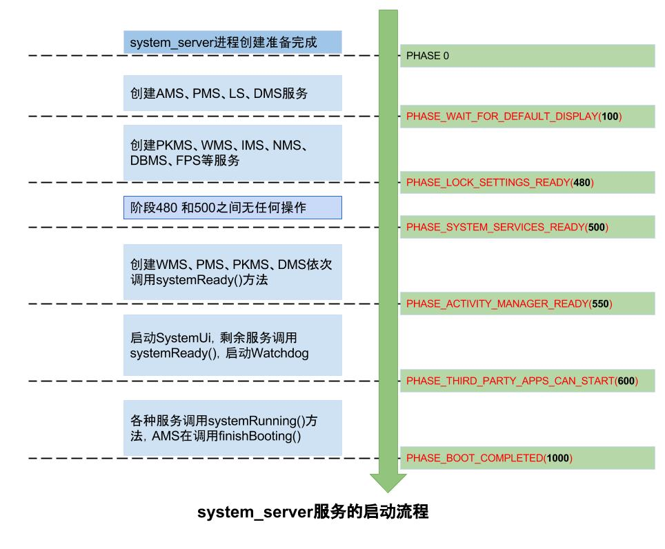

基于[Android 10的源码](http://aospxref.com/android-10.0.0_r47/xref/)分析

## [1、计算机是如何启动的？](https://blog.csdn.net/freekiteyu/article/details/79175010)
​        首先熟悉一些概念，计算机的硬件包括：CPU，内存，硬盘，显卡，显示器，键盘鼠标等其他输入输出设备。 所有的软件（比如：操作系统）都是存放在硬盘上，程序执行时需要将程序从硬盘上读取到内存中然后加载到 CPU 中来运行。 当我们按下开机键时，此时内存中什么都没有，，因此需要借助某种方式，将操作系统加载到内存中，而完成这项任务的就是 BIOS。

- 引导阶段

BIOS: Basic Input/Output System（基本输入输出系统），在 IBM PC 兼容系统上，是一种业界标准的固件接口（来自维基百科）。 BIOS 一般是主板芯片上的一个程序，计算机通电后，第一件事就是读取它。

BIOS 程序首先检查计算机硬件能否满足运行的基本条件，这叫做"硬件自检"（Power-On Self-Test），缩写为 POST。 如果硬件出现问题，主板会发出不同含义的蜂鸣，启动中止。 如果没有问题，屏幕就会显示出 CPU，内存，硬盘等信息。

硬件自检完成后，BIOS 把控制权转交给下一阶段的启动程序。 这时 BIOS 需要知道，下一阶段的启动程序到底存放在哪一个设备当中。 也就是说 BIOS 需要有一个外部存储设备的排序，排在前面的设备就是优先转交控制权的设备。 这种排序叫做启动排序，也就是我们平时进入 BIOS 界面时能看到的 Boot Sequence。

如果我们没有进行特殊操作的话，那么 BIOS 就会按照这个启动顺序将控制权交给下一个存储设备。 我们在使用 U 盘光盘之类的装系统时就是在这里将启动顺序改变了，将本来要移交给硬盘的控制权交给了 U 盘或者光盘。

第一存储设备被激活后，计算机读取该设备的第一个扇区，也就是读取最前面的 512 个字节。 如果这 512 个字节的最后两个字节是 0x55 和 0xAA ，表明这个设备可以用于启动；如果不是，表明设备不能用于启动，控制权于是被转交给“启动顺序”中的下一个设备。

这最前面的 512 个字节，就叫做"主引导记录"（Master boot record，缩写为 MBR）。 主引导记录 MBR 是位于磁盘最前边的一段引导代码。它负责磁盘操作系统对磁盘进行读写时分区合法性的判别、分区引导信息的定位，它由磁盘操作系统在对硬盘进行初始化时产生的。 硬盘的主引导记录 MBR 是不属于任何一个操作系统的，它先于所有的操作系统而被调入内存，并发挥作用，然后才将控制权交给主分区内的操作系统，并用主分区信息表来管理硬盘。

MBR 只有512个字节，放不了太多东西。 它的主要作用是，告诉计算机到硬盘的哪一个位置去找操作系统。 我们找到可用的 MBR 后，计算机从 MBR 中读取前面 446 字节的机器码之后，不再把控制权转交给某一个分区，而是运行事先安装的"启动管理器"（boot loader），由用户选择启动哪一个操作系统。

- 加载内核阶段

选择完操作系统后，控制权转交给操作系统，操作系统的内核首先被载入内存。

以 Linux 系统为例，先载入 /boot 目录下面的 kernel。 内核加载成功后，第一个运行的程序是 /sbin/init。 它根据配置文件（Debian 系统是 /etc/initab ）产生 init 进程。 这是 Linux 启动后的第一个进程，pid 进程编号为 1，其他进程都是它的后代。

然后，init 线程加载系统的各个模块，比如：窗口程序和网络程序，直至执行 /bin/login 程序，跳出登录界面，等待用户输入用户名和密码。

至此，全部启动过程完成。

## 2、Android 手机的启动过程

Android 系统虽然也是基于 Linux 系统的，但是由于 Android 属于嵌入式设备，并没有像 PC 那样的 BIOS 程序。 取而代之的是 **Bootloader**(系统启动加载器)。 它类似于 BIOS，在系统加载前，用以初始化硬件设备，建立内存空间的映像图，为最终调用系统内核准备好环境。 在 Android 里没有硬盘，而是 ROM，它类似于硬盘存放操作系统，用户程序等。 ROM 跟硬盘一样也会划分为不同的区域，用于放置不同的程序，在 Android 中主要划分为一下几个分区：

/boot：存放引导程序，包括内核和内存操作程序
/system：相当于电脑c盘，存放Android系统及系统应用
/recovery：恢复分区，可以进入该分区进行系统恢复
/data：用户数据区，包含了用户的数据：联系人、短信、设置、用户安装的程序
/cache：安卓系统缓存区，保存系统最常访问的数据和应用程序
/misc：包含一些杂项内容，如系统设置和系统功能启用禁用设置
/sdcard：用户自己的存储区，可以存放照片，音乐，视频等文件


那么 Bootloader 是如何被加载的呢？跟 PC 启动过程类似，当开机通电时首先会加载 Bootloader，**Bootloader 会读取 ROM 找到操作系统并将 Linux 内核加载到 RAM 中**。

当 Linux 内核启动后会初始化各种软硬件环境，加载驱动程序，挂载根文件系统，Linux 内核加载的最后阶段会启动执行第一个用户空间进程 init 进程。


### 2.1、loader

刷过机的朋友大概都知道，Android可以通过某个组合按键进入BootLoader页面，这个也就是上图中的最底层，在Android系统，甚至于它的内核还未加载时的一个引导程序，主要负责对kenel进行解压和初始化的工作

### 2.2、idle进程

kernel中的idle进程是**0号进程**，是唯一一个没有通过fock产生的进程，它的优先级非常低，用于CPU没有任务的时候进行空转，由内核中启动，并始终执行在内核态，由内核态的idle进程开启我们常提的1号进程init（对应源码，`system/core/init/init.cpp`）

### kthreadd

kthreadd进程同样由idle进程创建，pid为2，它始终运行在内核空间，负责所有内核线程的调度与管理。

### 2.3、init 进程


init 是 Linux 系统中用户空间的第一个进程(pid=1)，Kernel 启动后会调用 [/system/core/init/main.cpp ](http://aospxref.com/android-10.0.0_r47/xref/system/core/init/main.cpp)的 main() 方法，调用链如下：

```C++
# /system/core/init/main.cpp
int main(int argc, char** argv) {
    if (argc > 1) {
        if (!strcmp(argv[1], "selinux_setup")) {
            //对SELinux进行初始化，并通过execs的系统调用开启init进程
            return SetupSelinux(argv);
        }
        if (!strcmp(argv[1], "second_stage")) {
            return SecondStageMain(argc, argv);//⭐️第二阶段
        }
    }
    return FirstStageMain(argc, argv);//第一阶段
}

# /system/core/init/first_stage_init.cpp
int FirstStageMain(int argc, char** argv) {
    if (REBOOT_BOOTLOADER_ON_PANIC) {  //是否定义由init.mk决定
        InstallRebootSignalHandlers(); //处理init挂掉的情况，会重启bootloader
    }
...
    gid_t groups[] = {AID_READPROC};
    CHECKCALL(setgroups(arraysize(groups), groups));//设置用户组
    CHECKCALL(mount("sysfs", "/sys", "sysfs", 0, NULL));//挂载系统文件
... 
    const char* path = "/system/bin/init";//init二进制文件的目录
    const char* args[] = {path, "selinux_setup", nullptr};//execv()函数开启init进程
  //第一阶段的init结束，execv()函数(运行环境有linux，unix):装入并运行指定程序的函数，通过execv函数带参执行init文件，进入SetupSelinux
    execv(path, const_cast<char**>(args));
    return 1;
}

# /system/core/init/selinux.cpp
// This function initializes SELinux then execs init to run in the init SELinux context.
int SetupSelinux(char** argv) {
    //init二进制文件的目录
    const char* path = "/system/bin/init";
    const char* args[] = {path, "second_stage", nullptr};
    //execv()函数 执行到SecondStageMain
    execv(path, const_cast<char**>(args));
    return 1;
}
```

上面主要是调用`execv()`函数开启init进程，接着来到第二阶段[/system/core/init/init.cpp ](http://aospxref.com/android-10.0.0_r47/xref/system/core/init/init.cpp?fi=SecondStageMain#SecondStageMain)的SecondStageMain()函数：

```c++
int SecondStageMain(int argc, char** argv) {
  //初始化 Kernel log
  InitKernelLogging(argv);
  //加载系统启动脚本"init.rc"
  LoadBootScripts(am, sm);
  
  while (true) {
...    //init进程进入 loop 状态  等待事件发生
       if (auto result = epoll.Wait(epoll_timeout); !result) {
          LOG(ERROR) << result.error();
       }
  }
}

static void LoadBootScripts(ActionManager& action_manager, ServiceList& service_list) {
    //初始化系统属性，使用mmap共享内存，"/dev/__properties__/property_info"
  	property_init(); 
    Epoll epoll; //使用IO复用机制，epoll，即 event poll，是poll机制的升级版
    InstallSignalFdHandler(&epoll);  //使用epoll对init子进程的信号进行监听
    StartPropertyService(&epoll); //开启属性服务，并注册到epoll中
    //⭐️加载init.rc脚本文件
		Parser parser = CreateParser(action_manager, service_list);
    std::string bootscript = GetProperty("ro.boot.init_rc", "");
    if (bootscript.empty()) {
        parser.ParseConfig("/init.rc");
    } else {
        parser.ParseConfig(bootscript);
    }
}
```

首先初始化 Kernel log，创建一块共享的内存空间，加载 /default.prop 文件，解析 init.rc 文件。

#### init.rc 文件

rc文件，是用Android Init Language编写的特殊文件。用这种语法编写的文件，统一用".rc"后缀，它的语法说明可以在aosp源码`system/core/init/README.md`中找到

[init.rc ](http://aospxref.com/android-10.0.0_r47/xref/system/core/rootdir/init.rc)文件用于启动所有必要的进程、守护程序和服务，以便 android 正常运行，位于[ /system/core/rootdir/](http://aospxref.com/android-10.0.0_r47/xref/system/core/rootdir/)包中。 主要功能是定义了系统启动时需要执行的一系列 action 及执行特定动作、设置环境变量和属性和执行特定的 service。

init.rc 脚本文件配置了一些重要的服务，init 进程通过创建子进程启动这些服务，这里创建的 service 都属于 native 服务，运行在 Linux 空间，通过 socket 向上层提供特定的服务，并以守护进程的方式运行在后台。

通过 init.rc 脚本系统启动了以下几个重要的服务：

```c++
//⭐️接2.5: 导入zygote脚本
import /init.${ro.zygote}.rc
  
# Start logd before any other services run to ensure we capture all of their logs.
//在任何其他服务运行之前启动logd，以确保我们捕获它们的所有日志。
292     start logd
293 
294     # Start essential services.启动基本服务
//⭐️接2.4: ServiceManager是一个守护进程，它管理所有的 Android 系统服务和客户端的binder通信。在Android系统中用到最多的通信机制就是Binder，Binder主要由Client、Server、ServiceManager和Binder驱动程序组成。其中Client、Service和ServiceManager运行在用户空间，而Binder驱动程序运行在内核空间。核心组件就是Binder驱动程序了，而ServiceManager提供辅助管理的功能，无论是Client还是Service进行通信前首先要和ServiceManager取得联系。而ServiceManager是一个守护进程，负责管理Server并向Client提供查询Server的功能。
295     start servicemanager   
//HwServiceManager是Hardware Abstraction Layer(HAL硬件抽象层)服务管理中心，负责管理系统中的所有HAL服务，主要工作就是收集各个硬件服务，当有进程需要服务时由HwServiceManager 提供特定的硬件服务。
296     start hwservicemanager
//管理厂商服务
297     start vndservicemanager

//初始化网络
581 on boot
582     # basic network init
583     ifup lo
584     hostname localhost
585     domainname localdomain
```

- debuggerd：启动 debug system，处理调试进程的请求

- rild：启动 radio interface layer daemon 服务，处理电话相关的事件和请求

- service media /system/bin/mediaserver：媒体服务media_server 进程，启动 AudioFlinger，MediaPlayerService 和 CameraService，负责多媒体播放相关的功能，包括音视频解码

- service surfaceflinger /system/bin/surfaceflinger：surface_flinger 进程。SurfaceFlinger 负责图像绘制，是应用 UI 的和兴，其功能是合成所有 Surface 并渲染到显示设备。SurfaceFlinger 进程主要是启动 FrameBuffer，初始化显示系统。

- onrestart restart zygote：进程孵化器，启动 Android Java VMRuntime 和启动 systemserver，负责 Android 应用进程的孵化工作

- service bootanim /system/bin/bootanimation：开机动画服务，在这个阶段你可以在设备的屏幕上看到 “Android” logo 了。

- service installd /system/bin/installd：在Android系统中，PackageManagerService用于管理系统中的所有安装包信息及应用程序的安装卸载，但是应用程序的安装与卸载并非PackageManagerService来完成，而是通过PackageManagerService来访问installd服务来执行程序包的安装与卸载的。

以上工作执行完，**init 进程就会进入 loop 状态，当接收到请求创建新进程请求时立即唤醒并执行相应工作**。当init子进程(Zygote)退出时，会产生SIGCHLD信号，并发送给init进程，通过socket套接字传递数据，调用到wait_for_one_process()方法，根据是否是oneshot，来决定是重启子进程，还是放弃启动。由于缺省模式oneshot=false,因此Zygote一旦被杀便会再次由init进程拉起.

### 2.4、service_manager(详见binder)

start servicemanager 会执行由[frameworks/native/cmds/servicemanager/service_manager.c](http://aospxref.com/android-10.0.0_r47/xref/frameworks/native/cmds/servicemanager/service_manager.c)编译的程序

```c++
int main(int argc, char** argv){
   struct binder_state *bs;
   //打开设备文件 /dev/binder 以及将它映射到本进程的地址空间
   bs = binder_open(driver, 128*1024);
   //将自己注册为所有服务的大管家.
   binder_become_context_manager(bs))
   //循环等待和处理 Client 进程的通信请求
   binder_loop(bs, svcmgr_handler);
}
```

binder_open()是[binder.c](http://aospxref.com/android-10.0.0_r47/xref/frameworks/native/cmds/servicemanager/binder.c)定义的函数：

```c++
97  struct binder_state *binder_open(const char* driver, size_t mapsize)
98  {
99       struct binder_state *bs; 
100      struct binder_version vers;
//binder_state成员有：open /dev/binder的fd，mmap映射的大小，mmap后返回的buffer指针mapped；
102      bs = malloc(sizeof(*bs));
//调用kernel binder driver的binder_open；
108      bs->fd = open(driver, O_RDWR | O_CLOEXEC);
123      bs->mapsize = mapsize;   //⭐️mmap映射大小128kb
//调用kernel binder driver的binder_mmap。mmap后返回的buffer指针mapped
124      bs->mapped = mmap(NULL, mapsize, PROT_READ, MAP_PRIVATE, bs->fd, 0);
131      return bs;
138  }
```


### 2.5、Zygote 进程

init进程在执行init.rc脚本时`import /init.${ro.zygote}.rc`导入了[init.zygote.rc](http://aospxref.com/android-10.0.0_r47/xref/system/core/rootdir/init.zygote32.rc)（`system/core/rootdir/`包中）脚本，由4个不同位数的文件，通过`adb shell getprop | findstr ro.zygote`命令，看看`${ro.zygote}`这个环境变量具体的值是什么:

```c++
##init.zygote.rc
//启动zygote服务，会执行由[app_main.cpp]（frameworks/base/cmds/app_process/目录下）编译的二进制文件
service zygote /system/bin/app_process -Xzygote /system/bin --zygote --start-system-server
    class main                             //伴随着main class的启动而启动
    socket zygote stream 660 root system   //创建socket
    onrestart write /sys/android_power/request_state wake
    onrestart write /sys/power/state on
    onrestart restart media              //当zygote重启时,则会重启media
    onrestart restart netd               // 当zygote重启时,则会重启netd
```

[app_main.cpp](http://aospxref.com/android-10.0.0_r47/xref/frameworks/base/cmds/app_process/app_main.cpp)（`frameworks/base/cmds/app_process/`包下）：

```c++
int main(int argc, char* const argv[]){
    //⭐️1创建AppRuntime,AppRuntime是AndroidRuntime的子类对象
    AppRuntime runtime(argv[0], computeArgBlockSize(argc, argv));
    //设置为zygote启动模式
    strcmp(arg, "--zygote") 
    if (zygote) {
        //⭐️1、调用AndroidRuntime的start()函数，zygoteInit是一个java类，作为参数传递
        runtime.start("com.android.internal.os.ZygoteInit", args, zygote);
    } else if (className) {
        runtime.start("com.android.internal.os.RuntimeInit", args, zygote);
    } else {
        fprintf(stderr, "Error: no class name or --zygote supplied.\n");
        app_usage();
        LOG_ALWAYS_FATAL("app_process: no class name or --zygote supplied.");
    }
}
```

/[frameworks](http://aospxref.com/android-10.0.0_r47/xref/frameworks/)/[base](http://aospxref.com/android-10.0.0_r47/xref/frameworks/base/)/[core](http://aospxref.com/android-10.0.0_r47/xref/frameworks/base/core/)/[jni](http://aospxref.com/android-10.0.0_r47/xref/frameworks/base/core/jni/)/[AndroidRuntime.cpp](http://aospxref.com/android-10.0.0_r47/xref/frameworks/base/core/jni/AndroidRuntime.cpp)

```c++
//启动Android运行时环境，开启Dalvik虚拟机，执行参数给定的类的main()方法
void AndroidRuntime::start(const char* className, const Vector<String8>& options, bool zygote){
    JNIEnv* env;
    //⭐️2、开启Dalvik虚拟机
    if (startVm(&mJavaVM, &env, zygote) != 0) {
        return;
    }
    onVmCreated(env);
    //⭐️3、注册JNI方法
    if (startReg(env) < 0) {
        ALOGE("Unable to register all android natives\n");
        return;
    }
    //com.android.internal.os.ZygoteInit
    char* slashClassName = toSlashClassName(className != NULL ? className : "");
    jclass startClass = env->FindClass(slashClassName);
    jmethodID startMeth = env->GetStaticMethodID(startClass, "main",
            "([Ljava/lang/String;)V");
		//⭐️⭐️⭐️4、使用JNI调用ZygoteInit.main()方法，进入java世界
    env->CallStaticVoidMethod(startClass, startMeth, strArray);
}
```

[/frameworks/base/core/java/com/android/internal/os/ZygoteInit.java](http://aospxref.com/android-10.0.0_r47/xref/frameworks/base/core/java/com/android/internal/os/ZygoteInit.java)

```java
public static void main(String argv[]) {
        Runnable caller;
        try {
            RuntimeInit.enableDdms();   //开启ddms
            //预加载资源
            preload(bootTimingsTraceLog);
            //创建Zygote 的 LocalServerSocket
            zygoteServer = new ZygoteServer(isPrimaryZygote);

            //⭐️通过fork开启system_server进程，调用Zygote.forkSystemServer()
            if (startSystemServer) {
                Runnable r = forkSystemServer(abiList, zygoteSocketName, zygoteServer);
                if (r != null) {
                    r.run();
                    return;
                }
            }
            // zygote 永久循环
            caller = zygoteServer.runSelectLoop(abiList);
        } catch (Throwable ex) {
            throw ex;
        } finally {
            if (zygoteServer != null) {
                zygoteServer.closeServerSocket();
            }
        }
        // We're in the child process and have exited the select loop. Proceed to execute the
        // command.
        if (caller != null) {
            caller.run();
        }
    }
```


### 2.6、system_server 进程

[/frameworks/base/core/java/com/android/internal/os/ZygoteInit.java](http://aospxref.com/android-10.0.0_r47/xref/frameworks/base/core/java/com/android/internal/os/ZygoteInit.java)

```java
//准备参数，fork启动system server进程 
private static Runnable forkSystemServer(String abiList, String socketName,
            ZygoteServer zygoteServer) {
        /* Hardcoded command line to start the system server */
        String args[] = {
                "--setuid=1000",
                "--setgid=1000",
                "--setgroups=1001,1002,1003,1004,1005,1006,1007,1008,1009,1010,1018,1021,1023,"
                        + "1024,1032,1065,3001,3002,3003,3006,3007,3009,3010",
                "--capabilities=" + capabilities + "," + capabilities,
                "--nice-name=system_server",
                "--runtime-args",
                "--target-sdk-version=" + VMRuntime.SDK_VERSION_CUR_DEVELOPMENT,
                "com.android.server.SystemServer",
        };
        ZygoteArguments parsedArgs = null;

        int pid;

        try {
            //⭐️1、请求 fork 系统服务器进程，执行com.android.server.SystemServer
            pid = Zygote.forkSystemServer(
                    parsedArgs.mUid, parsedArgs.mGid,
                    parsedArgs.mGids,
                    parsedArgs.mRuntimeFlags,
                    null,
                    parsedArgs.mPermittedCapabilities,
                    parsedArgs.mEffectiveCapabilities);
        } catch (IllegalArgumentException ex) {
            throw new RuntimeException(ex);
        }

        /* For child process */
        if (pid == 0) {
            if (hasSecondZygote(abiList)) {
                waitForSecondaryZygote(socketName);
            }

            zygoteServer.closeServerSocket();
            return handleSystemServerProcess(parsedArgs);
        }

        return null;
    }

```

[frameworks/base/services/java/com/android/server/SystemServer.java](http://aospxref.com/android-10.0.0_r47/xref/frameworks/base/services/java/com/android/server/SystemServer.java)

```java
package com.android.server;
public final class SystemServer {
    //zygote进程fork启动SystemServer入口，会通过反射调用SystemServer.main()
    public static void main(String[] args) {
        new SystemServer().run();
    }
  
    private void run() {
        try {
            // Prepare the main looper thread (this thread).
            // 准备主线程looper
            Looper.prepareMainLooper();
            Looper.getMainLooper().setSlowLogThresholdMs(
                    SLOW_DISPATCH_THRESHOLD_MS, SLOW_DELIVERY_THRESHOLD_MS);
            // ⭐️2、加载libandroid_servers.so库，该库包含的源码在frameworks/base/services/目录下
            System.loadLibrary("android_servers");
            // ⭐️3、创建系统上下文->ActivityThread、Context
            createSystemContext();
            // ⭐️4、创建系统服务管理器SystemServiceManager，用来管理SystemService进程、启动其他服务
            mSystemServiceManager = new SystemServiceManager(mSystemContext);
            mSystemServiceManager.setStartInfo(mRuntimeRestart,
                    mRuntimeStartElapsedTime, mRuntimeStartUptime);
            LocalServices.addService(SystemServiceManager.class, mSystemServiceManager);
            // Prepare the thread pool for init tasks that can be parallelized
            SystemServerInitThreadPool.get();
        } finally {
            traceEnd();  // InitBeforeStartServices
        }

        //启动各种系统服务
        try {
            startBootstrapServices();// ⭐️5、启动引导服务
            startCoreServices();     // ⭐️6、启动核心服务
            startOtherServices();    // ⭐️7、启动其他服务
        } catch (Throwable ex) {
            Slog.e("System", "******************************************");
            Slog.e("System", "************ Failure starting system services", ex);
            throw ex;
        } finally {
            traceEnd();
        }
        //⭐️ 8、Loop 永久轮询
        Looper.loop();
        throw new RuntimeException("Main thread loop unexpectedly exited");
    }
}
```

#### 2.6.1、startBootstrapServices()启动引导服务

主要启动了：ActivityManagerService，PowerManagerService，LightsService，DisplayManagerService，PackageManagerService，UserManagerService

- ActivityTaskManagerService：把 Activity 相关的内容从 ActivityManagerService 剥离出来而产生的。

- ActivityManagerService(AMS)：AMN的子类，负责管理三大组件(除Activity)和进程，包括生命周期和状态切换。AMS因为要和ui交互，所以极其复杂，涉及window。

- PackageManagerService(PKMS)：包管理服务，不叫PMS是为了和电源管理服务区分开
- PowerManagerService(PMS)：电源管理服务

```java
 private void startBootstrapServices() {
        /**⭐️⭐️⭐️
         * 1、启动了ATM服务，
         * 2、构造方法中创建出了acitivity的生命周期管理 ClientLifecycleManager对象
         * 3、startService()->onStart()-> publishBinderService(Context.ACTIVITY_TASK_SERVICE, mService)-> ServiceManager.addService()->ServiceManagerNative.addService()注册ATMS
         *⭐️⭐️⭐️问题：SystemServiceManager和ServiceManager有什么区别?
         * ServiceManager:系统服务大管家，负责服务的注册查找等，和Binder相关
         * SystemServiceManager：用于管理系统服务的生命周期的，比如ActivityManagerService.Lifecycle继承自SystemService
         */
        ActivityTaskManagerService atm = mSystemServiceManager.startService(
                ActivityTaskManagerService.Lifecycle.class).getService();
        /**
         * ⭐️⭐️⭐️ 1、AMS 启动
         * 2、构造方法中调用ATMS.initialize()->ActivityStackSupervisor mStackSupervisor = createStackSupervisor() 创建了Activity栈管理对象
         * 3、mStackSupervisor.setRecentTasks(mRecentTasks)设置最近使用任务栈
         * 4、下面的mActivityManagerService.setSystemProcess()将AMS等添加到ServiceManager中
         */
        mActivityManagerService = ActivityManagerService.Lifecycle.startService(
                mSystemServiceManager, atm);
mActivityManagerService.setSystemServiceManager(mSystemServiceManager);
        mActivityManagerService.setInstaller(installer);
        mWindowManagerGlobalLock = atm.getGlobalLock();
        // PowerManagerService 电源管理服务
        mPowerManagerService = mSystemServiceManager.startService(PowerManagerService.class);

        mSystemServiceManager.startService(ThermalManagerService.class);
        mSystemServiceManager.startService(RecoverySystemService.class);
        // LightsService 管理LED和显示屏背光.
        mSystemServiceManager.startService(LightsService.class);
        //DisplayManagerService(显示管理器)
        mDisplayManagerService = mSystemServiceManager.startService(DisplayManagerService.class);
       //⭐️Phase100：等待显示阶段
   mSystemServiceManager.startBootPhase(SystemService.PHASE_WAIT_FOR_DEFAULT_DISPLAY);
        // ⭐️⭐️⭐️ PackageManagerService PKMS 启动
Watchdog.getInstance().pauseWatchingCurrentThread("packagemanagermain");
            mPackageManagerService = PackageManagerService.main(mSystemContext, installer,
                    mFactoryTestMode != FactoryTest.FACTORY_TEST_OFF, mOnlyCore);
             mSystemServiceManager.startService(UserManagerService.LifeCycle.class);

        // Set up the Application instance for the system process and get started.
        //⭐️⭐️⭐️将AMS等添加到ServiceManager中:ServiceManager.addService()
        mActivityManagerService.setSystemProcess();
        //传感器服务
        mSystemServiceManager.startService(new SensorPrivacyService(mSystemContext));
        traceEnd();
    }
```

#### 2.6.2、startCoreServices()启动核心服务

```java
    private void startCoreServices() {
        mSystemServiceManager.startService(BatteryService.class);//统计电池电量
        mSystemServiceManager.startService(UsageStatsService.class);//统计应用使用情况
        mWebViewUpdateService = mSystemServiceManager.startService(WebViewUpdateService.class);
        mSystemServiceManager.startService(CachedDeviceStateService.class);
        mSystemServiceManager.startService(BinderCallsStatsService.LifeCycle.class);
        mSystemServiceManager.startService(LooperStatsService.Lifecycle.class);
        mSystemServiceManager.startService(RollbackManagerService.class);
        mSystemServiceManager.startService(BugreportManagerService.class);
        mSystemServiceManager.startService(GpuService.class);
    }
```

#### 2.6.3、startOtherServices()启动其他服务

主要启动了： InputManagerService，WindowManagerService。准备好 window, power, package, display 服务。等待 ServiceManager，SurfaceFlinger启动完成，然后显示启动界面。

```java
private void startOtherServices() {
        final Context context = mSystemContext;
        VibratorService vibrator = null;
        DynamicSystemService dynamicSystem = null;
        IStorageManager storageManager = null;
        NetworkManagementService networkManagement = null;
        IpSecService ipSecService = null;
        NetworkStatsService networkStats = null;
        NetworkPolicyManagerService networkPolicy = null;
        ConnectivityService connectivity = null;
        NsdService serviceDiscovery = null;
        WindowManagerService wm = null;
        SerialService serial = null;
        NetworkTimeUpdateService networkTimeUpdater = null;
        InputManagerService inputManager = null;
        TelephonyRegistry telephonyRegistry = null;
        ConsumerIrService consumerIr = null;
        MmsServiceBroker mmsService = null;
        HardwarePropertiesManagerService hardwarePropertiesService = null;
  
  			wm = WindowManagerService.main(context, inputManager, !mFirstBoot, mOnlyCore,
                    new PhoneWindowManager(), mActivityManagerService.mActivityTaskManager);
        ServiceManager.addService(Context.WINDOW_SERVICE, wm, /* allowIsolated= */ false,
           
        // 现在便可以开始启动三方APP应用(如Launcher启动桌面)
        mActivityManagerService.systemReady(() -> {

}
```

经过上面这些步骤，我们调用调用createSystemContext()创建系统上下文的时候，也已经完成了mSystemContext和ActivityThread的创建。ATMS、AMS、WMS、PKMS等对象已经创建好了，并且完成了成员变量初始化。这是系统进程开启时的流程，在这之后，会开启系统的 Launcher程序，完成系统界面的加载与显示。

system_server进程启动系统服务会有以下阶段：

- PHASE_WAIT_FOR_DEFAULT_DISPLAY（100） 等待显示阶段 
- PHASE_LOCK_SETTINGS_READY（480） 锁定阶段：在此阶段，service就可以获得锁定的设置数据 
- PHASE_SYSTEM_SERVICES_READY（500）：系统服务准备就绪阶段：在此阶段，service可以安心的调用核心系统服务，比如PowerManager或者PackageManager
- PHASE_ACTIVITY_MANAGER_READY（550）： AMS准备就绪阶段：在启动阶段后，service就可以发送广播了 
- PHASE_THIRD_PARTY_APPS_CAN_START（600）： 启动第三方应用阶段：在启动阶段后，服务就可以启动/绑定第三方应用程序App就可以。并在此时调用Binder服务 
- PHASE_BOOT_COMPLETED（1000）： 启动结束阶段：在此阶段，此时服务可以运行用户与设备进行交互。当启动完成后Home应用程序会在此阶段启动。系统服务可能会监听这个阶段，而不是注册ACTION_BOOT_COMPLETED的广播接收器来减少整体延迟



## 3、总结

**Boot ROM**：当电源按下时，引导芯片代码会从预定义的地方(固化在ROM)开始执行，加载引导程序BootLoader到RAM,然后执行。（这一步由"芯片厂商"负责设计和实现）

**Boot loader：**Bootloader 会读取 ROM 找到操作系统并将 Linux 内核加载到 RAM 中，然后初始化各种软硬件环境，加载驱动程序，挂载根文件系统，Linux 内核加载的最后阶段会启动执行第一个用户空间进程 init 进程。

**Kernel**：Linux 内核是 Android 的核心，负责进程创建、进程间通信、设备驱动程序、文件系统管理等。 Android 在主流内核上应用自定义补丁来支持 Android 运行所需的某些功能，如唤醒锁等。内核可以作为未压缩图像或压缩图像加载。在加载时，它挂载根文件系统（通常作为内核命令行参数传递）并**启动用户空间中的第一个应用程序**。（这一步则是Android内核开发过程中需要涉及的地方）

**init 和 init.rc**：启动内核时执行的**第一个用户空间应用程序**

- init进程解析称为"init.rc"脚本的启动脚本。这是用一种专为 android 设计的语言编写的，用于启动所有必要的进程、守护程序和服务，以便 android 正常运行
- 启动一些Daemons守护进程和Native Service（硬件抽象层HAL相关的服务）
- 启动ServiceManager服务，用于管理系统中运行的所有Service，创建的每个服务都会在此进程中注册自己，并且此信息供其他进程/应用程序将来参考。
- 启动zygote进程
- init 进程就会进入 loop 状态，当子进程zygote挂掉后会通过socket发送single信号给init重启zygote

**ServiceManager：**

- 分析和运行init.rc

**zygote进程启动后主要做了以下几件事：**

- 调用 `AndroidRuntime::start()`函数启动Android运行时环境
- `AndroidRuntime::startVm()`开启Dalivik VM(ART)虚拟机
- `AndroidRuntime::startReg()`注册JNI方法
- `env->CallStaticVoidMethod(startClass, startMeth, strArray)`使用JNI调用`ZygoteInit.main()`方法，**进入java世界**，ZygoteInit.main()又做了下面几件事
  - `preload(bootTimingsTraceLog)`预加载资源
  - `new ZygoteServer(isPrimaryZygote)`创建Zygote 的 LocalServerSocket
  - `ZygoteInit.forkSystemServer()`fork启动`system_server` 进程
  - `zygoteServer.runSelectLoop()`zygote永久循环，等待创建新进程的请求


**SystemServer进程启动后主要做了以下几件事：**

- `Looper.prepareMainLooper()`准备主线程looper
- `System.loadLibrary("android_servers")`加载libandroid_servers.so库
- `createSystemContext()`创建系统上下文->ActivityThread、Context
- `new SystemServiceManager(mSystemContext)`创建系统服务管理器SystemServiceManager
- `startBootstrapServices()`启动引导服务，包、**ActivityTaskManagerService（ATMS）**、**ActivityManagerService（AMS）**，PowerManagerService，LightsService，DisplayManagerService，**PackageManagerService（PKMS）**，UserManagerService等
- `startCoreServices()`启动核心服务 BatteryService(统计电池电量)、UsageStatsService(统计应用使用情况)
- `startOtherServices()`启动其他服务InputManagerService，**WindowManagerService（WMS）**等，启动桌面launcher
- ` Looper.loop()` 永久轮询


## 4、问答

#### 4.1、SystemServiceManager和ServiceManager有什么区别?
**ServiceManager：**系统服务大管家，负责向Native层的ServiceManager注册服务和查找等，和Binder相关，它是java层面的，底层还有service_manager，通过Binder和底层通信
**SystemServiceManager：**用于管理系统服务的生命周期的，比如ActivityManagerService.Lifecycle继承自SystemService，SystemServiceManager中有一个`ArrayList<SystemService> mServices`保存了系统服务内部类`Lifecycle`对象，而`Lifecycle`对象又持有外部类XxxManagerService的引用从而控制生命周期


#### 4.2、fork有什么好处？

 fork 以创建多个实例来支持每个 android 进程。它有助于在 VM 实例之间使用共享代码，从而减少内存占用和加载时间，非常适合嵌入式系统
