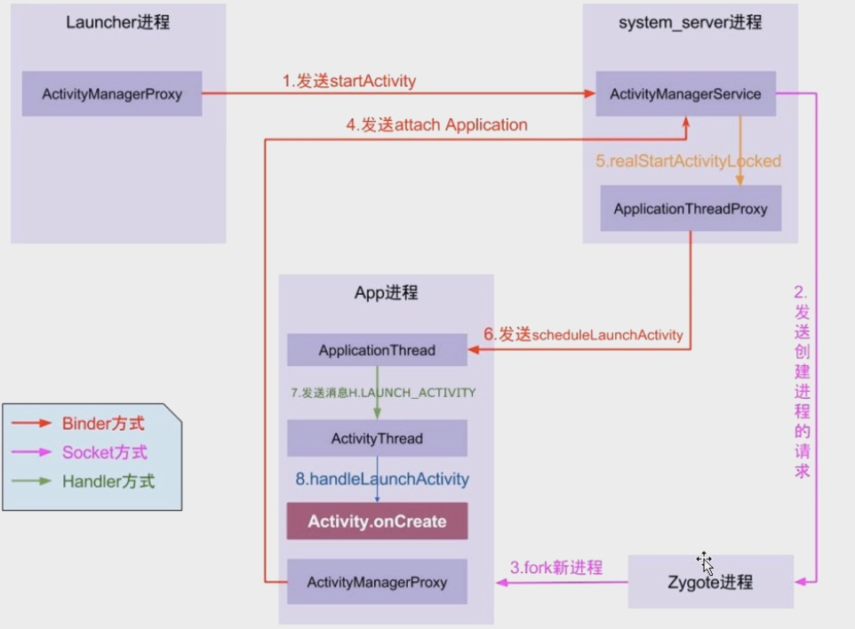
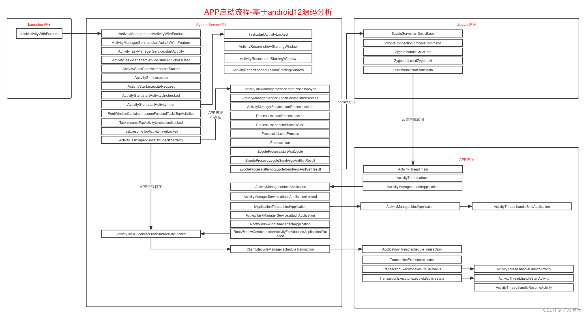

基于[Android 12的源码](http://aospxref.com/android-12.0.0_r3/xref/)分析



### 1、 launcher进程通过binder向AMS发送启动Activity请求(app进程->system_server进程)

- Activity.startActivity(Intent intent)

- Activity.startActivityForResult()

- [Instrumentation.execStartActivity()](http://aospxref.com/android-12.0.0_r3/xref/frameworks/base/core/java/android/app/Instrumentation.java#1920)  Instrumentation这个类是用于监控系统与应用的交互的

- [ActivityTaskManager.getService().startActivity()](http://aospxref.com/android-12.0.0_r3/xref/frameworks/base/core/java/android/app/ActivityTaskManager.java#155) ⭐️**通过ServiceManager获取到ATMS的binder并调用其startActivity()接口**

  > 通过ServiceManager.getService(Context.ACTIVITY_TASK_SERVICE)获取ATMS代理对象，使用Binder机制向ATMS发起启动activity的请求。
  >
  > 注意：10之前是通过AMS.startActivity()，10之后ATM.startActivity()，本文是基于Android12源码跟踪的,`ATMS`是`Android 10`以后新加的一个服务，用来专门处理`Activity`相关工作，分担`AMS`的工作

- [ActivityTaskManagerService.startActivityAsUser()](http://aospxref.com/android-12.0.0_r3/xref/frameworks/base/services/core/java/com/android/server/wm/ActivityTaskManagerService.java#1178)**调用远程ATMS服务的方法**

- [ActivityStarter.execute()](http://aospxref.com/android-12.0.0_r3/xref/frameworks/base/services/core/java/com/android/server/wm/ActivityStarter.java#611)

- ActivityStarter.executeRequest()

- ActivityStarter.startActivityUnchecked()

- ActivityStarter.startActivityInner()

- [RootWindowContainer.resumeFocusedStacksTopActivities()](http://aospxref.com/android-12.0.0_r3/xref/frameworks/base/services/core/java/com/android/server/wm/RootWindowContainer.java#2315)

- [Task.resumeTopActivityUncheckedLocked()](http://aospxref.com/android-12.0.0_r3/xref/frameworks/base/services/core/java/com/android/server/wm/Task.java)

- Task.resumeTopActivityInnerLocked()

- [ActivityTaskSupervisor.startSpecificActivity()](http://aospxref.com/android-12.0.0_r3/xref/frameworks/base/services/core/java/com/android/server/wm/ActivityTaskSupervisor.java#978)

  ​    ⭐️**判断需要启动的activity所在的进程是否已经启动**?

  - 已经启动 :[ActivityTaskSupervisor.realStartActivityLocked()](http://aospxref.com/android-12.0.0_r3/xref/frameworks/base/services/core/java/com/android/server/wm/ActivityTaskSupervisor.java#realStartActivityLocked)（**详见6**）
  - 没启动：[ActivityTaskManagerService.startProcessAsync()](http://aospxref.com/android-12.0.0_r3/xref/frameworks/base/services/core/java/com/android/server/wm/ActivityTaskManagerService.java#4564)，调用到AMS中，**AMS通过socket给zygote发送创建进程的请求（详见2）**

### 2、AMS通过socket给zygote发送创建进程的请求（system_server进程->zygote进程)

- [ActivityTaskManagerService.startProcessAsync()](http://aospxref.com/android-12.0.0_r3/xref/frameworks/base/services/core/java/com/android/server/wm/ActivityTaskManagerService.java#4564)

- [ActivityManagerService.startProcess()](http://aospxref.com/android-12.0.0_r3/xref/frameworks/base/services/core/java/com/android/server/am/ActivityManagerService.java#16021)

- ActivityManagerService.startProcessLocked()

- [ProcessList.startProcessLocked() #2082](http://aospxref.com/android-12.0.0_r3/xref/frameworks/base/services/core/java/com/android/server/am/ProcessList.java#2044)

- [ProcessList.startProcess() #2396](http://aospxref.com/android-12.0.0_r3/xref/frameworks/base/services/core/java/com/android/server/am/ProcessList.java#2297)

- [Process.start()](http://aospxref.com/android-12.0.0_r3/xref/frameworks/base/core/java/android/os/Process.java)

- [ZygoteProcess.start()](http://aospxref.com/android-12.0.0_r3/xref/frameworks/base/core/java/android/os/ZygoteProcess.java#345)

- ZygoteProcess.startViaZygote() #787

- ZygoteProcess.openZygoteSocketIfNeeded()->attemptConnectionToPrimaryZygote()-> [primaryZygoteState = ZygoteState.connect(mZygoteSocketAddress, mUsapPoolSocketAddress)](http://aospxref.com/android-12.0.0_r3/xref/frameworks/base/core/java/android/os/ZygoteProcess.java#1044)

  ⭐️ **打开zygote进程的LocalSocket连接**

  ```java
  final LocalSocket zygoteSessionSocket = new LocalSocket();
  zygoteSessionSocket.connect(zygoteSocketAddress);
  ```

- ZygoteProcess.zygoteSendArgsAndGetResult()

- [ZygoteProcess.attemptZygoteSendArgsAndGetResult()](http://aospxref.com/android-12.0.0_r3/xref/frameworks/base/core/java/android/os/ZygoteProcess.java#463)

  ```java
  //zygoteState就是上面ZygoteState.connect()返回结果，里面保存了zygote socket地址和写入流等信息
  final BufferedWriter zygoteWriter = zygoteState.mZygoteOutputWriter;
  //通过socket给zygote发送数据请求fork进程
  zygoteWriter.write(msgStr);
  zygoteWriter.flush();
  ```

### 3、zygote进程fork应用进程（zygote进程->App进程)

- zygote进程启动后创建了ZygoteServer对象，启动了 VM虚拟机，fork了system_server进程，然后就进入了loop循环等待消息[ zygoteServer.runSelectLoop(abiList)](http://aospxref.com/android-12.0.0_r3/xref/frameworks/base/core/java/com/android/internal/os/ZygoteInit.java#990)

- [ZygoteServer.runSelectLoop()](http://aospxref.com/android-12.0.0_r3/xref/frameworks/base/core/java/com/android/internal/os/ZygoteServer.java?fi=runSelectLoop#runSelectLoop)

- [ZygoteConnection.processCommand()](http://aospxref.com/android-12.0.0_r3/xref/frameworks/base/core/java/com/android/internal/os/ZygoteConnection.java#117) 接受来自AMS的请求创建新进程的命令参数数据

- [Zygote.forkAndSpecialize()](http://aospxref.com/android-12.0.0_r3/xref/frameworks/base/core/java/com/android/internal/os/Zygote.java?fi=forkAndSpecialize#339)

  ```java
  int pid = nativeForkAndSpecialize() ⭐️调用native函数fork一个新进程，返回两个pid。pid为0时为子进程，设置标记为子进程。反之仍就还是Zygote进程
  ```

- [ZygoteConnection.handleChildProc()](http://aospxref.com/android-12.0.0_r3/xref/frameworks/base/core/java/com/android/internal/os/ZygoteConnection.java#514) 中关闭了socket连接

- [ZygoteInit. childZygoteInit()](http://aospxref.com/android-12.0.0_r3/xref/frameworks/base/core/java/com/android/internal/os/ZygoteInit.java?fi=zygoteInit#1047)

- [RuntimeInit.findStaticMain()](http://aospxref.com/android-12.0.0_r3/xref/frameworks/base/core/java/com/android/internal/os/RuntimeInit.java?fi=findStaticMain#findStaticMain)⭐️反射执行ActivityThread.main()，这里只看到了main方法，没有看到ActivityThread类。其实ActivityThread类是通过socket传递过来的一个参数，其定义在ProcessList的startProcessLocked方法中`  final String entryPoint = "android.app.ActivityThread";`

**这里没涉及到跨进程通信，因为zygote fork出app进程后，ZygoteServer继续轮训了，app进程则通过反射调用Activity.main()**

### 4. app进程->system_server进程

- [ActivityThread.main()](http://aospxref.com/android-12.0.0_r3/xref/frameworks/base/core/java/android/app/ActivityThread.java)

  ```java
  main{
    Looper.prepareMainLooper()⭐️创建主线程Looper
    ActivityThread.attach() 通知AMS
    Looper.loop()开启轮询
  }
  ```

- [ActivityThread.attach()](http://aospxref.com/android-12.0.0_r3/xref/frameworks/base/core/java/android/app/ActivityThread.java#attach) 

- ActivityManager.getService() .attachApplication() 

  ⭐️通过`ServiceManager.getService(Context.ACTIVITY_SERVICE)`获取AMS的binder对象，并将`ApplicationThread`传给AMS，ApplicationThread也是一个binder对象，AMS通过它调用app进程

  ⭐️⭐️⭐️AMS是如何管理app生命周期的？App启动后会将自己的ApplicationThread的binder对象传给AMS

- [ActivityManagerService.attachApplication()](http://aospxref.com/android-12.0.0_r3/xref/frameworks/base/services/core/java/com/android/server/am/ActivityManagerService.java#4638)

- ActivityManagerService.attachApplicationLocked()

- [ApplicationThread.bindApplication()](http://aospxref.com/android-12.0.0_r3/xref/frameworks/base/services/core/java/com/android/server/am/ActivityManagerService.java#4501)⭐️AMS通知APP进程进行初始化操作（**见5.1**）

- [ActivityTaskManagerService.attachApplication()](http://aospxref.com/android-12.0.0_r3/xref/frameworks/base/services/core/java/com/android/server/wm/ActivityTaskManagerService.java)

- [RootWindowContainer. attachApplication()](http://aospxref.com/android-12.0.0_r3/xref/frameworks/base/services/core/java/com/android/server/wm/RootWindowContainer.java#1909)

- RootWindowContainer. startActivityForAttachedApplicationIfNeeded()

- [ActivityTaskSupervisor.realStartActivityLocked()](http://aospxref.com/android-12.0.0_r3/xref/frameworks/base/services/core/java/com/android/server/wm/ActivityTaskSupervisor.java#713)（**回到1，当activity进程已经启动，直接开启activity**）

### 5. AMS通知APP进程进行各种生命周期操作(system_server进程->app进程)

[ActivityManagerService.attachApplicationLocked()](http://aospxref.com/android-12.0.0_r3/xref/frameworks/base/services/core/java/com/android/server/am/ActivityManagerService.java#4275)这里主要做了2件事:

#### 5.1、**ApplicationThread.bindApplication()  通知APP进行初始化操作**

- ApplicationThread.bindApplication()发送一个BIND_APPLICATION的Handler消息，然后调用到ActivityThread
- [ActivityThread.handleBindApplication()](http://aospxref.com/android-12.0.0_r3/xref/frameworks/base/core/java/android/app/ActivityThread.java#6432)
  - Process.setArgV0(data.processName)设置进程名称
  - `ContextImpl appContext = ContextImpl.createAppContext(this, data.info)`创建Context，加载APK的资源
  - `mInstrumentation = new Instrumentation()`生成代理类
  - `Application app = data.info.makeApplication(data.restrictedBackupMode, null)`-[Instrumentation](http://aospxref.com/android-12.0.0_r3/xref/frameworks/base/core/java/android/app/Instrumentation.java).newApplication()创建application->app.attach()⭐️
  -  `mInstrumentation.onCreate(data.instrumentationArgs)`调用Application的onCreate

#### 5.2、通知APP拉起指定的MainActivity


### 6、ATMS启动Activity，并执行生命周期

- [ActivityTaskSupervisor.realStartActivityLocked() #868](http://aospxref.com/android-12.0.0_r3/xref/frameworks/base/services/core/java/com/android/server/wm/ActivityTaskSupervisor.java#713)

  ```java
   boolean realStartActivityLocked(ActivityRecord r, ...){
     final ClientTransaction clientTransaction = ClientTransaction.obtain(proc.getThread(), r.appToken);
     /**
      * 创建启动activity的事务，该事务会调用ApplicationThread.handleLaunchActivity()
      * ⭐️⭐️⭐️安卓9开始，Activity的启动流程中，不再是系统侧直接通知APP去执行相应的生命周期，而是通过ClientLifecycleManager事务管理来替代，即系统侧构造一些事务对象，一次性传递给APP，由APP完成最终的执行。
      */
     clientTransaction.addCallback(LaunchActivityItem.obtain(new Intent(r.intent),...)
     // 设置所需的最终状态,该事务会执行onResume()生命周期方法
     final ActivityLifecycleItem lifecycleItem;
     if (andResume) {
  			lifecycleItem = ResumeActivityItem.obtain(isTransitionForward);
  		} else {
  			lifecycleItem = PauseActivityItem.obtain();
  		}
  		clientTransaction.setLifecycleStateRequest(lifecycleItem);
  		// 执行事务，会通过ApplicationThread 的binder调用app client
  		mService.getLifecycleManager().scheduleTransaction(clientTransaction);                              
   }
  ```

- [ClientLifecycleManager.scheduleTransaction()](http://aospxref.com/android-12.0.0_r3/xref/frameworks/base/services/core/java/com/android/server/wm/ClientLifecycleManager.java#45)

  ⭐️ATMS通过ApplicationThread调用app进程，给客户端发送事务

- [ApplicationThread.scheduleTransaction()](http://aospxref.com/android-12.0.0_r3/xref/frameworks/base/core/java/android/app/ActivityThread.java#1798)

- ActivityThread.this.scheduleTransaction(transaction)

- [ActivityThread父类ClientTransactionHandler.scheduleTransaction()](http://aospxref.com/android-12.0.0_r3/xref/frameworks/base/core/java/android/app/ClientTransactionHandler.java#49)

- ActivityThread发送一个`ActivityThread.H.EXECUTE_TRANSACTION`的Handler消息

- [TransactionExecutor.execute()](http://aospxref.com/android-12.0.0_r3/xref/frameworks/base/core/java/android/app/servertransaction/TransactionExecutor.java#69)

- TransactionExecutor.executeCallbacks(transaction)

  ​        ⭐️创建Activity

  - (LaunchActivityItem.execute()](http://aospxref.com/android-12.0.0_r3/xref/frameworks/base/core/java/android/app/servertransaction/LaunchActivityItem.java)

  - [ActivityThread.handleLaunchActivity()](http://aospxref.com/android-12.0.0_r3/xref/frameworks/base/core/java/android/app/ActivityThread.java#3761) 

    这里面会调用` WindowManagerGlobal.initialize()`初始化WMS的binder引用

  - ActivityThread.performLaunchActivity() 通过反射创建activity，调用

  - activity.attach() Activity进行关联，这时候会把自身的状态同步到系统侧

  - mInstrumentation.callActivityOnCreate()-> activity.performCreate(icicle)->activity.onCreate(()

    

- TransactionExecutor.executeLifecycleState(transaction)

     ⭐️执行生命周期`onStart()`、`onResume()`

  - `cycleToPath(r, lifecycleItem.getTargetState(), true /* excludeLastState */, transaction)  
  
    ⭐️当前Activity状态为`ON_CREATE`（start），需要执行到`ON_RESUME`（finish），`cycleToPath()`方法中会调用start与finish中间部分的生命周期`ActivityThread.handleStartActivity()`
  
  - [ResumeActivityItem.execute()](http://aospxref.com/android-12.0.0_r3/xref/frameworks/base/core/java/android/app/servertransaction/ResumeActivityItem.java)
  - (ActivityThread.handleResumeActivity()](http://aospxref.com/android-12.0.0_r3/xref/frameworks/base/core/java/android/app/ActivityThread.java#4785)
  - ActivityThread.performResumeActivity()  
  - [r.activity.performResume(r.startsNotResumed, reason)](http://aospxref.com/android-12.0.0_r3/xref/frameworks/base/core/java/android/app/ActivityThread.java#4751)
  - mInstrumentation.callActivityOnResume(this)->activity.onResume()




### 7、总结

​		开启Activity首先会调用startActivity()->startActivityForResult()，然后调用到Instrumentation的execStartActivity()方法，这个方法中通过ServiceManager获取到ATMS的binder对象，然后调用ATMS的startActivity()方法，这是**第一次跨进程通信**，是使用的binder；

​		ATMS会调用到ActivityTaskSupervisor的startSpecificActivity()，这里会判断要开启的Activity所在的进程是否已经启动，如果启动了，就调用realStartActivityLocked()去开启Activity，如果没有启动，则会调用ATMS的startProcessAsync()方法创建进程，ATMS又委托AMS使用socket给zygote发送创建新进程的请求，这是**第二次跨进程通信**；

​		init进程启动zygote进程后，zygote创建了虚拟机，fork了system_server进程之后，ZygoteServer就一直处于循环状态，当接收到AMS的socket消息后，就去fork一个新的app进程，然后关闭该socket连接继续循环。app进程中会反射调用ActivityThread.main()方法(ActivityThread是通过socket传递过来的)，main()方法中创建了主线程Looper，调用attach()方法将ApplicationThread对象传递给AMS，这是**第三次跨进程通信**，AMS就是通过这个ApplicationThread调用app进程的；

​		AMS调用ApplicationThread的bindApplication()方法通知app进程进行初始化操作，这是**第四次跨进程通信**，初始化操作主要是创建了ContextImpl、加载apk资源、创建Instrumentation对象、Application对象、调用Application的onCreate()方法；

​		AMS然后会让ATMS继续开启Activity，这就回到前面进程已经启动的情况了。realStartActivityLocked()方法中创建了用来启动activity的ClientTransaction，这个事务中包含了LaunchActivityItem、ResumeActivityItem，通过ApplicationThread将事务传递到app进程，ActivityThread收到事务后会发送一个`ActivityThread.H.EXECUTE_TRANSACTION`的Handler消息，处理该消息时会调用TransactionExecutor的execute()，依次执行事务中的命令，其中LaunchActivityItem主要是通过反射创建了Activity对象，调用attach()、onCreate()方法，ResumeActivityItem就是调用onResume()，这就是整个Activity的启动过程。


### 8、问答

#### 8.1、ClientTransaction

服务端通知app启动activity时，创建了一个客户端事务对象，往事务中添加了LaunchActivityItem、ResumeActivityItem两个命令项，该事务会依次调用ApplicationThread.handleLaunchActivity()、handleStartActivity()、handleResumeActivity()

安卓9开始，Activity的启动流程中，不再是系统侧直接通知APP去执行相应的生命周期，而是通过ClientLifecycleManager事务管理来替代，即系统侧构造一些事务对象，一次性传递给APP，由APP完成最终的执行。

#### 8.2、ARN与AMS有关


