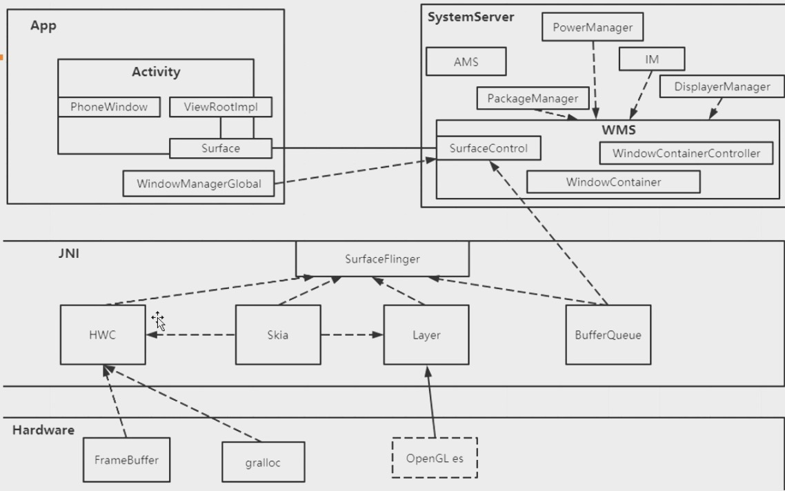

## 1、以addView()看Window相关类

- **Window**

  处理顶级窗口外观和行为策略的抽象基类，定义了顶级窗体样式和行为，提供了一套标准的UI方法，比如背景、标题区域、默认按键处理等， 唯一实现类是`[PhoneWindow](http://aospxref.com/android-12.0.0_r3/xref/frameworks/base/core/java/com/android/internal/policy/PhoneWindow.java)`，PhoneWindow 对 View 进行管理

- **ViewManager**

  定义了向Activity添加、修改、删除View的接口

```java
public void addView(View view, ViewGroup.LayoutParams params);
public void updateViewLayout(View view, ViewGroup.LayoutParams params);
public void removeView(View view);
```

- ⭐️**[WindowManager](http://aospxref.com/android-12.0.0_r3/xref/frameworks/base/core/java/android/view/WindowManager.java)**

  是一个接口，继承自`ViewManager`，`WindowManager`是外界访问`Window`的入口，对`Window`的操作通过它完成，比如通过WindowManager添加View：`mWindowManager.addView(mFloatingButton, mLayoutParams)`。WindowManager 实际管理的是 Window 中的 View ，并通过 Binder 机制来与 WindowManagerService（WMS）进行 IPC 通信，通过 WMS 来管理 Window 。

  ViewManager中定义了`LayoutParams extends ViewGroup.LayoutParams`，可通过它设置窗口的显示规则

  ```java
  
  public static class LayoutParams extends ViewGroup.LayoutParams implements Parcelable {
    public int x;  //window的x坐标
    public int y;
    /**
     * 窗口类型主要有三类：
     * 应用程序窗口（FIRST_APPLICATION_WINDOW=1～LAST_APPLICATION_WINDOW=99）:如Activity、Dialog
     * 子窗口（FIRST_SUB_WINDOW=1000～LAST_SUB_WINDOW=1999）:不能单独存在，需要附属特定的父Window，如PopupWindow,ContextMenu,OptionMenu
     * 系统窗口（FIRST_SYSTEM_WINDOW=2000 ～ LAST_SYSTEM_WINDOW=2999）：需声明权限才能创建。如Toast。< uses-permission android:name="android.permission.SYSTEM_ALERT_WINDOW"/>,Android6.0以下直接声明权限即可，Android6.0以上还需要用户打开软件设置页手动打开，才能授权
     *
     *Window是分层的，层级大的会覆盖在层级小的Window上面，对应WindowManager.LayoutParams的type参数
     */
    public int type;  
    /**
     * window属性：
     * FLAG_NOT_FOCUSABLE：表示Window不需要获取焦点，也不需要接收各种输入事件，此标记会同时启动FLAG_NOT_TOUCH_MODEL，最终事件会传递给下层的具有焦点的Window
     * FLAG_NOT_TOUCH_MODAL：表示系统会将当前Window区域以外的单击事件传递给底层的Window，而区域以内的单击事件则自己处理。一般都需要开启此标记，否则其他Window将无法收到单击事件
     * FLAG_SHOW_WHEN_LOCKED：表示Window可显示在锁屏界面
     */
    public int flags;
  }
  ```

  

- **[WindowManagerImpl](http://aospxref.com/android-12.0.0_r3/xref/frameworks/base/core/java/android/view/WindowManagerImpl.java)**

  WindowManager的实现类，它并没有实现逻辑，而是通过桥接模式，将功能委托给 WindowManagerGlobal 

  ```java
  public void addView(@NonNull View view, @NonNull ViewGroup.LayoutParams params) {
    applyTokens(params);
    //⭐️
    mGlobal.addView(view, params, mContext.getDisplayNoVerify(), mParentWindow,mContext.getUserId());
  }
  ```

- **[WindowManagerGlobal](http://aospxref.com/android-12.0.0_r3/xref/frameworks/base/core/java/android/view/WindowManagerGlobal.java)**

  一个单例，一个进程只有一个 WindowManagerGlobal 实例，负责 WindowManager 的具体功能实现。WindowManagerGlobal 中包含了 View 的添加、删除和更新的核心代码。WindowManagerGlobal 中处理 View 的添加、更新和删除，与 ViewRootImpl 密切相关。

  ```java
  public final class WindowManagerGlobal {
     private final ArrayList<View> mViews = new ArrayList<View>();
     private final ArrayList<ViewRootImpl> mRoots = new ArrayList<ViewRootImpl>();
     private final ArrayList<WindowManager.LayoutParams> mParams =
              new ArrayList<WindowManager.LayoutParams>();
      
  	 public void addView(View view, ViewGroup.LayoutParams params,
              Display display, Window parentWindow, int userId) {
          ...//给 view 设置布局参数
       ViewRootImpl root;
       View panelParentView = null;
       //创建ViewRootImpl
       root = new ViewRootImpl(view.getContext(), display);
       view.setLayoutParams(wparams);
       //将 View 、ViewRootImpl 、LayoutParams 分别保存到各自的数组中
       mViews.add(view);
       mRoots.add(root);
       mParams.add(wparams);
       //⭐️最终调用 ViewRootImpl 的 setView() --> WMS
       root.setView(view, wparams, panelParentView, userId);  
  }
  ```

- **[ViewRootImpl ](http://aospxref.com/android-12.0.0_r3/xref/frameworks/base/core/java/android/view/ViewRootImpl.java)**

  ViewRootImpl 代表的是 Android 视图层次结构的顶部，实际上就是View树的根节点的抽象，用于处理View相关的事件，比如绘制，事件分发。它是连接DecorView 和 WindowManager的纽带，也是DecorView的parent。View的三大流程（测量、布局、绘制）都是通过ViewRootImpl完成的。当Activity对象呗创建完毕之后，会将DecorView添加到Window中，同时会创建ViewRootImpl对象，并将ViewRootImpl和DecorView产生关联。

  WindowManager 通过根节点对象，来更新整个树结构上的 View 节点的内容。一个 Window 会有一个根节点，这一点我们可以通过 Android 的视图结构亦或是无障碍服务节点的树结构来证实。所以，在客户端 WindowManager 这一侧，实际上是在更新树结构；而在服务端 WMS 中的逻辑，则是管理窗口与屏幕之间的联系。

  ```java
  //ViewRootImpl
  public void setView(View view, WindowManager.LayoutParams attrs, View panelParentView, int userId) {
      ...
      //⭐️在添加到窗口管理器之前安排第一次布局，会触发ViewRootImpl.performTraversals()->调用根View的`performMeasure()`、`performLayout()`、`performDraw()`三个方法分发测量、布局、绘制事件
      // 这也是Activity View的第一次绘制
      requestLayout();
      //⭐️
      //mWindowSession 是 IwindowSession 的对象，实现类是 Session；ViewRootImpl构造方法中调用WindowManagerGlobal.getWindowSession()首先获取到WMS，然后通过WMS.openSession()打开Session
      //⭐️mWindow是ViewRootImpl内部类W类型，继承自IWindow.Stub，是App暴露给WMS的抽象实例，在ViewRootImp中实例化，与ViewRootImpl一一对应，同时也是WMS向App端发送消息的 Binder通道
  		int res = mWindowSession.addToDisplayAsUser(mWindow, mWindowAttributes,
                              getHostVisibility(), mDisplay.getDisplayId(), userId,
                              mInsetsController.getRequestedVisibility(), inputChannel, mTempInsets,
                              mTempControls);
      //重新计算并更新窗口的 Frame
      computeWindowBounds(mWindowAttributes, mInsetsController.getState(),getConfiguration().windowConfiguration.getBounds(), mTmpFrames.frame);
      // 根据 WMS 的处理结果res，WindowManager中继续计算了Frame，经过计算后通过setFrame(Rect)方法进行设置
      // ⭐️最后会调用notifyInsetsChanged()->requestLayout()->scheduleTraversals()->performTraversals()->performMeasure()、performLayout()、performDraw()绘制流程
      setFrame(mTmpFrames.frame);   
    
      // 为window的根View设置parent
      // ⭐️就是这时候设置ViewRootImpl为DecorView的parent
      view.assignParent(this);
  }
  ```

- **[IWindow](http://aospxref.com/android-12.0.0_r3/xref/frameworks/base/services/core/java/com/android/server/wm/Session.java)**

  App 端暴露给 WMS 的抽象实例，在 ViewRootImpl 中实例化，与 ViewRootImpl 一一对应，也是**WMS 调用 APP 端的通道**。

- **[Session](http://aospxref.com/android-12.0.0_r3/xref/frameworks/base/services/core/java/com/android/server/wm/Session.java)**

  Session 是`IWindowSession`，本身就是 Binder ，它持有WMS的引用，每个应用程序都会有一个 Session ，是**View RootImpl调用WMS的通道**，通过单例WindowManagerGlobal的静态方法`getWindowSession()`获取，通过 Session 跨进程调用到了 WMS 的 `addWindow()`方法，此时流程进入到系统服务端， addToDisplayAsUser 返回了 WMS 的处理结果

  ```java
  class Session extends IWindowSession.Stub implements IBinder.DeathRecipient{
  	final WindowManagerService mService;
    @Override
    public int addToDisplayAsUser(IWindow window, WindowManager.LayoutParams attrs, ...) {
      //Session直接调用WMS的addWindow()
      return mService.addWindow(this, window, attrs, ...);
    }
  }
  ```

- **[WindowManagerService](http://aospxref.com/android-12.0.0_r3/xref/frameworks/base/services/core/java/com/android/server/wm/WindowManagerService.java)**

  WindowManagerService 是系统中重要的服务，WindowManagerService 负责管理窗口的启动、添加、删除、大小和层级等；它还持有 InputManagerService 的引用来处理窗口的触摸事件；亦或是处理窗口之间切换动画。


## 2、WMS

### 2.1、WMS启动

zygote进程fork出system_server进程后，会执行[com.android.server.SystemServer](http://aospxref.com/android-12.0.0_r3/xref/frameworks/base/services/java/com/android/server/SystemServer.java)的main()方法，main方法中创建了SystemServer对象，执行其run方法，这里主要调用`startBootstrapServices()`、` startCoreServices()`、`startOtherServices()`三个方法启动一系列系统服务，WMS就是在`startOtherServices()`中启动的。

```java
//#SystemServer.java
private void startOtherServices() {
       //.....
       WindowManagerService wm = null;
       InputManagerService inputManager = null;
       //⭐️启动WMS，WMS的main方法中会new一个WindowManagerService对象
  		 wm = WindowManagerService.main(context, inputManager, !mFirstBoot, mOnlyCore, new PhoneWindowManager(), mActivityManagerService.mActivityTaskManager);
       mActivityManagerService.setWindowManager(wm);
       wm.onInitReady();
       //将WMS注册到 ServerManager里面，客户端想要使用 WMS 就需要先去 ServiceManager 中查询信息，然后与 WMS 所在的进程建立通信
       ServiceManager.addService(Context.WINDOW_SERVICE, wm, false,
       wm.displayReady(); //初始化显示信息
       wm.systemReady();  //通知 WMS 系统初始化工作已经完成
}
```

接着看看WMS的构造方法：

```java
private WindowManagerService(Context context, InputManagerService inputManager,
            boolean showBootMsgs, boolean onlyCore, WindowManagerPolicy policy,
            ActivityTaskManagerService atm, DisplayWindowSettingsProvider
            displayWindowSettingsProvider, Supplier<SurfaceControl.Transaction> transactionFactory...) {
  // 持有IMS的引用
  mInputManager = inputManager; // Must be before createDisplayContentLocked.
  // 持有WindowManagerPolicy，用来定义一个窗口测量所需要遵循的规范
  mPolicy = policy;
	// 创建WindowAnimator，用于管理所有的窗口动画
  mAnimator = new WindowAnimator(this);
  // 创建 RootWindowContainer 根窗口容器
  mRoot = new RootWindowContainer(this);
  // 持有获取 DisplayManager 服务
  mDisplayManager = (DisplayManager)context.getSystemService(Context.DISPLAY_SERVICE);
  mActivityManager = ActivityManager.getService();
  mActivityTaskManager = ActivityTaskManager.getService();
  // 将 LocalService 添加到 LocalServices 中
  LocalServices.addService(WindowManagerInternal.class, new LocalService());
}
```

WMS 的职责很多，主要的就是下面这几点：

- 窗口管理：WMS是窗口的管理者，负责窗口的启动，添加和删除，另外窗口的大小也时有 WMS 管理的，管理窗口的核心成员有 DisplayContent，WindowToken 和 WindowState
- 窗口动画：窗口间进行切换时，使用窗口动画可以更好看一些，窗口动画由 WMS 动画子系统来负责，动画的管理系统为 WindowAnimator
- 输入系统的中转站：通过对窗口触摸而产生的触摸事件，InputManagerServer(IMS) 会对触摸事件进行处理，他会寻找一个最合适的窗口来处理触摸反馈信息，WMS 是窗口的管理者，因此理所当然的就成为了输入系统的中转站。
- Surface 管理：窗口并不具备绘制的功能，因此每个窗口都需要有一个块 Surface 来供自己绘制，为每个窗口分配 Surface 是由 WMS 来完成的。


### 2.2、WMS相关的类

- **RootWindowContainer**

设备窗口层次结构的根，再 WMS 构造方法中被创建。负责管理 DisplayContent。

- **WindowState**

WMS 端的窗口令牌，与窗口一一对应，是 WMS 管理窗口的重要依据，内部保存了窗口的所有状态信息。

- **WindowToken**

WindowToken 主要有两个作用。

1. 可以理解为窗口令牌，当应用程序想要向 WMS 申请创建一个窗口，则需要向 WMS  出示有效的 WindowToken。并且窗口类型必须与所持有的 WindowToken 的类型一致。从上面的代码中可以看到，在创建系统类型窗口时不需要提供有效的 Token，WMS 会隐式的创建一个 WindowToken，看起来谁都可以添加这个系统窗口，但是在 addWindow 方法一开始就调用 mPolicy.checkAddPermission 来检查权限，她要求客户端必须拥有 INTERNAL_SYSTEM_WINDOW 或者 SYSTEM_ALERT_WINDOW 权限才可以创建系统类型窗口。
2. WindowToken 会将相同组件（例如 Activity）的窗口（WindowState）集合在一起，方便管理。至于为什么说会集合在一起，因为有些窗口时复用的同一个 token，例如 Activity 和 Dialog 就是复用的同一个 AppToken，Activity 中的 PopWindow 复用的是一个 IWindow 类型 Token，Toast 系统类型的窗口也可以看成 null，就算不是 null，WMS 也会强制创建一个隐式 token。

- **DisplayContent**

如果说 WindowToken 按照窗口之间的逻辑将其分组，那么 DisplayContent 则根据窗口的显示位置将其分组。隶属于同一个 DisplayContent 的窗口会被显示在同一个屏幕中，每一个 DisplayContent 都对应一个唯一的 ID，在添加窗口的时候通过指定这个 ID 决定将被显示在那个屏幕中。

DisplayContent 有一个隔离的概念，处于不同 DisplayContent 的两个窗口在布局，显示顺序以及动画处理上不会有任何的耦合。因此，就这几个方面来说，DisplayContent 就像是一个孤岛，所有这些操作都可以在内部执行。因此这个本来属于 WMS 全局操作的东西，变成了 DisplayContent 内部的操作了。

另外，DisplayContent 由 RootWindowContainer 来管理，再添加窗口的最开始，就会根据传入的参数获取 DisplayContent。


2、Activity的层级

Activity->PhoneWindow->DecorView->TitleView、ContentView


## 5、问答

### 1、View.invalidate()触发了哪些UI动作

​        **View的`invalidate()`方法首先会判断是否跳过绘制（可见性、是否有parent），然后调用parent的`invalidateChild()`，请求父亲绘制自己，invalidateChild() 中通过do while循环调用`invalidateChildInParent()`将绘制请求传递到View树根节点ViewRootImpl的`invalidate()`，继续调用到`performTraversals()`，该方法会调用根View的`performMeasure()`、`performLayout()`、`performDraw()`三个方法分发测量、布局、绘制事件。并不是每次都会调用performMeasure()、performLayout()，首先会判断View的位置有没有变化，如果没有就不需要测量和布局**。

​		invalidate()只会触发需要绘制的View的直系父布局树，根据flag 及Rect区域

- **View.invalidate()**

- **View.invalidateInternal() **

  首先通过`skipInvalidate()`判断是否跳过绘制：View visiblity属性是否为VISIBLE？parent是否为null?等。然后调用`ViewParent.invalidateChild(this, damage)`将绘制请求传给父亲，ViewGroup实现了ViewParent

- **[ViewGroup.invalidateChild()](http://aospxref.com/android-12.0.0_r3/xref/frameworks/base/core/java/android/view/ViewGroup.java#6061) **

  这个方法中通过do while循环调用`parent = parent.invalidateChildInParent(location, dirty)` 请求parent绘制自己并返回父亲的父亲，这将绘制请求传递给View树根节点ViewRootImpl

- **[ViewRootImpl.invalidateChildInParent()](http://aospxref.com/android-12.0.0_r3/xref/frameworks/base/core/java/android/view/ViewRootImpl.java#1817)**

- **ViewRootImpl.invalidateRectOnScreen()**

- **ViewRootImpl.scheduleTraversals()** 

  通过 mChoreographer 对象发布一个回调来运行下一帧。Choreographer  是用来协调动画，输入和绘图的时间的类。执行的 Runnable 类型是 TraversalRunnable

- **TraversalRunnable.run()**

- **ViewRootImpl.doTraversal() **移除一个消息屏障，调用performTraversals()

- **[ViewRootImpl.performTraversals()](http://aospxref.com/android-12.0.0_r3/xref/frameworks/base/core/java/android/view/ViewRootImpl.java#performTraversals)**

  调用根View的`performMeasure()`、`performLayout()`、`performDraw()`三个方法分发测量、布局、绘制事件，**并不是每次都会调用performMeasure()、performLayout()，首先会判断View的位置有没有变化，如果没有就不需要测量和布局**。下面以performMeasure()为例

- **View.measure()**

- **ViewGroup.onMeasure()**

  ViewGroup是一个接口，他的子类容器会重写`onMeasure()`方法，然后调用`measureChildxxx()`测量子控件，然后调用子控件的`measure()`，直到测量事件传递到每个叶子结点


### 2、Activity、Window、View的关系

ActivityThread.performLaunchActivity() 通过反射创建activity，然后调用activity.attach()初始化Activity，这里会为Activity创建Window（PhoneWindow），为window创建WindowManager（WindowManagerImpl）,onCreate()中又通过setContentView()解析xml加载View树，并绑定到Window中的DecorView上。

Activity表示一个页面，但并不是我们真正可见的，它主要提供了一个载体，通过生命周期方便我们编程控制页面显示。真正可见的是View，View要依附于Window显示，Window可以帮助Activity管理View，`Window`和`View`通过`ViewRootImpl`来建立联系。`Window`并**不可见**，它实际以`View`的形式存在，它是`View`的直接**管理者**。ViewRootImpl通过WindowSession和WMS通信，让WMS管理窗口的启动、添加、删除、大小和层级等，WMS通过底层SurfaceFlinger服务为窗口创建Surface，控制窗口的显示区域，以及底层绘制等。

```java
//Activity启动流程会依次调用ActivityThread的handleLaunchActivity()和handleResumeActivity()
--------------------------------------------------------------------------------------------
// ActivityThread.java
public Activity handleLaunchActivity(ActivityClientRecord r, ...) {
    // WindowManagerGlobal是一个单例，initialize初始化WMS的binder引用
    WindowManagerGlobal.initialize();
    // 启动Activity
    final Activity a = performLaunchActivity(r, customIntent);
}
private Activity performLaunchActivity(ActivityClientRecord r, Intent customIntent){
    Activity activity = null;
    try {
        // 1. 反射创建Activity
        java.lang.ClassLoader cl = appContext.getClassLoader();
        activity = mInstrumentation.newActivity(cl, component.getClassName(), r.intent);
        // 加载resource
        appContext.getResources().addLoaders(
        app.getResources().getLoaders().toArray(new ResourcesLoader[0]));
        // 2. 对activity初始化
        activity.attach(appContext, this,...);
        // 5. 执行onCreate()
        mInstrumentation.callActivityOnCreate(activity, r.state, r.persistentState);
        return activity;
    }
}
public void handleResumeActivity(ActivityClientRecord r, ...) {
    //10. 调用activity的onResume()
    performResumeActivity(r, finalStateRequest, reason)
    //11. 设置activity可见 ——>windmanager.addView(mDecor)
    r.activity.makeVisible();
}
--------------------------------------------------------------------------------------------
//Activity.java
final void attach(Context context, ActivityThread aThread,...) {
        attachBaseContext(context);
  // ⭐️3. 创建PhoneWindow
  mWindow = new PhoneWindow(this, window, activityConfigCallback);
  // ⭐️4. 为window设置WindowManager （WindowManagerImpl对象）
 mWindow.setWindowManager((WindowManager)context.getSystemService(Context.WINDOW_SERVICE),
    mToken, ...);
  mWindowManager = mWindow.getWindowManager();
}
protected void onCreate(@Nullable Bundle savedInstanceState) {
  super.onCreate(savedInstanceState);
  // 6. 设置布局文件，会调用getWindow().setContentView(layoutResID)
  setContentView(R.layout.activity_main)
}
void makeVisible() {
  if (!mWindowAdded) {
    ViewManager wm = getWindowManager();
    /**
     * ⭐️12. 将DecorView添加到WindowManager中，调用流程：
     *       WindowManagerImpl.addView()
     *       WindowManagerGlobal.addView() -> ⭐️new ViewRootImpl()
     *       ViewRootImpl.setView() -> ⭐️requestLayout() Activity第一次绘制
     *                              -> ⭐️mWindowSession.addToDisplayAsUser() 通知WMS添加Window
     *                              -> ⭐️ViewRootImpl.scheduleTraversals() 走绘制流程
     *                              -> ⭐️view.assignParent(this) 设置ViewRootImpl为DecorView的parent
     */
    wm.addView(mDecor, getWindow().getAttributes());
    mWindowAdded = true;
  }
  //设置DecorView可见
  mDecor.setVisibility(View.VISIBLE);
}
--------------------------------------------------------------------------------------------
//PhoneWindow.java
public void setContentView(int layoutResID) { 
  if (mContentParent == null) {
    //⭐️7. 初始化DecorView
    installDecor();
  } 
  //⭐️9. 解析XML布局文件，生成布局树挂在到DecorView下
  mLayoutInflater.inflate(layoutResID, mContentParent);
}
private void installDecor() {
  if (mDecor == null) {
     //8. 创建DecorView对象 ->new DecorContext(applicationContext, this)
     mDecor = generateDecor(-1);   
  }
}

```


### 3、为什么onResume()中获取不到控件的宽高（为0）？

[ActivityThread.handleResumeActivity()](http://aospxref.com/android-12.0.0_r3/xref/frameworks/base/core/java/android/app/ActivityThread.java#4785)  再调用Activity.onResume() 之后才调用makeVisible()让Activity可见，具体动作就是将DecorView添加到Window中，并设置DecorView为VISIBLE。这就意味着在onResume生命周期方法调用时，View树都没有绑定到窗口中，WMS没有返回窗口的显示位置及尺寸，更不要说View的测量了。

但是不一定都是0，当Activity已经执行过一次onResume()，然后打开了一个新的Activity后返回有会执行onResume，这时候是能获取到View宽高的 。

```java
//ActivityThread.java
public void handleResumeActivity(ActivityClientRecord r, boolean finalStateRequest,
            boolean isForward, String reason) {

  //调用onResume()
  if (!performResumeActivity(r, finalStateRequest, reason)) {return;}
   ...
  if (r.activity.mVisibleFromClient) {
    //之后才让activity可见
    r.activity.makeVisible();
  }
}

//Activity.java
void makeVisible() {
  if (!mWindowAdded) {
    ViewManager wm = getWindowManager();
    //⭐️ onResume()之后才把DecorView添加到Window中
    wm.addView(mDecor, getWindow().getAttributes());
    mWindowAdded = true;
  }
  mDecor.setVisibility(View.VISIBLE);
}

```


### 4、可以在子线程中设置UI吗？

- **invalidate() &postInvalidate()**：postInvalidate()可以在子线程中刷新UI

- **在onCreate()方法中可以在子线程设置UI，比如`textView.setText(xxx)`，这不会crash。原因是在onCreate()中设置UI并不会触发`invalidate()`刷新流程**，`invalidate()`流程会调用到[ViewGroup.invalidateChild()](http://aospxref.com/android-12.0.0_r3/xref/frameworks/base/core/java/android/view/ViewGroup.java#6061)，这个方法里面会dowhile循环执行`parent.invalidateChildInParent()`直到将刷新请求传递到[ViewRootImpl.invalidateChildInParent()](http://aospxref.com/android-12.0.0_r3/xref/frameworks/base/core/java/android/view/ViewRootImpl.java#1817)。

  ```java
  //ViewGroup.java
  public final void invalidateChild(View child, final Rect dirty) {
      ViewParent parent = this;
      do {
         parent = parent.invalidateChildInParent(location, dirty);
      } while (parent != null);
  }
  ```

  但此时ViewRootImpl没有创建，DecorView的parent为null，事件传递到DecorView就结束了，所以onResume()之前并不会真的刷新UI，不会执行到[ViewRootImpl.checkThread()](http://aospxref.com/android-12.0.0_r3/xref/frameworks/base/core/java/android/view/ViewRootImpl.java#9310)

  > DecorView在被添加到Window中的时候才会初始化parent，activity在onResume之后makeVisible()时才调用wm.addView(mDecor) --> WindowManagerGlobal.addView()方法中才创建ViewRootImpl（继承自ViewParent）对象），然后调用**ViewRootImpl.setView()**方法里面才调用`view.assignParent(this)`将DecorView的mParent设置为当前ViewRootImpl。

  ```java
  //ViewRootImpl.java
  public ViewParent invalidateChildInParent(int[] location, Rect dirty) {
    //检查是否在子线程更新了UI，抛异常
     checkThread();
     ...
  }
  void checkThread() {
     if (mThread != Thread.currentThread()) {
          throw new CalledFromWrongThreadException(
               "Only the original thread that created a view hierarchy can touch its views.");
     }
  }
  ```


### 5、View的绘制过程都是用的同一个canvas吗？

View的三大流程（测量、布局、绘制）都是通过ViewRootImpl完成的，ViewRootImpl中有`performMeasure()`、`performLayout()`、[performDraw()](http://aospxref.com/android-12.0.0_r3/xref/frameworks/base/core/java/android/view/ViewRootImpl.java#4128)三个方法分发测量、布局、绘制事件

- [ViewRootImpl.performDraw()](http://aospxref.com/android-12.0.0_r3/xref/frameworks/base/core/java/android/view/ViewRootImpl.java#4146)

- [ViewRootImpl.draw()](http://aospxref.com/android-12.0.0_r3/xref/frameworks/base/core/java/android/view/ViewRootImpl.java#4446)

- [ViewRootImpl.drawSoftware()](http://aospxref.com/android-12.0.0_r3/xref/frameworks/base/core/java/android/view/ViewRootImpl.java#4463)

  ```java
  private boolean drawSoftware(Surface surface, AttachInfo attachInfo, int xoff, int yoff,
              boolean scalingRequired, Rect dirty, Rect surfaceInsets) {
      // Draw with software renderer.
      final Canvas canvas;
      //先要锁住，整个app所有的canvas都来自同一个surface
      canvas = mSurface.lockCanvas(dirty);
      //分发绘制，将canvas传入
      mView.draw(canvas);
      //
      surface.unlockCanvasAndPost(canvas);
  }
  ```

  


