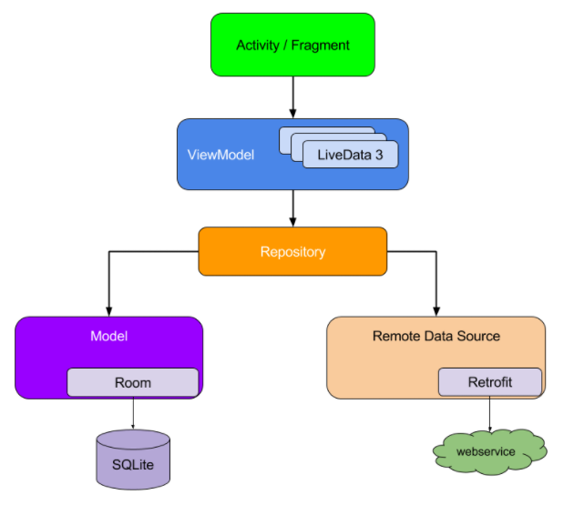

https://guolin.blog.csdn.net/article/details/109787732


[Android 中的依赖项注入](https://developer.android.google.cn/training/dependency-injection)


# 1. 依赖注入

## 1.1 什么是依赖项注入？

面向对象的程序中一个类通常会引用其他类，这些被引用的类称为依赖项。比如下面代码中，汽车Car类依赖于引擎Engine类的实例：

```Kotlin
class Car {
    //Car依赖一个Engine的实例
    val engine = Engine()
    fun run() {
        engine.start()
        println("嘀嘀嘀...汽车行驶中...")
        engine.stop()
    }
}
class Engine {
    fun start() = println("引擎启动了...")
    fun stop() = println("引擎熄火了...")
}
fun main() {
    val car = Car()
    car.run()
}

//运行结果：

引擎启动了...
嘀嘀嘀...汽车行驶中...
引擎熄火了...
```

上面的示例中，Car依赖Engine类，并且在Car内部创建了Engine实例，这就叫主动控制依赖，主动控制依赖会带来一系列问题，下面会讲到。要对类的成员（依赖项）进行初始化，除了让Car类主动初始化，另一种就是在Car外部构建依赖项，然后赋值给engine变量（通过**构造函数注入**或者**setter注入**），这样对于Car来说，Engine确实不是它自己创建的，但是它不用管是谁创建的，这就是控制反转（IoC），将依赖项的初始化交给别人，而不是主动控制。对于初始化Engine实例并赋值给Car中的engine变量的程序来说就是依赖项注入（为Car注入依赖项Engine实例）：

```Kotlin
class Car {
    lateinit var engine : Engine
    fun run() {
        engine.start()
        println("嘀嘀嘀...汽车行驶中...")
        engine.stop()
    }
}
class Engine {
    fun start() = println("引擎启动了...")
    fun stop() = println("引擎熄火了...")
}
fun main() {
    val car = Car()
    //在main方法中初始化Engine实例，并通过setter注入给Car
    car.engine = Engine()
    car.run()
}
```

## 1.2 为什么要使用依赖注入？

对于Car来说，它依赖于Engine才能跑起来，如果不使用依赖注入（上面第一份代码），这就造成了两个类的**强耦合**。很早以前，汽车引擎默认为燃气发动机`GasEngine`，现在新能源汽车出现了，我们需要为Car换上电引擎`ElectricEngine`，应该怎么办？

```Kotlin
class Car {
    //主动初始化依赖项，如果依赖项发生变化，需要修改代码
    var engine = ElectricEngine()
    ...
}
```

可以看出，Car和Engine密切相关，Car的实例依赖一种类型的Engine，并且无法自由的使用子类或者代替类实现。如果现在既有燃气汽车，又有新能源汽车和混动汽车，就需要创建三个Car类。但是如果使用依赖注入，情况就有所转变了：

```Kotlin
interface Engine{
    fun start()
    fun stop()
}
class GasEngine : Engine{
    override fun start() = println("汽油引擎启动了...")
    override fun stop() = println("汽油引擎熄火了...")
}
class ElectricEngine : Engine{
    override fun start() = println("电引擎启动了...")
    override fun stop() = println("电引擎熄火了...")
}
class Car(val engine:Engine) {
    fun run() {
        engine.start()
        println("嘀嘀嘀...汽车行驶中...")
        engine.stop()
    }
}
fun main() {
    //汽油车跑起来
    var car = Car(GasEngine())  //构造函数注入依赖项
    car.run()
    //新能源跑起来
    println("------------------------------")
    car = Car(ElectricEngine())  //构造函数注入依赖项
    car.run()
}
```

通过依赖注入，可以将不同的Engine实例传入Car，达到**重用Car**的目的。而且对于上面的测试程序，我们可以很**轻松的测试Car类**，而不用去修改Car的代码就能测试不同的场景（不同的引擎）。

**总结：**依赖注入最大的好处是实现类的解耦，从而达到代码重用、易于重构、方便测试的目的。并且依赖注入更加符合面向对象编程的思想和开闭原则（对象应该对于扩展开放，对修改封闭，这意味实体类允许在不改变它的源代码的前提下变更它的行为）

## 1.3 为什么要使用依赖注入框架？

在上述示例中，我们自行创建依赖项并管理这些依赖项，这称为手动依赖项注入。示例中的Car只有一个依赖项Engine，现在需求变了，需要对Car进行丰富，为它添加司机、轮胎等：

```Kotlin
//轮胎
class Tyre(val name:String){}
//司机
class Driver(val name:String){}
class Car(val engine:Engine,
    val tyre:Tyre,
    val driver:Driver) {
    fun run() {
        engine.start()
        println("嘀嘀嘀...${driver.name}驾驶着装有${tyre.name}的汽车行驶中...")
        engine.stop()
    }
}
fun main() {
	//手动依赖注入Card的依赖项
    var car = Car(GasEngine(), Tyre("真空轮胎"), Driver("openXu"))
    car.run()
}

//运行结果：

汽油引擎启动了...
嘀嘀嘀...openXu驾驶着装有真空轮胎的汽车行驶中...
汽油引擎熄火了...
```

随着Car的依赖项增多，我们手动创建并注入依赖项就会越繁琐；而且在多层架构中，要创建一个顶层对象，必须手动提供其下层所有的依赖项。如下所示，为了创建一个Car对象，需要创建它的一级依赖项(Engine、Tyre、Driver...)，而一级依赖项又依赖二级依赖项（Spark、Hub、Clothe...），随着依赖层次的增加，会发现手动创建对象变得非常困难；而且随着类的增多会使得依赖关系图变得复杂不可维护。

```xml
Car
 |--Engine
 |     |--Spark(火花塞)
 |     |--...
 |
 |--Tyre
 |    |--Hub(轮毂)
 |    |--...
 |
 |--Driver
 |    |--Clothe(衣服)
 |    |--...
 |--...
```

不仅如此，在Android开发中，我们手动创建依赖项后可能还需要管理这些依赖项的生命周期，这样更加使得依赖注入无法实施。所以自动依赖注入的框架就出现了，自动依赖框架可以帮我们完成如下工作：

- 在合适的时机自动构建依赖项实例
- 为需要注入依赖项的对象自动注入依赖项
- 维护管理内存中依赖项的生命周期
- 维护依赖关系图

有了依赖注入框架，我们需要做的工作就是，告诉框架：

- 哪些类需要注入依赖项
- 哪些依赖项需要注入
- 怎样构建依赖项实例

至于什么时候构建实例化依赖项、怎样将依赖项注入、维护依赖关系以及销毁依赖项等工作都由依赖注入框架帮我们完成了。


## 1.4 Dagger和Hilt的关系

[Dagger](https://github.com/square/dagger)译为“匕首”，是Square公司(开源了OkHttp、Retrofit等)开源的的一个依赖注入框架，正如译义，像匕首一样将被依赖的对象实例插入到需要它的地方。它是基于Java反射实现的，所以也继承了反射带来的诸多开发和性能问题：

- 在运行时通过反射连接依赖项，反射会降低程序的运行效率
- Dagger上手门槛非常高，基于反射的实现使得在编译期无法得知编码是否正确，只能通过运行时是否崩溃判断。由于使用太灵活，出现问题后排查非常困难

正是由于Dagger的这些问题导致它并没有被大量使用，尽管它是一个非常强大灵活优秀的依赖注入框架。后来Google Fork了Dagger的源码，对其进行改造并发布了[Dagger2](https://github.com/google/dagger)，Square也觉得Dagger2的优化非常成功，所以放弃维护Dagger1，并推荐使用Dagger2。

Google的Dagger2是基于Java注解实现的，从而解决了反射的弊端。通过注解，在编译期自动生成连接依赖项的代码，避免了运行时的反射，而且Dagger2会在编译期对编码进行检查，如果对框架使用不正确则会直接编译失败，降低了错误排查难度。

Dagger2在易用性方面得到了海外开发者广泛认可，从而迅速的得到了广泛的使用。尽管Dagger2在海外非常受欢迎，但是其复杂度也是非常高的，如果没有很好的掌握它就去盲目使用反而会拖累你的开发。可能是因为国内外开发者研究技术栈的侧重点不同，Dagger2在国内并没有得到很好的应用。

由于Dagger2的上手门槛太高，Android开发者迫切的希望Google能够提供一个更加易用的依赖注入框架，所以Google在20年发布了[Hilt](https://developer.android.google.cn/jetpack/androidx/releases/hilt)，将它作为Jetpack家族的一员。Hilt是基于Dagger2的，是一个专门面向Android开发的一个依赖注入框架，它是Dagger2在Android开发中的场景化(结合了Android组件的独有的生命周期，确保在正确的节点创建并注入对象)，Hilt译为“刀柄”，可以猜测Hilt是为了隐藏Dagger的锋利（避免Android开发者使用不好Dagger而误伤自己），专为Android开发者打造的一个简单易用的依赖注入框架。
                                                                                                                                                                                                                                                                                                                                                                                                                                                                                                                                                                                                                                                                                                                                                                                                                                                                                                                                                                                                                                                                                                                                                                                                                                                                                                                                                                                                                                                                                                                                                                                                                                                                                                                                                                                                                                                                                                                                                                                                                                                                                                                                                                                                                                                                                                                                                                                                                                                                                                                                                                                                                                                                                                                                                                                                                                                                                                                                                                                                                                                                                                                                                                                                                                                                                                                                                                                                                                                                                                                                                                                                                                                                                                                                                                                                                                                                                                                                                                                                                                                                                                                                                                                                                                                                                                                                                                                                                                                                                                                                                                                                                                                                                                                                                                                                                                                                                                                                                                                                                                                                                                                                                                                                                                                                                                                                                                                                                                                                                                                                                                                                                                                                                                                                                                                                                                                                                                                                                                                                                                                                                                                                                                                                                                                                                                                                                                                                                                                                                                                                                                                                                                                                                                                                                                                                                                                                                                                                                                                                                                                                                                                                                                                                                                                                                                                                                                                                                                                                                                                                                                                                                                                                                                                                                                                                                                                                                                                                                                                                                                                                                                                                                                                                                                                                                                                                                                                                                                                                                                                                                                                                                                                                                                                                                                                                                                                                                                                                                                                                                                                                                                                                                                                                                                                                                                                                                                                                                                                                                                                                                                                                                                                                                                                                                                                                                                                                                                                                                                                                                                                                                                                                                                                                                                                                                                                                                                                                                                                                                                                                                                                                                                                                                                                                                                                                                                                                                                                                                                                                                                                                                                                                                                                                                                                                                                                                                                                                                                                                                                                                                                                                                                                                                                                                                                                                                                                                                                                                                                                                                                                                                                                                                                                                                                                                                                                                                                                                                                                                                                                                                                                                                                                                                                                                                                                                                                                                                                                                                                                                                                                                                                                                                                                                                                                                                                                                                                                                                                                                                                                                                                                                                                                                                                                                                                                                                                                                                                                                                                                                                                                                                                                                                                                                                                                                                                                                                                                                                                                                                                                                                                                                                                                                                                                                                                                                                                                                                                                                                                                                                                                                                                                                                                                                                                                                                                                                                                                                                                                                                                                                                                                                                                                                                                                                                                                                                                                                                                                                                                                                                                                                                                                                                                                                                                                                                                                                                                                                                                                                                                                                                                                                                                                                                                                                                                                                                                                                                                                                                                                                                                                                                                                                                                                                                                                                                                                                                                                                                                                                                                                                                                                                                                                                                                                                                                                                                                                                                                                                                                                                                                                                                                                                                                                                                                                                                                                                                                                                                                                                                                                                                                                                                                                                                                                                                                                                                                                                                                                                                                                                                                                                                                                                                                                                                                                                                                                                                                                                                                                                                                                                                                                                                                                                                                                                                                                                                                                                                                                                                                                                                                                                                                                                                                                                                                                                                                                                                                                                                                                                                                                                                                                                                                                                                                                                                                                                                                                                                                                                                                                                                                                                                                                                                                                                                                                                                                                                                                                                                                                                                                                                                                                                                                                                                                                                                                                                                                                                                                                                                                                                                                                                                                                                                                                                                                                                                                                                                                                                                                                                                                                                                                                                                                                                                                                                                                                                                                                                                                                                                                                                                                                                                                                                                                                                                                                                                                                                                                                                                                                                                                                                                                                                                                                                                                                                                                                                                                                                                                                                                                                                                                                                                                                                                                                                                                                                                                                                                                                                                                                                                                                                                                                                                                                                                                                                                                                                                                                                                                                                                                                                                                                                                                                                                                                                                                                                                                                                                                                                                                                                                                                                                                                                                                                                                                                                                                                                                                                                                                                                                                                                                                                                                                                        

# 手动依赖项注入

上个部分我们对依赖注入有了一个基本的了解，至少知道依赖注入是为了解决两个类的依赖关联(耦合)问题的，那问题来了，在Android开发场景中，有哪些地方可以使用依赖注入呢？其实可以使用依赖注入的地方非常多，可以说只要两个有依赖关系的类都可以使用依赖注入。

Android Jetpack的Architecture(架构组件)推荐我们使用MVVM模式进行开发，而且Hilt也被作为Jetpack的一员，可以说它们搭配是再合适不过了。MVVM就是将代码划分为多个类，不同的类关注点不一样，承载的功能也不同，但是一个完整的业务或者说一个页面的实现需要多个小的类相互连接配合，这就形成了类之间的依赖关系。




# 使用Hilt实现依赖注入


# 多模块应用中使用Hilt


# Hilt怎么用？

## 1. 简单入门

### 1.1 依赖关系

`TestActivity`中依赖一个`User`变量，按照传统的做法，我们应该使用new调用构造方法创建一个User对象:

```Kotlin
data class User (var age:Int=28 , var name:String="openXu") {
}

class TestActivity : AppCompatActivity() {

    lateinit var binding : ActivityTestBinding

    //主动创建被依赖的对象
    var user : User = User(28,"openXu")

    override fun onCreate(savedInstanceState: Bundle?) {
        super.onCreate(savedInstanceState)
        binding = ActivityTestBinding.inflate(layoutInflater)
//        binding = DataBindingUtil.setContentView<ActivityDetailBinding>(this, R.layout.activity_detail)
        binding.apply {
            lifecycleOwner = this@TestActivity
        }
        setContentView(binding.root)

        binding.user = user
    }
}
```

### 1.2 被依赖的对象

为了使用Hilt依赖注入达到控制反转(IOC)的目的（将对象的控制权交给Hilt框架），为`user`变量加上`@Inject`注解，不要初始化对象，表示`user`变量在需要被使用时，将由依赖注入框架构建并初始化它:

```Kotlin
@Inject lateinit var user : User
```

### 1.3 怎样构建实例对象

程序在需要使用`user`对象在时，Hilt框架应该怎样去构建一个`User`实例呢？所以，我们要告诉它怎样创建对象，构建对象最简单的办法就是调用构造方法，所以在User的构造方法上也加上`@Inject`注解，表示如果需要构建User实例时，Hilt会调用被Inject注解标注的构造方法来创建对象然后注入给`user`变量：

```Kotlin
data class User @Inject constructor (var age:Int=28 , var name:String="openXu") {
}
```

上面的写法会报错，因为User主构造函数的参数都有默认值，这样会自动生成一个无参构造函数，类被编译后，无参构造函数也会自动被打上`@Inject`注解，编译不会通过，因为Hilt不知道到底使用哪个构造函数构建对象（一个类只能有一个构造方法被`@Inject`标记），所以我们把默认值去掉：

```Kotlin
data class User @Inject constructor (var age:Int , var name:String) {
}
```

运行还是不通过，虽然User只有一个构造方法被标记了，但是Hilt在调用该构造方法时应该传什么参数呢？所以这时候，User又依赖age和name两个对象，我们同样需要告诉Hilt当构造User实例时要使用的age和name应该怎样构造，这样就是嵌套依赖了，先不要搞这么复杂。我们换一种写法：

```Kotlin
data class User (var age:Int , var name:String ) {
    @Inject constructor():this(28, "openXu")
}
```

这样总归没问题了吧？当`TestActivity`中需要用到被`@Inject`标记的`user`对象时，Hilt就会尝试去调用被`@Inject`标记的无参次构造函数，次构造方法又会委托给主构造函数，并传入默认参数值，这样就能创建一个User的实例，然后注入给user对象。

### 1.4 谁需要注入依赖，在什么时候注入？

通过上面的配置，Hilt知道了哪些对象是需要被注入的，也知道了怎样去构建对象实例，运行之后，报错：`kotlin.UninitializedPropertyAccessException: lateinit property user has not been initialized`。该有的两方面都有了，怎么还报错呢？这个错误的意思user对象没有被初始化，也就是说注入失败了。原因是还需要告诉Hilt哪些类中使用了依赖注入，这样方便Hilt去扫描从而生成一些代码。请认真理解下方注释：

```Kotlin
/**
 * AndroidEntryPoint注解用于标记一个Android组件类，该类将被设置为使用标准的Hilt-Dagger Android组件进行注入。
 * 目前，它支持activities, fragments, views, services, and broadcast receivers
 *
 * 这个注解将生成一个基类"Hilt_<annotated class name>"，被注释的类会扩展这个基类，这个基类负责将成员注入到Android类中，
 * 并且会在正确的生命周期点（比如Activity的onCreate()方法）实例化被依赖的对象。所以说Hilt是Dagger在Android平台的一种场景，它考虑到了Android生命周期
 */
@AndroidEntryPoint
class TestActivity : AppCompatActivity() {
	@Inject lateinit var user : User
	...
}
```

不仅如此，还需要为`Application`打上`@HiltAndroidApp`注解，`HiltAndroidApp`注解和`AndroidEntryPoint`的用法是类似的，但是`HiltAndroidApp`只用于标记`Application`，表示所有组件的入口点。

```Kotlin
@HiltAndroidApp
class PokedexApp : Application()
```


