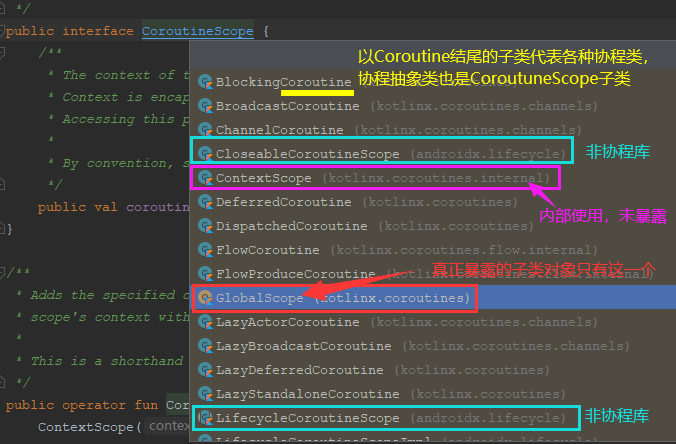

> 版权声明：本文为openXu原创文章[【openXu的博客】](http://blog.csdn.net/xmxkf)，未经博主允许不得以任何形式转载

[kotlin协程硬核解读(2. 协程基础使用&源码浅析)](https://openxu.blog.csdn.net/article/details/116999821)

@[toc]

上一篇文章我们使用Retrofit+协程的示例初步体验了协程的魅力，并解释了kotlin协程为什么会出现。这篇文章我们了解一些协程的相关概念和kotlin协程库提供的API，文章中可能会对相关类进行一些原理的讲解，如果大家看不明白也没关系，因为后面几篇文章会深入源码讲解相关原理，到时候再回头看这里就明白了。而这篇文章的目的是学会协程库相关API使用。文章内容可能比较多比较杂，大家可以只看一些简单的部分，学会简单的使用协程，当遇到问题时根据大纲定位到相应内容再深入了解。

**本文关于源码解读相关的内容如果看不懂的话建议先搁置，先阅读后两篇文章后在反过头看这里。**

# 1. 依赖

[kotlin协程源码(kotlinx.coroutines)](https://github.com/hltj/kotlinx.coroutines-cn)，如果是在纯Java或者Kotlin项目中使用协程，需要添加对`kotlinx-coroutines-core`模块的依赖，很明显它是kotlin协程核心实现库：

```xml
//根build.gradle
buildscript {
    //指定kotlin版本，通常使用最新版本
    ext.kotlin_version = "1.4.20"
}
allprojects {
    repositories {
        jcenter()   //确保jcenter()或mavenCentral()位于存储库列表中
    }
}

//module build.gradle
dependencies {
    implementation 'org.jetbrains.kotlinx:kotlinx-coroutines-core:1.4.2'
}
```

如果需要在具体平台使用，还需要引入平台库，比如在Android上，通常还需要引入[kotlinx-coroutines-android](https://github.com/hltj/kotlinx.coroutines-cn/blob/master/ui/coroutines-guide-ui.md)，它是协程针对Android提供的特有的支持，提供了适应Android应用程序的API（就像RxJava和RxAndroid的关系），其`Dispatchers.Main` 为Android应用程序提供上下文：

```xml
def kotlin_coroutines = '1.4.2'  
implementation 'org.jetbrains.kotlinx:kotlinx-coroutines-android:${kotlin_coroutines}'
//kotlinx-coroutines-android依赖了kotlinx-coroutines-core
//implementation 'org.jetbrains.kotlinx:kotlinx-coroutines-core:${kotlin_coroutines}'

```

**注意：**`kotlinx-coroutines-core`包含协程正常运行不需要的资源文件，这些文件仅由调试器使用，在Android开发生成apk时可通过gradle配置在不损失功能的情况下避免apk中包含这些文件：

```xml
android {
    packagingOptions {
        exclude "DebugProbesKt.bin"
    }
}
```

# 2. 相关概念及术语

**协程**

协程是可挂起计算的实例，它需要一个代码块(挂起lambda表达式)运行，并具有类似的生命周期（可以被创建、启动和取消），它不绑定到任何特定的线程，可以在一个线程中挂起其执行，并在另一个线程中恢复，它在完结时可能伴随着某种结果（值或异常）。

在Kotlin协程库中，所有的协程都是抽象类`kotlinx.coroutines.AbstractCoroutine`的子类，在使用协程编写代码时，我们不会接触到该类，因为根本不需要我们关心协程是怎样执行、怎样调度的。我们需要做的就是告诉协程库，我需要开启协程了、我要在哪个线程中执行挂起函数、我需要在什么时候取消协程，Kotlin协程库为我们暴露了协程上下文`CoroutineContext`、协程作用域`CoroutineScope`、协程工作`Job`来完成这些工作，这三个类就是协程库暴露给我们的API，了解这3个类就能玩转协程绝大部分的使用场景。

**协程构建器**

使用一些“挂起lambda表达式”作为参数来创建一个协程的函数称为协程构建器，并且可选地，还提供某种形式以访问协程的结果。kotlin协程库提供了几个构建器如`launch{}`、`async{}`等用于构建协程

**挂起函数**

使用`suspend`修饰符标记的函数。它可能会通过调用其他挂起函数挂起执行代码，而不阻塞当前执行线程。挂起函数不能在常规代码中被调用，只能在其他挂起函数或挂起lambda表达式中。标准库提供了原始的挂起函数，用于定义其他所有挂起函数。协程之所以能用同步的方式编写异步代码，正是由于挂起函数的**非阻塞挂起**，说的通俗一点，协程在调用到挂起函数时，会挂起当前状态，让当前线程去做别的事情，而挂起函数通常（但不一定）会切到别的线程执行，当挂起函数执行完毕会将结果值或者异常对象带到当前线程，恢复当前线程的状态让它继续执行协程中的代码

**挂起函数类型**

表示挂起函数以及挂起lambda表达式的函数类型。它就像一个普通的函数类型，但具有suspend修饰符。举个例子，`suspend () -> Int`是一个没有参数、返回Int的挂起函数的函数类型。一个声明为`suspend fun foo() : Int` 的挂起函数符合上述函数类型。launch()函数接受一个挂起函数类型的参数block

```kotlin
public fun CoroutineScope.launch(
    context: CoroutineContext = EmptyCoroutineContext,
    start: CoroutineStart = CoroutineStart.DEFAULT,
    block: suspend CoroutineScope.() -> Unit   //接受一个 挂起函数类型 作为参数
): Job {
	...
}
```

**挂起lambda表达式**

如果函数的最后一个参数是函数类型，调用该函数时需要传入一个函数类型实例，由于函数最后一个参数是函数类型或者函数接口，调用它时可以将函数类型实例写在方法体外，这就是普通的普通的lambda表达式。挂起lambda表达式与普通lambda表达式在形式上是一样的，不同的是它的函数类型被`suspend`修饰符标记。就像常规lambda表达式是匿名局部函数的短语法形式一样，**挂起lambda表达式是匿名挂起函数的短语法形式**。我们可以在挂起lambda表达式中调用其他挂起函数挂起执行代码，而不阻塞当前执行线程。

> 你可能在上一篇文章或者其他文章中有看到这样的描述：创建协程时{}括起来的就是协程，这其实是不准确的，{}括起来的实际上是一个**匿名挂起函数**，它作为实参传给launch函数，这个函数中封装了协程需要执行的所有代码。由于它是一个挂起函数，所以我们可以在它的{}中调用其他挂起函数。

```kotlin
    /**
     * launch()函数接受一个挂起函数类型作为参数，在调用lacunch函数是使用lambda表达式的形式
     * 由于这个lambda表达式对应的函数类型是挂起函数类型，所以称这个lambda表达式为挂起lambda表达式
     */
    GlobalScope.launch {   //挂起lambda表达式
        //调用其他挂起函数
    }
```

**挂起作用域**

挂起作用域是指挂起函数的函数体之内的区域，通俗的讲就是挂起函数的{}括起来的区域就是挂起作用域。只有在这个区域内才能调用挂起函数。如下：

```kotlin
    GlobalScope.launch {   //launch()接受一个挂起函数类型作为参数，所以lambda表达式{}里面就是挂起作用域
        //挂起作用域
    }

    //挂起函数
    suspend fun mySuspendFun() : Int = withContext(Dispatchers.IO){
        //挂起作用域
    }
```


**挂起点**

协程执行过程中可能被挂起的位置，从语法上说，挂起点是对一个挂起函数的调用，但实际的挂起在挂起函数调用了标准库中的原始挂起函数时发生。挂起的原理是函数return了一个特殊的`COROUTINE_SUSPENDED`标志，这个会在下篇文章中详细讲解。

**续体**

是挂起的协程在挂起点时的状态，它在概念上表示在挂起点之后的剩余应执行的代码。已经创建，但尚未启动的协程，由它的初始续体表示，这由它的整个执行组成，类型为`Continuation`

# 3. 协程构建器

如果要调用挂起函数，首先得通过协程构建器构建协程，因为挂起函数的调用源头只能是协程代码块中。标准库提供了用于在常规非挂起作用域中启动协程执行的函数，这些函数称为协程构建器。在点击查看`GlobalScope.launch()`函数源码时，发现这个函数定义在`kotlinx.coroutines.Builders.common.kt`文件中，定位发现它编译后的class文件为`kotlinx.coroutines.BuildersKt.class`

> 为什么源文件和class文件的名称不同？因为kotlin允许直接在文件中定义函数，这些函数称为顶层函数，但是kotlin源文件最终会被编译为class文件，这些顶层函数应该被放在哪个class文件中？在`Builders.common.kt`文件最上方发现了`@file:JvmName("BuildersKt")`注解，表示这个源文件中的file成员会被编译到名为`BuildersKt`的class文件中

`BuildersKt.class`内容如下：

```java
package kotlinx.coroutines

public fun <T> runBlocking(context: kotlin.coroutines.CoroutineContext /* = compiled code */, block: suspend kotlinx.coroutines.CoroutineScope.() -> T): T { contract { /* compiled contract */ }; /* compiled code */ }
...

public suspend fun <T> withContext(context: kotlin.coroutines.CoroutineContext, block: suspend kotlinx.coroutines.CoroutineScope.() -> T): T { contract { };}

public fun <T> kotlinx.coroutines.CoroutineScope.async(context: kotlin.coroutines.CoroutineContext , start: kotlinx.coroutines.CoroutineStart, block: suspend kotlinx.coroutines.CoroutineScope.() -> T): kotlinx.coroutines.Deferred<T> { }

public suspend inline operator fun <T> kotlinx.coroutines.CoroutineDispatcher.invoke(noinline block: suspend kotlinx.coroutines.CoroutineScope.() -> T): T {  }

public fun kotlinx.coroutines.CoroutineScope.launch(context: kotlin.coroutines.CoroutineContext , start: kotlinx.coroutines.CoroutineStart , block: suspend kotlinx.coroutines.CoroutineScope.() -> kotlin.Unit): kotlinx.coroutines.Job { }
```

从类名BuildersKt可以看出这是协程的构建器对应的类，一共有5个函数，都可以用来构建一个新的协程，其中`runBlocking()`、`withContext()`是顶层函数，这两个函数可以直接调用(不需要创建对象)，但是`withContext`是一个suspend挂起函数，它只能在协程或其他挂起函数中调用(必须先有协程)。`invoke`函数是`CoroutineDispatcher(协程调度器)`的扩展，它也是一个suspend函数，同样也是需要先有协程。`launch()`和`async()`是`CoroutineScope`接口的扩展函数，需要使用`CoroutineScope`的实例对象调用。

> 注意：所有的构建器其实都是函数，下面的讲解中可能会出现如`launch()`或者`launch{}`的形式其实都是指launch()函数的构建器。只是不同的语言场景表现形式不一样罢了，如果把它当成构建器偏向于写成`launch{}`的形式，将它描述为函数是将写为`launch()`

综上，如果要在非挂起作用域中启动协程，有3种构建器：

## 3.1 runBlocking{}

```kotlin
fun main() {
    // 使用runBlocking顶层函数创建协程
    runBlocking {
        ...
    }
}
```

`runBlocking(context: CoroutineContext = EmptyCoroutineContext, block: suspend CoroutineScope.() -> T)`函数是一个顶层函数（直接定义在`Builders.kt`文件中），它接受两个参数，第一个参数是`CoroutineContext`协程上下文，被赋予默认值`EmptyCoroutineContext`，所以调用它时通常只需要传第二个参数。

这个函数创建的协程**会阻塞当前线程**，直到协程代码块执行完毕，所以**通常用于main函数或者其他测试用例中**

> 因为在main函数中启动一个协程去执行耗时任务，如果不阻塞main函数的线程，main函数执行完jvm就退出了，为了避免jvm退出，通常在最后需要`Thread.sleep(Long.MAX_VALUE)`让主线程休眠来等待协程执行完毕。但是如果使用`runBlocking{}`创建协程就不会出现jvm提前退出的问题

## 3.2 launch{}

```kotlin
//使用GlobalScope单例对象调用launch
fun main() {
    val job = GlobalScope.launch {
        //调用其他挂起函数
        for(i in 1..5){
            delay(1000)   //每隔1s打印一个数字
            println("--->$i")
        }
    }

    Timer().schedule(object:TimerTask(){
        override fun run() {
            println("-----------------------------3s时间到----------------------------")
            println("协程是否活动？${job.isActive}")          //true
            println("协程是否执行完毕？${job.isCompleted}")   //false
            println("协程是否取消？${job.isCancelled}")       //false
            job.cancel("中途取消协程，生命周期结束")
            println("协程是否活动？${job.isActive}")          //false
            println("协程是否执行完毕？${job.isCompleted}")   //false
            println("协程是否取消？${job.isCancelled}")      //true
        }
    }, 3000)   //3s后结束协程
    Thread.sleep(100000)  //阻止jvm退出
}
```

`launch()`函数在不阻塞当前线程的情况下启动新的协程，并将对协程的引用作为`Job`返回，可以通过调用`Job.cancel()`取消协程。

> 需要注意的是通过`GlobalScope`创建的协程是全局范围的协程，**是顶层协程，其生命周期与应用程序同步**。也就是说即便协程执行完毕，但是应用程序没有关闭，协程还是会继续运行着，如果我们不停的创建很多顶层协程，虽然它是轻量级的但仍然会消耗一些内存资源，所以如果要创建顶层协程，**通常需要手动保持`Job`引用，在合适的时机调用`job.cancel()`退出这些协程**。

## 3.3 async{}

```kotlin
// 使用 GlobalScope单例对象调用async
fun main() {
    GlobalScope.async {
        //调用其他挂起函数
        delay(1000)
        println("GlobalScope.async")
    }
}
```

`async{}`和`launch{}`是差不多的，默认情况下，创建的协程都会立即执行，不同的是这两个函数返回类型不同，`launch`返回的是Job，可以通过Job取消协程，而`async`返回的是`Deferred`类型，`Deferred`是`Job`的子类，所以同样可以cancel协程，但是它是一个有结果的Job，也就是说`async{}`可以返回一个值，这个值将保存在`Deferred`中，可以调用`Deferred.await()`获取协程的返回值，而**`await()`是一个挂起函数，只能在挂起作用域内调用，所以通常不用`async{}`来创建最外层的协程**，因为非挂起作用域无法调用`await()`函数获取协程的返回值，所以返回值没有意义，这样的话async()的返回值Deferred就是普通的Job，所以完全可以使用launch{}代替async{}

**async{}通常用于在挂起作用域中构建并发的子协程**，这些子协程作业将并发执行，但是可以等待并发协程都返回数据后，合并处理结果，这种需求在开发中是非常常见的：

```kotlin
fun main() {
    val job = GlobalScope.launch {
        //通过async{}构建的协程默认会立即执行，因为默认启动模式为CoroutineStart.DEFAULT
        val deferred1 = async(start = CoroutineStart.DEFAULT){
            delay(1000)
            println("1 子协程返回数据")
            "deferred1"
        }
        val deferred2 = async{
            delay(2000)
            println("2 子协程返回数据")
            "deferred2"
        }
        //async{}的执行结果被封装在Deferred对象中，需要调用await()获取结果值
        val result1 = deferred1.await()  //获取第1个子协程的返回值
        val result2 = deferred2.await()  //获取第2个子协程的返回值
        println("返回数据:$result1 - $result2")   //合并两个返回结果 deferred1 - deferred2
    }
    Thread.sleep(100000)  //阻止jvm退出
}
```

## 3.4 怎样获取CoroutineScope的实例对象？

`launch()`和`async()`构建器是`CoroutineScope`接口的扩展函数，只有CoroutineScope的子类对象才能调用这两个函数。kotlin协程核心库中只暴露了`GlobalScope`这一个子类单例给我们，所以上面的示例中我就直接使用了这个对象创建协程，但是`GlobalScope`全局作用域创建的协程即使执行完毕也不会退出，会引发内存泄漏，使用局限性太大，难道就没有其他子类对象可使用了吗？

协程库还提供了`MainScope()`和`CoroutineScope(context:CoroutineContext)`两个工厂函数来获取一个CoroutineScope实例对象。当然我们还可以通过实现`CoroutineScope`接口自定义作用域类然后创建它的对象：

```kotlin
/**自定义协程作用域类*/
class MyCoroutineScope(context: CoroutineContext) : CoroutineScope {
    override val coroutineContext: CoroutineContext = context
}
fun main() {
    //构建一个自定义作用域对象
    val coroutineScope = MyCoroutineScope(Dispatchers.Unconfined)
    //调用launch函数创建协程
    coroutineScope.launch {
        delay(1000)
        println("协程是在${Thread.currentThread()}执行的")
    }
    Thread.sleep(100000)  //阻止jvm退出
}
```

至于我们在什么情况下该选择哪种作用域对象，稍后会单独详细讲解CoroutineScope

## 3.5 其他构建器(构建子协程)

上面几种方式可以在非挂起作用域中启动协程（构建最外层协程），如果是在挂起作用域内，还可以通过其他构建器创建子协程，如`withContext()`和`coroutineScope()`。严格的说来这两个函数称为**作用域函数**，只是它们真的可以创建子协程，所以这里暂且给它们一个协程构建器的名分吧：

```kotlin
GlobalScope.launch() {  
    //1. 构建子协程: 通常用于切换线程、或者自定义挂起函数
    withContext(Dispatchers.IO){}
    //2. 构建子协程: 通常用于分担父协程任务(将作业任务分块)
    coroutineScope{}
    //3. 构建子协程: 通常用于构建并发任务,等待结果合并
    val deferred = async {  }
    ...
}
```

## 3.6 总结

协程构建器有`runBlocking{}`、`launch{}`、`async{}`、`withContext(){}`、`coroutineScope{}`等，这么多种协程构建器到底什么时候该用哪一种？上面已经对每种构建器进行了分析，相信大家也应该知道怎么选择了，这里总结一下：

注：文章中的"最外层协程"、"顶层协程"、"非挂起作用域构建协程"都是指在非挂起函数中构建的协程

| 构建器                          | 能否构建最外层协程                               | 能否构建子协程 | 特点                                        | 常用指数(五星) | 常用场景                                                     |
| ------------------------------- | ------------------------------------------------ | -------------- | ------------------------------------------- | -------------- | ------------------------------------------------------------ |
| `runBlocking{}`                 | 能                                               | 能             | 阻塞"主线程"避免jvm退出                     | ★★             | main函数或者其他测试场景                                     |
| `launch{}`                      | 能                                               | 能             | 在非挂起作用域构建协程，不会阻塞"主线程"    | ★★★★★          | 所有场景中构建顶层协程                                       |
| `async{}`                       | 能(不建议，因为没有意义，完全可以用launch{}代替) | 能             | 多个async协程能并发执行，**可以有返回值**   | ★★★★           | 需要并发执行的场景                                           |
| `withContext(Dispatchers.xx){}` | 不能                                             | 能             | 通常接受Dispatchers调度器上下文元素作为参数 | ★★★★★★         | 通常用于切换线程或者自定义挂起函数，这个可以说是比launch{}的使用频率还高 |
| `coroutineScope{}`              | 不能                                             | 能             | 上下文环境跟父协程完全相同                  | ★              | 通常用于分担封装任务，便于代码阅读                           |

# 4. CoroutineScope协程作用域

## 4.1 怎样选择合适的CoroutineScope

```kotlin
public interface CoroutineScope {
    /**作用域的上下文*/
    public val coroutineContext: CoroutineContext
}
```

`CoroutineScope`是一个接口，直译为协程范围(作用域)，我们可以大胆猜测它可能就是控制协程的创建和取消的，而协程就运行在这个动作中间的时段，有点控制协程生命周期的意思了哈。如果要在非挂起函数内构建协程，要么调用`runBlocking{}`(会阻塞线程，使用局限性大)，要么通过CoroutineScope的子类对象调用扩展函数`launch()`，那它到底有多少种子类呢？请看下图分析：



CoroutineScope的子类看起来有好多，但是以`Coroutine`结尾的子类实际上都是`AbstractCoroutine`(协程抽象类)的子类，虽然AbstractCoroutine也继承自CoroutineScope，但是还是把它们叫做协程而不是协程作用域。就好比虽然人也是动物，其他动物也是动物，你可以当着小朋友的面指着一条小狗说：你看这个小动物好可爱啊，但是你要是指着一个人说：你看这个小动物好可爱啊，你看人家不抽你。你可能会觉得委屈，人确实是动物啊，没毛病吧？严格意义上来说确实没毛病，但是人和其他动物创造的价值不同（也就是功能关注点不同），人们觉得自己对社会创造的价值比其他动物大，而动物只是简单的吃喝拉撒睡为了活着，所以不应该和它们混为一谈，而人之所以是动物也是为了活着去创造价值，如果人类能找到一个不吃喝就能活着的办法，也许就会慢慢进化得和动物没有任何关系了，但是却永远不会丢失创造价值的主要功能。`AbstractCoroutine`继承了`Job`、`CoroutineScope`和`Continuation`，当我们创建一个协程对象时，返回的类型是`Job`，而不是`AbstractCoroutine`，因为协程的目的是按顺序执行协程代码块中的代码以及控制协程的生死，返回的`Job`类型就可以满足这些功能，而作为续体和作用域类型的作用是协程内部实现时为了方便，而这些对我们是不可见的，所以当我们关注一个类的时候应该了解它的主要功能是什么，其他的功能只是辅助。

子类中以`Scope`结尾的还有几个，除了`ContextScope`和`GlobalScope`，另外的都不在协程核心库，而ContextScope是internal(模块内使用)，所以Kotlin协程库真正暴露给我们的就只有`GlobalScope`这一个子类。既然定义了`ContextScope`为什么不给我们使用？留着过年吗？不是的，协程库提供了顶层函数`MainScope()`和`CoroutineScope()`来获取`ContextScope`的实例对象。

我就想通过作用域对象创建一个协程，你给我扒扒儿这么多干什么？其实我就是想告诉你，**在不同的场景创建协程应该使用不同作用域对象**，而协程核心库中只有`GlobalScope`和`ContextScope`两个子类可以使用，TMD两个怎么够？最起码要3个啊...其实这两个已经足以应付大部分使用场景了。比如：

- 我只想在main函数中做个测试，那就用`runBlocking{}`或者`GlobalScope.launch{}`；
- 我想在UI线程中开启协程，那就用`MainScope().launch {}`
- 其他场景中那就用`CoroutineScope(context).launch {}`，想在哪个线程执行、协程名字是什么...通过传递上下文参数都搞定，这种方式通吃一切场景

## 4.2 CoroutineScope有什么作用

想要知道一个类有什么作用，最直接的方式就是通过看它的源码了解它有那些成员变量、提供了哪些函数(包括扩展函数)。`CoroutineScope`相关的源码在下面👇👇👇贴出来了，内容比较长大家可以选择不看，直接看总结：

- 接口没有任何抽象方法需要实现，仅仅维护了一个上下文成员变量。所以**不同的作用域类型或者对象的本质区别是它们持有不同的上下文数据对象**，它将作为初始上下文传递给被创建的协程（协程上下文就是一堆数据集合，是专门为协程保存数据的）
- 除了单例对象`GlobalScope`，**获取作用域实例对象的最佳方法是`CoroutineScope(context)`和`MainScope()`工厂函数**
- 重载了+操作符，可以**通过plus操作符将指定上下文添加到此作用域**，用相应的键覆盖当前作用域上下文中的现有元素。比如`CoroutineScope(Dispatchers.Main)`和`CoroutineScope(EmptyCoroutineContext)+Dispatchers.Main`是一样的效果
- **`cancel()`扩展函数用于取消作用域**（取消协程），在Android开发中通常需要在组件`onDestroy()`方法中调用`scope.cancel()`避免内存泄漏，需要注意的是只有上下文中包含Job的Scope才能调用cancel()，否则会抛异常
- `isActive`扩展属性判断当前**作用域是否处于活动状态**

根据源码发现作用域除了构建协程外，其他的操作都是围绕它的成员遍历`coroutineContext`协程上下文，要么就是获取or修改上下文对象，要么就通过上下文元素实现某个功能，比如`cancel()`和`isActive`都是通过coroutineContext来完成的

```kotlin
package kotlinx.coroutines

/**
 * ☆☆☆不要看我，太长看了也没用
 * 
 * 定义新协同程序的作用域，每个协程构建器(比如launch、async等)都是CoroutineScope的扩展函数，通过CoroutineScope创建的协程它也有自己的协程上下文CoroutineContext，它继承自作用域的coroutineContext`元素来自动传播其上下文和可取消性(CoroutineContext.cancel()扩展)。
 *
 * 获取Scope作用域实例对象的最佳方法是CoroutineScope(context)和MainScope()工厂函数
 *
 * ### 结构化并发惯例
 *
 * 不建议手动实现CoroutineScope接口，而应首选委派实现.
 * 根据惯例，CoroutineScope的上下文coroutineContext应包含一个[Job]的实例，以强制执行结构化并发，并传播取消
 *
 * 每个协程构建器(比如launch、async等)和每个作用域函数(如coroutineScope、withContext等)都将自己的作用域
 * 及其自己的[Job]实例提供给它运行的内部代码块。
 * 按照惯例，它们都会等待代码块中的所有协程完成之后再完成它们自己，从而强制执行结构化并发。
 *
 * ### Android使用
 *
 * Android中所有带生命周期lifecycle的实体都提供了对协程范围的支持
 *
 * ### 自定义使用
 *
 * [CoroutineScope] 应该在具有明确定义生命周期的实体上实现或者声明为属性，这些实体负责启动子协程，比如：
 *
 * ```
 * class MyUIClass {
 *     val scope = MainScope() // the scope of MyUIClass
 *     fun destroy() { // MyUIClass实例销毁
 *         scope.cancel() // 取消在此范围内启动的所有协程
 *     }
 *     //注意: 如果实例被销毁或者这个方法中任何已启动的协程抛出一个异常，将取消所有嵌套的协程
 *     fun showSomeData() = scope.launch { // 在主线程中启动协程
 *        // ... 在这里，我们可以使用挂起函数或与其他调度器的协程构建器
 *        draw(data) // 主线程更新UI
 *     }
 * }
 * ```
 */
public interface CoroutineScope {
    /**1. ★★★作用域的上下文成员变量*/
    public val coroutineContext: CoroutineContext
}

/**
 * 用于获取当前协程的上下文对象，此函数是避免在接收器位置[CoroutineScope.coroutineContext]名称冲突
 * ```
 * GlobalScope.launch { // this: CoroutineScope
 *         //父协程
 *         val flow = flow<Unit> {  //this: FlowCollector
 *           //子协程，如果在这里想获取子协程的上下文，直接使用coroutineContext是不行的
 *           coroutineContext          // 这是父协程的上下文
 *           currentCoroutineContext() // 当前协程的上下文
 *         }
 *     }
 * ```
 */
public suspend inline fun currentCoroutineContext(): CoroutineContext = coroutineContext

/*****************2. ★★★获取作用域实例对象************************/
/**
 * 为UI组件创建主协程作用域
 * 使用示例:
 * ```
 * class MyAndroidActivity {
 *     private val scope = MainScope()
 *     override fun onDestroy() {
 *         super.onDestroy()
 *         scope.cancel()
 *     }
 * }
 * ```
 */
public fun MainScope(): CoroutineScope = ContextScope(SupervisorJob() + Dispatchers.Main)

/**根据给定的协程上下文元素创建一个协程作用域对象*/
public fun CoroutineScope(context: CoroutineContext): CoroutineScope =
        ContextScope(if (context[Job] != null) context else context + Job())

/**
 * 不绑定到任何作业的全局[CoroutineScope]
 * 全局作用域用于启动在整个应用程序生命周期内运行且不会过早取消的顶级协程
 * 应用程序代码通常应该使用应用程序定义的[CoroutineScope]，不推荐使用GlobalScope
 */
public object GlobalScope : CoroutineScope {
    override val coroutineContext: CoroutineContext
        get() = EmptyCoroutineContext
}

/*****************3. ★★★重载了+操作符************************/

/**
 * plus操作符将指定上下文添加到此作用域，用相应的键覆盖当前作用域上下文中的现有元素。
 * 这是“CoroutineScope（thiscope+context）”的缩写。
 */
public operator fun CoroutineScope.plus(context: CoroutineContext): CoroutineScope =
        ContextScope(coroutineContext + context)
/*****************4. ★★★取消作用域************************/
/**使用可选的原因取消此作用域，包括其Job及所有子协程。如果该作用域没有job则抛IllegalStateException异常*/
public fun CoroutineScope.cancel(cause: CancellationException? = null) {
    val job = coroutineContext[Job] ?: error("Scope cannot be cancelled because it does not have a job: $this")
    job.cancel(cause)
}
public fun CoroutineScope.cancel(message: String, cause: Throwable? = null): Unit = cancel(CancellationException(message, cause))

/*****************5. ★★★当前作用域状态************************/

/**当前[Job]仍处于活动状态（尚未完成且尚未取消）时，返回“true”。*/
public val CoroutineScope.isActive: Boolean
    get() = coroutineContext[Job]?.isActive ?: true
/**确保当前作用域是活动的，否则抛异常CancellationException */
public fun CoroutineScope.ensureActive(): Unit = coroutineContext.ensureActive()

/*****************6. 其他************************/
/**
 * 创建一个作用域并用这个作用域调用指定的挂起代码块，此函数用于并行分解工作
 * 创建的作用域将继承父协程的上下文，但是会覆盖父作用域上下文的[Job]元素
 */
public suspend fun <R> coroutineScope(block: suspend CoroutineScope.() -> R): R {
    ...
}
```

## 4.3 自定义CoroutineScope(viewModelScope、LifecycleCoroutineScope)

虽然文档上告诉我们不建议手动实现`CoroutineScope`接口，而应该使用工厂函数获取Scope实例。但是有些情况我们还是要考虑自定义`CoroutineScope`，举个例子：

```kotlin
//为ViewModel定义一个扩展属性viewModelScope
public val ViewModel.viewModelScope: CoroutineScope
    get() {
        val scope: CoroutineScope? = this.getTag(JOB_KEY)
        if (scope != null) {
            return scope
        }
        return setTagIfAbsent(JOB_KEY,
                //2. ★★★创建一个自定义协程作用域对象，接受的上下文数据都是一样的，好长一串
                CloseableCoroutineScope(kotlinx.coroutines.SupervisorJob() + kotlinx.coroutines.Dispatchers.Main.immediate)
        )
    }
//自定义的CoroutineScope
internal class CloseableCoroutineScope(context: CoroutineContext) : Closeable, CoroutineScope {
    override val coroutineContext: CoroutineContext = context
    //ViewModel退出时会在clear()方法中调用close()取消该作用域，1. ★★★但是必须实现Closeable
    override fun close() {
        coroutineContext.cancel()   //其实可以直接调用cancel()
    }
}
```
viewmodel的ktx扩展包`androidx.lifecycle:lifecycle-viewmodel-ktx`中为`ViewModel`定义了一个扩展属性`viewModelScope`，这其实就是自定义`CoroutineScope`的对象，因为ViewModel是有生命周期的，如果需要在ViewModel中使用协程，在它销毁时应该将它创建的协程也取消掉，ViewModel在销毁时会回调`clear()`方法，这个方法中会自动关闭掉一些对象，这些对象通过一个Map保存，但要求对象类型必须实现了`Closeable`(可关闭)接口，所以为了将协程作用域生命周期绑定到ViewModel，有两个办法：

- 使用协程库自带的Scope创建协程，然后重写ViewModle的`onCleared()`方法手动关闭协程作用域，这种方式太麻烦，也不够优雅
- 自定义Scope，同时实现`Closeable`接口，并将scope实例对象添加到ViewModle的可关闭对象集合Map中，这样就能自动实现协程与ViewModle生命周期同步

所以这个场景中为了让`CoroutineScope`实现`Closeable`这一点是不得不自定义Scope的理由，其实这么做还有一个好处，如果要在ViewModel中创建协程，直接就能拿到`viewModelScope`对象，而不用每次都传递好长一串协程上下文作为参数了。

`androidx.lifecycle`包中还有`LifecycleCoroutineScope`，可以猜测这是将协程作用域与Lifecycle绑定，当[Lifecycle]被销毁时，此作用域将被取消。感兴趣的可以去看看源码


## 4.4 block: suspend CoroutineScope.() -> Unit 的理解

所有的协程构建器都接受一个**挂起函数类型**作为参数，比如launch()：

```kotlin
//launch构建器源码
public fun CoroutineScope.launch(
        context: CoroutineContext = EmptyCoroutineContext, //协程上下文对象，默认为Empty空的
        start: CoroutineStart = CoroutineStart.DEFAULT,    //启动模式，默认立即执行
        //挂起函数类型，★★★同时把这个函数定义为CoroutineScope的匿名扩展函数
        block: suspend CoroutineScope.() -> Unit
): Job {
    //launch函数是CoroutineScope的扩展函数，函数体里面的this就是CoroutineScope实例对象
    //这里的newCoroutineContext()相当于this.newCoroutineContext()，它也是CoroutineScope的扩展函数
    //newContext = this.coroutineContext + context 组合成新的上下文对象
    val newContext = newCoroutineContext(context)
    //创建一个协程实例对象
    val coroutine = if (start.isLazy)
        LazyStandaloneCoroutine(newContext, block) else
        StandaloneCoroutine(newContext, active = true)
    //用给定的代码块[block]和[start]策略启动这个协同程序
    coroutine.start(start, coroutine, block)
    return coroutine
}
```

看有★的地方，所有的协程构建器都会接受一个`suspend CoroutineScope.() -> Unit`函数类型作为参数，而这个函数又被定义为`CoroutineScope`的**匿名扩展函数**，我们在lambda表达式{}代码块中编写代码的时候其实有一个隐形的this，this的类型是扩展函数的接受类型CoroutineScope，但是这个this并不是创建协程用的作用域对象GlobalScope，而是被创建的协程对象，协程对象都是AbstractCoroutine的子类对象，AbstractCoroutine实现了CoroutineScope接口。kotlin扩展函数的本质就是一个静态的工具函数，这个函数被编译为class后将增加一个参数，参数类型是扩展接受类型CoroutineScope，而调用函数时传递的实参（接受对象）是协程对象。**协程代码块中隐形的this并不是创建当前协程的作用域对象，而是被创建的当前协程对象**，其目的是当在一个协程代码块中直接调用launch{}或者async{}创建其他协程时，通过this获取父协程中的上下文对象从而**继承父协程上下文，让两个协程形成父子关系，从而传播可取消性和异常传播。**

如果是在一个协程代码块中调用`withContext(Dispatchers.xx){}`或者`coroutineScope{}`创建子协程时，并不是通过this来获取父协程的上下文的，这两个函数是挂起函数，挂起函数的本质是当被编译为class时会自动为挂起函数增加一个`Continuation`续体类型的参数，当调用挂起函数时会把“当前协程”作为续体类型传递给这两个挂起函数从而让它们获取到并继承父协程中的上下文对象形成父子关系。这些内容大家现在可能不懂，因为写文章时如果讲到某个知识点我希望尽量将其讲全面，现在看不懂没关系，只需要对这些有一个大概印象，当大家看了下两篇通过源码讲解协程工作原理后在回头来看一遍就理解了。

```kotlin
GlobalScope.launch {this:CoroutineScope ->   //隐形的CoroutineScope类型的 this
    println("$this")   //this是传递给扩展函数的实参 StandaloneCoroutine{Active}@420cea2d对象
    // this代表当前协程(AbstractCoroutine的子类对象)，而不是GlobalScope对象
    // 在这个块中编写代码就相当于是在CoroutineScope类的一个函数里面编写代码，
    // 我们可以拿到CoroutineScope中的一切，当然除了上下文CoroutineContext也没用什么可拿的了
}
```

## 4.5 小结

上面讲了一大串关于协程作用域的，看起来内容很多，其实真要总结一下就是一句话搞定：**协程作用域是用于构建协程的，它维护的协程上下文数据将作为初始上下文对象传递给被创建的协程对象，提供的扩展函数`cancel()`可用于取消协程从而控制协程生命周期**

# 5. CoroutineContext协程上下文

Android中的上下文Context提供了各种功能，比如操作资源文件、获取应用信息、操作文件系统、权限、启动组件等等，可以说是无所不能、贯穿始终。同样协程中的上下文贯穿整个协程，到处都有它的身影，协程的主要工作都是通过各种上下文元素对象完成的，同时这些上下文元素本身又是上下文。先抛开各种上下文元素的功能，**可以将协程上下文整体简单的看成一种"数据结构"，像List、Map等一样，它的作用就是用于为协程保存各种数据的**，协程能用到的数据都用它来保存就好了。下面是协程上下文接口源码：

```java
/**协程上下文接口，定义了一种数据结构，其抽象方法和操作符接口是kotlin.coroutines.CombinedContext中实现的*/
interface CoroutineContext {
	//get操作符是Kotlin操作符重载，可以通过[..]的写法访问给定键的元素
    operator fun <E : Element> get(key: Key<E>): E?
    //fold函数提供迭代上下文中所有元素的方法
    fun <R> fold(initial: R, operation: (R, Element) -> R): R
    //plus操作符允许使用+号让两个上下文组合并返回，同时加号右边的元素会替换掉加号左边具有相同键的元素。
    operator fun plus(context: CoroutineContext): CoroutineContext
    //minusKey函数返回不包含指定键的上下文
    fun minusKey(key: Key<*>): CoroutineContext

	/**协程上下文的一个元素，本身也是上下文，是仅有这一个元素的上下文*/
    interface Element : CoroutineContext {
        val key: Key<*>
    }
    /**上下文的 Key */
    interface Key<E : Element>
}
```

协程上下文是一组符加到协程中的对象，它是各种不同元素的"集合"，可以包括协程执行的主元素`Job`、负责协程线程策略的元素`CoroutineDispatcher`、协程标识和名称`CoroutineName`、处理未被捕捉的异常`CoroutineExceptionHandler`等等。如果把协程看作一个轻量线程，协程上下文就像是线程的一组局部变量。协程上下文可以看作是map和set的混合体，因为get操作符可以通过Key获取一个Element对象，这就像是map；而Element本身又持有Key，又可以通过plus直接添加Element，这就像是Element的set集合，协程上下文是一种非常灵活的数据结构。

协程上下文接口定义了一种数据结构，其目的是为协程保存各种上下文元素对象。但是协程上下文的作用远不止于为协程保存数据（完全可以用集合代替），可以说协程的主要功能都是通过各种协程上下文元素对象实现的，比如维护协程状态控制生命周期的Job，控制协程线程调度的CoroutineDispatcher，处理异常的CoroutineExceptionHandler等等，每一种协程上下文元素都负责一种功能实现，这些比较重要的上下文元素后面的文章会详细讲解其功能及原理。由于上下文元素Element本身又继承自CoroutineContext，加上上下文接口定义的各种操作符又形成了这种特殊的数据结构，协程上下文相关类关系如下：

```xml
   CoroutineContext              上下文接口，定义了一种类似链表（可通过+号连接）的数据结构
		 |-- Element            上下文元素，表示链表中的一个数据
		 |     |-- AbstractCoroutineContextElement  上下文元素的基本实现类，这个类继承了CombinedContext，实现了上下文元素作为数据结构的接口，所有自定义上下文对象都应该继承自该类
          |-- CombinedContext       上下文接口的实现，主要实现了链表数据结构的各种元素操作函数
		 |-- EmptyCoroutineContext  上下文接口空的实现，表示一个空的链表 
   
    Key   上下文元素的Key，AbstractCoroutineContextElement中维护了Key的变量，每个上下文元素都有唯一的Key
```

## 5.1 自定义Element

协程上下文虽然有一些具体的子类，但是它的实例对象却是无数种的，由于这种特别的数据结构特性，我们可以很方便的通过+操作符组合成各种不同的上下文对象。所有自定义上下文元素应该继承标准库的`kotlinx.coroutines.AbstractCoroutineContextElement`，因为它实现了上下文数据结构的操作接口（如果不继承它就需要自己实现这些函数，而且还不能和协程库已有的上下文元素类配合使用），建议使用以下风格。以下示例展示了存储当前用户名的授权上下文元素：

```kotlin

//上下文元素的基本实现类，主要实现了上下文接口中的各种数据结构操作函数
public abstract class AbstractCoroutineContextElement(public override val key: Key<*>) : Element

/**
 * 自定义上下文元素Element，需要继承AbstractCoroutineContextElement。
 * 父类构造器接受的参数key: Key覆盖了Element接口的成员key，这里把AuthUser（类名可用作对该类的伴生对象的引用，
 * 相当于AuthUser.Key）传递过去。所以AuthUser这个上下文元素的key就是它的伴生对象Key
 */
class AuthUser(val name: String) : AbstractCoroutineContextElement(AuthUser) {
    //将上下文的Key定义为相应元素类的伴生对象能够流畅访问上下文中的相应元素
    companion object Key : CoroutineContext.Key<AuthUser>
}
```

## 5.2 协程上下文操作

withContext()创建子协程传入的`Dispatchers.IO`等线程调度器其实就是一个上下文元素对象，查看源码发现Dispatchers.IO是`CoroutineDispatcher`类型的，而CoroutineDispatcher又是`AbstractCoroutineContextElement`的子类，所以`Dispatchers.IO`就是一个标准的上下文Element元素对象：

```kotlin
public actual object Dispatchers {
	...
 	public val IO: CoroutineDispatcher = DefaultScheduler.IO
}	
public abstract class CoroutineDispatcher :
    AbstractCoroutineContextElement(ContinuationInterceptor), ContinuationInterceptor {
    public companion object Key : AbstractCoroutineContextKey<ContinuationInterceptor, CoroutineDispatcher>(
        ContinuationInterceptor,
        { it as? CoroutineDispatcher })
}
```

而且从源码可以看到它的Key为`CoroutineDispatcher.Key`，这样就可以通过`coroutineContext[CoroutineDispatcher.Key]`或者`coroutineContext[CoroutineDispatcher]`从协程上下文中提取协程的线程策略：

```kotlin
GlobalScope.launch {
        //--父协程的线程策略Dispatchers.Default
        println("--父协程的线程策略${coroutineContext[CoroutineDispatcher.Key]}")
        withContext(Dispatchers.IO){
            //--子协程的线程策略Dispatchers.IO
            println("--子协程的线程策略${coroutineContext[CoroutineDispatcher]}")
        }
    }
```

## 5.3 CoroutineContext\CoroutineScope小练习

```kotlin
/**存储当前用户名的授权上下文元素*/
class AuthUser(val name: String) : AbstractCoroutineContextElement(AuthUser) {
    companion object Key : CoroutineContext.Key<AuthUser>
}
/**定义一个协程作用域*/
class CloseableCoroutineScope(context: CoroutineContext) : Closeable, CoroutineScope {
    override val coroutineContext: CoroutineContext = context
    override fun close() {
        coroutineContext.cancel()
    }
}

fun main() {
    println("主线程${Thread.currentThread()}")  //主线程Thread[main,5,main]
    //构建包含了 授权信息和执行线程的上下文 的协程
    CloseableCoroutineScope(AuthUser("openXu") + Dispatchers.IO)
            .launch {
                //协程开始执行Thread[DefaultDispatcher-worker-2,5,main]
                println("协程开始执行${Thread.currentThread()}")
                //--打印上下文[runable.AuthUser@1da51ecd, StandaloneCoroutine{Active}@5f1e600b, Dispatchers.IO]
                println("--打印上下文${coroutineContext}")
                //--获取上下文元素runable.AuthUser@1da51ecd
                println("--获取上下文元素${coroutineContext[AuthUser.Key]}")
                //--获取上下文元素Dispatchers.IO
                println("--获取上下文元素${coroutineContext[ContinuationInterceptor]}")
                if(coroutineContext[AuthUser.Key]!=null &&
                        coroutineContext[AuthUser.Key] is AuthUser){
                    if(coroutineContext[AuthUser.Key]!!.name == "openXu"){
                        //√√√恭喜openXu认证通过了
                        println("√√√恭喜${coroutineContext[AuthUser.Key]!!.name}认证通过了")
                    }else{
                        println("×××${coroutineContext[AuthUser.Key]!!.name}认证失败了")
                    }
                }else{
                    println("认证失败了")
                }
            }

    Thread.sleep(2000)
}
```

## 5.4 上下文传递关系

无论是作用域中维护的上下文还是构建器接受的参数上下文，最终都会组合为新的上下文对象传递给被创建的协程对象。协程抽象类`AbstractCoroutine`中有两个上下文`CoroutineContext`类型的成员变量:

```kotlin
public abstract class AbstractCoroutine<in T>(
    //父上下文对象
    protected val parentContext: CoroutineContext,
    active: Boolean = true
) : JobSupport(active), Job, Continuation<T>, CoroutineScope {
    //当前协程对象的上下文
    public final override val context: CoroutineContext = parentContext + this
}
```

- parentContext: 表示从父协程中继承的上下文，当然里面的元素并非都来自父协程或者作用域，还有参数和默认添加的上下文元素
- context：表示当前协程对象的上下文，将父上下文中的Job给替换了。如果在当前协程中创建子协程，context将作为初始上下文传递给子协程

如果想要知道一个协程对象的上下文对象中存在那些上下文元素，只需要记住：**协程对象中的上下文 = 初始上下文(作用域的上下文or父协程上下文) + 构建器参数上下文 + 续体拦截器(调度器) + Job(协程对象本身)** （上下文可以通过+组合成新对象），下面对这四部分分别作出解释：

### 5.4.1 初始上下文(子继承父)

所有协程构建器都会有初始上下文对象，`runBlocking{}`的初始上下文是从`GlobalScope`作用域中获取的；`launch{}`和`async{}`的初始上下文是从调用它们的作用域对象中获取的；`withContext(){}`和`coroutineScope{}`只能创建子协程，它们的初始上下文对象就是父协程中的上下文对象。

```kotlin
public fun <T> runBlocking(context: CoroutineContext = EmptyCoroutineContext, ...): T {
    val newContext: CoroutineContext
    ...
    //runBlocking{}中的初始上下文对象是 GlobalScope中的上下文EmptyCoroutineContext
    newContext = GlobalScope.newCoroutineContext(context + eventLoop)
    ...
}

//launch()和async()扩展函数的初始上下文对象就是 调用它们的 作用域对象 中的 上下文
public fun CoroutineScope.launch(context: CoroutineContext = EmptyCoroutineContext, ...): Job 
public fun <T> CoroutineScope.async(context: CoroutineContext = EmptyCoroutineContext, ...): Deferred

/**
 * withContext()和coroutineScope()的初始上下文是从续体uCont中获取的，而续体的上下文来自父协程，这块内容等大家看下一篇文章就明白了
 */
public suspend fun <T> withContext(context: CoroutineContext, ...): T {
    return suspendCoroutineUninterceptedOrReturn sc@ { uCont ->
        // 初始上下文对象uCont.context
        val oldContext = uCont.context
        ...
    }
}
public suspend fun <R> coroutineScope(...): R {
    ...
    return suspendCoroutineUninterceptedOrReturn { uCont ->
        //初始上下文对象uCont.context
        val coroutine = ScopeCoroutine(uCont.context, uCont)
        coroutine.startUndispatchedOrReturn(coroutine, block)
    }
}
```

### 5.4.2 构建器参数上下文(参数传入)

除了`coroutineScope()`外，其它4个构建器都接受一个上下文作为参数，`runBlocking{}`、`launch{}`和`async{}`的上下文参数默认为`EmptyCoroutineContext`，可以不传；`withContext()`的参数没有默认值必传，因为withContext()通常用于切换线程，所以要明确声明需要在哪个线程调度。

### 5.4.3 ContinuationInterceptor续体拦截器(可继承、可传参、可默认)

协程必须运行在一个线程上，所以要指定调度器。如果初始上下文和参数上下文中都不存在调度器，会添加一个默认的调度器（协程调度器是通过续体拦截器实现的）。比如通过`runBlocking{}`构建协程如果不在参数上传递调度器，则会默认创建一个拦截器在当前线程调度；其他的情况则会使用默认调度器`Dispatchers.Default`。子协程的初始上下文是父协程的上下文，所以会继承父协程的调度器，但是如果通过参数覆盖了，比如`withContext(Dispatchers.IO){}`则会用`Dispatchers.IO`替换掉父协程的调度器(Key相同的上下文元素使用+组合时，+号后面的会替换前面的元素)。

```kotlin
public actual fun CoroutineScope.newCoroutineContext(context: CoroutineContext): CoroutineContext {
    val combined = coroutineContext + context
    val debug = if (DEBUG) combined + CoroutineId(COROUTINE_ID.incrementAndGet()) else combined
    //组合初始上下文 和 参数上下文时，会判断是否存在拦截器，如果不存在则添加默认的调度器Dispatchers.Default
    return if (combined !== Dispatchers.Default && combined[ContinuationInterceptor] == null)
        debug + Dispatchers.Default else debug
}
```

### 5.4.4 Job(默认自动添加)

所有的协程对象都继承`AbstractCoroutine`，在完成前3部分组合后，构建协程对象时会将组合传递给协程构造函数中的`parentContext`参数，它表示从父环境中继承的上下文。而我们指的协程上下文是协程类中维护的成员变量`context`，可以看到最后context是`parentContext`+this(协程继承了Job类型)的一个新组合对象。

```kotlin
public abstract class AbstractCoroutine<in T>(
    protected val parentContext: CoroutineContext,
    active: Boolean = true
) : JobSupport(active), Job, Continuation<T>, CoroutineScope {
    //协程中维护的上下文成员变量context 。 默认将当前协程对象作为Job添加到协程的上下文对象中
    public final override val context: CoroutineContext = parentContext + this
```

```kotlin
    val job = GlobalScope.launch {
        println("当前协程对象: $this")     //StandaloneCoroutine{Active}@1fb9f8cf
        println("协程上下文中的job: ${coroutineContext[Job]}")  //StandaloneCoroutine{Active}@1fb9f8cf
    }
    println("构建协程返回: $job")   //StandaloneCoroutine{Active}@1fb9f8cf
```

### 练习

协程对象中的上下文由以上4部分组成，理解了这四部分上下文的来历，相信随便指定一个挂起作用域，你都能说出它所在的协程的上下文对象都有什么元素了，请看下面示例：

```kotlin
//示例1
runBlocking {
    //①. 最外层协程的上下文 = GlobalScope的上下文EmptyCoroutineContext + EmptyCoroutineContext + ThreadLocalEventLoop.eventLoop + this
    val deferred = async {
        //②. async子协程上下文 = ① + EmptyCoroutineContext + null(①中存在调度器) + this
        val result = withContext(Dispatchers.IO){
            //③. withContext子协程上下文 = ② + Dispatchers.IO + null(参数上下文中存在调度器) + this
        }
    }
    withContext(Dispatchers.Default){
        //④. withContext子协程上下文 = ① + Dispatchers.Default + null(参数上下文中存在调度器) + this
    }
    coroutineScope{
        //④. coroutineScope子协程上下文 = ① + null(没有参数上下文) + null(①中存在调度器) + this
    }
}

//示例2
CoroutineScope(Dispatchers.Main).launch {
    //最外层协程的上下文 = Scope的上下文(Dispatchers.Main + Job()) + EmptyCoroutineContext +
    //                      null(初始上下文中存在Dispatchers.Main) + this将替换掉初始上下文中的Job()
}
```


## 5.5 父子协程的本质

在上面4.4节中，我们提到了协程构建器中传入的挂起Lambda表达式代码块中的隐形的this是当前协程对象，其目的是与在协程代码块中创建的其他协程形成父子关系传播可取消性和异常。**两个协程之所以能形成父子关系的关键原因是子协程继承了父协程的上下文对象中的Job上下文元素，从而传播可取消性。**如果在一个协程代码块中使用一个全新的协程作用域创建的协程对象并不是子协程，因为没有继承外层协程的上下文，你非得纠结这两个嵌套关系的协程到底是什么关系，那我告诉你，它们没有半毛钱关系，是平行关系。后面讲到协程的取消传播和异常传播时如果没有这个概念很容易写出一些传播中断出现与实际预期不符的例子，请看下面的示例(辨别两个协程是否构成父子协程)：

```kotlin
fun main(){
    GlobalScope.launch { //这里有一个隐性this，是父协程的对象
        //子协程：调用this.launch()创建的协程将父协程this作为作用域对象，从而继承了父协程的上下文对象
        launch{ ... }
        //子协程：this.async()
        async { ... }
        //子协程：虽然通过参数传入了上下文对象，但是其初始上下文还是从this中继承的
        launch (Dispatchers.IO){ ... }
        //子协程：下面两个挂起函数构建器创建的协程通过续体继承了父协程上下文
        withContext(Dispatchers.IO){ ... }
        //子协程
        coroutineScope { ... }
        
        //★ 非子协程：在协程代码块内部 通过新的作用域对象 创建的协程不属于子协程，外层协程的取消不能传递取消它
        CoroutineScope(Dispatchers.IO).launch { ... }
        
        //★ 子协程：虽然创建了新的作用域对象，但是通过this.coroutineContext获取到了父协程的上下文作为参数传入，也是间接继承了父协程的上下文
        CoroutineScope(coroutineContext).launch { ... }
        
        //★ 非子协程：这个协程虽然看起来和上面一样通过coroutineContext获取了父协程上下文作为参数传入，但是+Job()会将父协程上下文中的job对象给顶替了，所以不是子协程
        CoroutineScope(coroutineContext+Job()).launch { ... }
    }
}
```

# 6. 协程调度器

```kotlin
public actual object Dispatchers {
    public actual val Default: CoroutineDispatcher = createDefaultDispatcher()
    public actual val Main: MainCoroutineDispatcher get() = MainDispatcherLoader.dispatcher
    public actual val Unconfined: CoroutineDispatcher = kotlinx.coroutines.Unconfined
    public val IO: CoroutineDispatcher = DefaultScheduler.IO
}

```

kotlin协程库提供了`Dispatchers`单例对象，该单例对象中有4种变量表示不同的调度线程，`actual`表示这些调度器是跟平台相关的，不同的平台会对应不同的调度器对象，这些调度器实例对象都是`CoroutineDispatcher`的子类对象，它是一个标准的上下文对象。协程中的调度器是通过一种名为**`ContinuationInterceptor`续体拦截器**的上下文实现的，关于调度器原理后续文章会详细讲解，而本篇中我们只需要学会怎么使用调度器。

在多线程环境中使用协程的时候就需要用到协程调度器使代码运行在正确的线程中。最典型的栗子就是在Android开发中，我们通常要在主线程更新UI，而在子线程请求数据或者进行耗时操作。为了将不同线程执行的代码写成上下结构的形式，通常需要将这些代码包裹在一个协程代码块中，而这个代码块中的代码涉及到UI更新，所以协程代码块需要执行在主线程，所以要通过创建协程时需要传递`Dispatchers.Main`，或者使用协程库提供的`MainScope()`或者其他扩展库中的作用域对象如`viewModelScope`(只能在ViewModel中使用)，其实他们也是通过`Dispatchers.Main`实现的：

```kotlin
class XxxActivity : AppCompatActivity() {

    override fun onCreate(savedInstanceState: Bundle?) {
        super.onCreate(savedInstanceState)
                ...
        //1. 传递Dispatchers.Main调度器，开启在UI线程中调度的协程
        CoroutineScope(Dispatchers.Main).launch {
            //这个Lambda表达式闭包中的代码将在UI线程执行
        }

        //2. 通过MainScope()作用域对象，开启在UI线程中调度的协程
        MainScope().launch {}

        //3. 只能在ViewModel中使用
        //viewModelScope.launch {}
    }
}
```

上述示例中通过多种方式构建了在UI线程调度的协程，我们可以在闭包中编写UI代码，但是更新UI需要先请求数据，请求数据的接口函数通常会被定义为挂起函数，但是挂起操作并不会切换线程(下一篇文章[《3. suspend挂起函数&挂起和恢复的实现原理》](https://openxu.blog.csdn.net/article/details/117000039)详解)，为了保证耗时、网络请求等操作的挂起函数是**全部**在子线程执行，可以通过`withContext(Dispatchers.IO)`主动切换线程：

```kotlin
//通过MainScope()作用域对象，开启在UI线程中调度的协程
MainScope().launch {
    //切换到IO线程
    val user = withContext(Dispatchers.IO){
        RetrofitClient.apiService.getUserInfo()
    } 
    //UI线程更新
    tvName.text = "欢迎${user.name}"

    //切换到IO线程
    val userIcon = withContext(Dispatchers.IO){
        RetrofitClient.apiService.getUserIcon(user.id)
    } 
    //UI线程更新
    Glide.with(ivUser.getContext()).load(userIcon).into(ivUser);
    ...
}

```

# 7. 协程的取消

## 7.1 使用

### Job.cancel()

协程中运行的挂起函数通常是异步耗时的，如果用户关闭了启动协程的页面，那这个协程的执行结果就不再被需要了，为了避免协程运行在启动它的组件生命周期之外**造成内存泄漏**，应该在组件销毁的回调中取消协程。比如直接在Activity和Fragment中使用协程，应该手动在`onDestroy()`中通过`launch()`函数返回的协程`Job`取消协程(当然我们可以将这些操作抽取到Base中，或者通过自定义Scope实现生命周期绑定):

```kotlin
class XxxActivity : AppCompatActivity() {

    private val jobList = mutableListOf<Job>()

    override fun onCreate(savedInstanceState: Bundle?) {
        super.onCreate(savedInstanceState)

        //开启协程，并将job引用添加到集合中
        val job = MainScope().launch {
            ...
        }
        jobList.add(job)
    }

    override fun onDestroy() {
        //遍历取消协程
        for(job in jobList){
            job.cancel()
        }
        super.onDestroy()
    }
}
```

### CoroutineContext.cancel() && CoroutineScope.cancel()

还可以通过协程作用域或者上下文的扩展函数`cancel()`取消协程，它们的本质都是从上下文对象中获取Key为`Job`的Job上下文对象，然后通过`job.cancel()`实现的。需要注意的是如果使用作用域的cancel()取消协程，那该作用域的上下文中必须包含一个Job元素，否则会抛异常（`GlobalScope`的上下文是`EmptyCoroutineContext`，所以无法通过GlobalScope取消协程，但是可以通过launch{}返回的Job取消）。

比如在`ViewModel`中，通常会使用`viewModelScope.launch {}`创建协程，而`viewModelScope`是`CloseableCoroutineScope(SupervisorJob() + Dispatchers.Main.immediate)`的对象，构造函数传递的上下文中包含`SupervisorJob()`返回的Job对象。ViewModel在销毁时会在clear()中调用viewModelScope的上下文对象的cancel()来取消协程，从而实现与ViewModel生命周期的绑定。


## 7.2 协程取消的原理

### 7.2.1 取消的传递

```kotlin
public abstract class AbstractCoroutine<in T>(...
) : JobSupport(active), Job, Continuation<T>, CoroutineScope {}
```

kotlin协程库协程对应的抽象类`AbstractCoroutine`实现了`Job`(通过继承`JobSupport`而间接实现)，launch()构建器返回的job对象就是协程对象的Job类型表现形式，为什么不直接返回`AbstractCoroutine`类型？目的是隐藏复杂的实现，只给我们暴露必要的API，我们拿到Job类型的对象后就可以调用其cancel()取消协程了。

```kotlin
public interface Job : CoroutineContext.Element {
    //通过序列Sequence来维护当前job的所有子job
    public val children: Sequence<Job>
}

//子Job接口
public interface ChildJob : Job {
    //当父job被取消时，会调用此函数从而取消子job
    public fun parentCancelled(parentJob: ParentJob)
}

//父Job接口
public interface ParentJob : Job {
    //当子job被取消时，通过父Job的此函数来获取被取消的原因
    public fun getChildJobCancellationCause(): CancellationException
}

//Job的实现类，同时实现了ChildJob和ParentJob接口
public open class JobSupport constructor(active: Boolean) : Job, ChildJob, ParentJob, SelectClause0 {
        internal var parentHandle: ChildHandle?   //当前协程的父协程帮助类，当前协程作为子协程
}
```

Job接口中通过`Sequence`序列保存其子Job的引用，所以Job具有父子层次结构，Job的实现类`JobSupport`同时实现了`ChildJob`和`ParentJob`，表示一个Job对象既可以是一个其他Job的孩子，也可以是其他Job的父亲。**当通过Job的cancel()取消一个协程会导致它的所有子协程也会被取消，这就是取消传递**。作为孩子`ChildJob`提供了供父亲取消自己的函数`parentCancelled(parentJob)`，作为父亲`ParentJob`提供了`getChildJobCancellationCause()`函数让子job知道取消他们的原因。(关于父子协程是在什么时候怎样建立关系的请看[《4. 协程的创建和启动流程分析)》](https://openxu.blog.csdn.net/article/details/117000126)的2.2节)

这一段理解起来比较绕，我们通过一个栗子来解决。把Job看作是人Person类，然后请你(没错，就是正在看文章的你，把自己当作一个Job对象)将下面一段文字用普通话大声的富有感情的朗诵一遍：

> 我是我爸爸的儿砸，我还是我众多孩子的爸爸。作为我爸爸的孩子，我提供了一个欠抽的屁股(`parentCancelled(parentJob)`函数)可以让我爸爸胖揍，我爸爸作为一个爸爸，他也提供了一个编造揍我的理由的函数`getChildJobCancellationCause()`；我爸爸有一天生气了(被调用了`job.cancel()`)回到家就开始抽我的屁股(调用`parentCancelled(parentJob)`)同时还愤怒的咆哮老子(将他的引用`parentJob`传递给了函数)抽死你，我在被抽的时候听到了我爸爸的怒吼哭着问我爸爸：你为什么要揍我？(通过爸爸的引用`parentJob`调用其`getChildJobCancellationCause()`函数询问一个原因)，我爸爸毫不犹豫的甩了我一句：揍你还需要理由吗？没有理由我就不能揍我儿子？(将这句话封装为一个`CancellationException`异常作为回答抛给我)


### 7.2.2 使协程可被取消

调用了job.cancel()只是将协程的状态变为Cancelling，但并不意味这协程会立即停止执行。协程中运行的通常是耗时异步函数，当调用cancel()的时候如果函数还在执行计算，要怎样让计算停止呢？**协程的取消是协作式的，它需要协程代码块中代码的配合才能被取消，kotlin协程库`kotlinx.coroutines`包下提供的所有挂起函数都是可被取消的，它们会在执行的时候检查协程的取消， 并在取消时抛出`CancellationException`异常，从而使协程进入Cancelled状态。**也就是说，如果在协程代码块中没有调用挂起函数也没用其他检查措施，就不能被真正取消，而是要等到协程代码块执行完毕。

下面的示例验证了这一结论。在协程中开启一个while循环，每隔1s打印一次，一共打印3次，1.5s时调用`job.cancel()`取消协程。如果使用挂起函数`delay(1000)`实现延迟则协程在取消时，该函数会抛出异常从而终止协程代码块，如果使用普通的`Thread.sleep(1000)`，这时候协程代码块中没有调用任何挂起函数，所以在调用cancel()取消后，循环还在继续执行：

```kotlin
fun main(){
    val job = GlobalScope.launch {
        try {
            var i = 0
            //通过while循环每隔1s打印，模拟耗时计算
            while (i < 3) {
                delay(1000)   //1 ★ 只有调用挂起函数才能使协程能被取消
                //Thread.sleep(1000)   //2 ★ 使用 Thread.sleep代替delay会导致job.cancel()取消失败
                println("我睡了 ${++i} s...")
            }
        }catch (e:Exception){
            //job.cancel()会导致协程中调用的挂起函数抛出kotlinx.coroutines.JobCancellationException异常从而使得协程代码块终止执行
            println("抛异常：$e")
        }
    }
    Timer().schedule(object: TimerTask(){
        override fun run() {
            println("==============3.5s时间到， 取消协程")
            job.cancel()
        }
    }, 1500)   //1.5s后取消父协程
    Thread.sleep(1000000)
}

执行结果：
	
    //1. 使用挂起函数delay(1000)的情况
    我睡了 1 s...
    ==============3.5s时间到， 取消协程
    抛异常：kotlinx.coroutines.JobCancellationException: StandaloneCoroutine was cancelled; job=StandaloneCoroutine{Cancelling}@34521b48

    //2. 使用Thread.sleep(1000) ，协程中没有调用任何其他挂起函数，会导致cancel()后循环还在继续执行
    我睡了 1 s...
    ==============3.5s时间到， 取消协程
    我睡了 2 s...
    我睡了 3 s...
```

挂起函数之所以能配合协程取消，是因为它检查了协程的取消状态。如果协程代码块中没有调用挂起函数，我们也可以通过`job.isActive`或`job.ensureActive()`等方式来检查协程的状态从而配合取消协程。比如将上面的while循环改为如下形式也能实现配合取消协程：

```kotlin
//isActive是一个Boolean值，表示当前协程是否是活动状态，当调用了cancel()后，它变为false
while (i < 3 && isActive) {
    Thread.sleep(1000)   
    println("我睡了 ${++i} s...")
}

or

while (i < 3) {
    Thread.sleep(1000)  
    ensureActive()   //该函数确保job为活动状态，否则抛出JobCancellationException异常
    println("我睡了 ${++i} s...")
}
```


## 7.3 小结&测试

通过7.2对源码的解读，我们发现**协程代码块中必须调用挂起函数才能使cancel()函数取消成功。对父级Job的cancel()调用会导致其所有子Job递归地立即取消，调用子Job的cancel()不会影响父Job和它的兄弟Job。**

需要注意的是，并不是将一个协程嵌套在另一个协程的代码块中就是子协程，父子协程之间之所以存在父子关系，是因为子协程继承了父协程的上下文，只有在一个协程代码块中通过this(父协程的引用作为作用域类型)调用`launch{}`、`async{}`或者通过挂起函数`withContext()`、`coroutineScope{}`创建的协程才是。但是**如果在一个协程中创建了一个新的作用域对象让后通过新作用域创建的协程并不是子协程，因为新作用域没有继承外层协程的上下文，不能传递取消**。

下面的示例很好的验证了这个结论，在父协程中开启3个子协程 还有一个新作用域对象创建的协程，这四个协程都干了同一件事，每隔1s打印一句话；1.5s的时候取消子协程1，所以子协程1只会打印一次，2.5s的时候取消父协程，会触发所有子协程的取消，所以子协程2和子协程3会打印2次。但是当父协程被取消时，父协程内部使用新作用域创建的协程并没有被取消，因为这个协程不属于子协程：

```kotlin
fun main(){
    //父协程
    val parentJob = GlobalScope.launch {
        //子协程1
        val childJob1 = launch (context=Dispatchers.IO){
            repeat(100){    //重复100次
                delay(1000)    //每隔1s打印一次
                println("1.childJob1还活着")
            }
        }
        Timer().schedule(object: TimerTask(){
            override fun run() {
                println("-------------1.5s时间到， 取消子协程1")
                //★ 只会导致 子协程1 及其子协程(递归) 被取消，并不会影响其父协程和兄弟协程
                childJob1.cancel()
            }
        }, 1500)   //1.5s后结束子协程3
        //子协程2
        launch (context=Dispatchers.IO){
            repeat(100){
                delay(1000)    //每隔1s打印一次
                println("2.childJob2还活着")
            }
        }
        //★ 在协程内部 通过新的作用域对象 创建的协程不属于子协程，外层协程的取消不能传递取消它
        CoroutineScope(Dispatchers.IO).launch {
            repeat(100){
                delay(1000)    //每隔1s打印一次
                println("内部非子协程还活着")
            }
        }
        //子协程3，withContext挂起函数也会创建一个新的DispatchedCoroutine类型的协程对象，作为parentJob的子协程
        withContext(Dispatchers.IO){
            repeat(100){
                delay(1000)    //每隔1s打印一次
                println("3.$this 还活着")
            }
        }

    }
    Timer().schedule(object: TimerTask(){
        override fun run() {
            println("==============2.5s时间到， 取消父协程，子协程也会被取消")
            //★ 父协程的取消会递归取消它的所有子协程（子协程1、子协程2、子协程3）
            parentJob.cancel()
        }
    }, 2500)   //2.5s后取消父协程
    Thread.sleep(1000000)
}

打印结果：

    1.childJob1还活着
    2.childJob2还活着
    内部非子协程还活着
    3.DispatchedCoroutine{Active}@6cb423ec 还活着
    -------------1.5s时间到， 取消子协程1
    2.childJob2还活着
    内部非子协程还活着
    3.DispatchedCoroutine{Active}@6cb423ec 还活着
    ==============2.5s时间到， 取消父协程，子协程也会被取消
    内部非子协程还活着
    内部非子协程还活着
    内部非子协程还活着
    ....
```

# 8. 异常处理

想使用好协程，正确的异常处理是必不可少的，原本打算将异常处理也写在这篇大杂烩中，但是如果要将协程异常原理讲清楚内容实在太多了，所以将异常处理放到单独的文章[《kotlin协程硬核解读(5. Java异常本质&协程异常传播取消和异常处理机制)》](https://openxu.blog.csdn.net/article/details/117200099)中，如果大家只想学会在使用协程时应该怎样处理异常，直接拉到文章末尾，如果想真正搞懂异常的本质和各种平台上的异常处理机制那就全文通读。

# 9. 总结

这篇文章内容很多很杂，如果只是为了简单的学会使用协程，不需要每个点都看那么深入，而是将本文作为参考，当遇到问题时可以根据大纲快速定位到相关内容然后针对某一点再去深入。接下来的几篇文章会讲解协程最核心的内容：

[《kotlin协程硬核解读(3. suspend挂起函数&挂起和恢复的实现原理)》](https://openxu.blog.csdn.net/article/details/117000039)

[《kotlin协程硬核解读(4. 协程的创建和启动流程分析)》](https://openxu.blog.csdn.net/article/details/117000126)

[《kotlin协程硬核解读(5. Java异常本质&协程异常传播取消和异常处理机制)》](https://openxu.blog.csdn.net/article/details/117200099)

[《kotlin协程硬核解读(6. 协程调度器实现原理)》](https://openxu.blog.csdn.net/article/details/117336178)


参考文献：

[Kotlin协程设计提案](https://github.com/Kotlin-zh/KEEP/blob/master/proposals/coroutines.md)
[Kotlin协程指南](https://www.kotlincn.net/docs/reference/coroutines/coroutines-guide.html)
[Kotlin协程文档](https://kotlin.github.io/kotlinx.coroutines/kotlinx-coroutines-core/kotlinx.coroutines/index.html)
[Android上的Kotlin协程](https://developer.android.google.cn/kotlin/coroutines)


