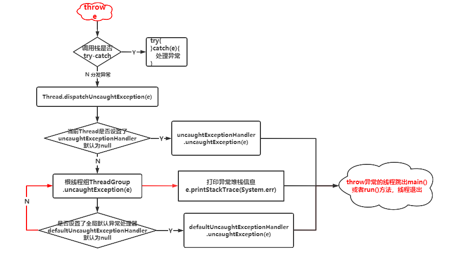

> 版权声明：本文为openXu原创文章[【openXu的博客】](http://blog.csdn.net/xmxkf)，未经博主允许不得以任何形式转载

@[toc]

本文承接[《kotlin协程硬核解读(2. 协程基础使用&源码浅析)》](https://openxu.blog.csdn.net/article/details/116999821)中的第8章节

# 1. 异常的本质

平时在开发中当程序`throw`抛出了一个异常对象而没有被`try-catch`处理掉的话，会在控制台看到一大串红色的异常堆栈信息，然后程序就崩溃了，这是大家的噩梦。大家有没有想过抛出异常为什么会导致程序崩溃？控制台打印红色异常信息和程序崩溃的根源是什么？想要搞懂这些问题，先要简单了解一下JVM、java程序、进程、线程之间的关系。

## 1.1  操作系统、程序、JVM、进程、线程

**操作系统**

我们平时使用的电脑、ipad、手机等各种智能设备在关机的情况下，它们就是一堆塑料废铜烂铁，我们把着对废铜烂铁称为硬件，它们是看得见摸得着的内存条、硬盘、鼠标、键盘、摄像头等等，只有开机后运行了各种应用程序（应用程序就是软件，软件就是应用程序）后才智能。应用程序为用户提供了各种功能，但对于这堆硬件来说就是去操纵这些硬件来为用户提供功能。比如当我看到了美好的风景想拍一张照片，我拿出手机打开相机按下快门就可以记录下美好的画面，对于手机硬件来说，相机程序就是操纵了手机的摄像头。作为普通开发人员开发的各种应用程序是不可以直接操纵这些硬件的，只有操作系统(operation system，简称OS)可以管理和操纵硬件。**操作系统是管理计算机硬件、运行与管理各种软件(应用程序)的计算机程序。它内嵌了各种驱动程序来操纵硬件设备，并提供了接口库供普通开发人员调用开发出各种应用程序，这些应用程序就是间接的通过操作系统提供的api来操纵硬件的**。操作系统提供了管理配置内存、决定系统资源供需优先次序、控制输出输出设备、操作网络和管理文件系统等基本功能，并提供了可以让用户和系统交互的操作界面。为什么会出现各种不同的操作系统呢(Windows、Linux、Unix、macOS、iOS、Android)？一款苹果手机、华为手机、小米手机它们在某些硬件上可能使用的是同一个品牌甚至同一个性号的硬件(比如都使用了索尼的某个型号的摄像头)，但是却运行着不同的操作系统。**出现不同操作系统的原因除了满足不同计算机终端(电脑和手机)需求，终极原因就是："我觉得你开发的这个操作系统程序不行呐，不能充分的利用管理硬件和其他软件"**。我们经常会听到别人对比ios和android系统的手机："苹果就是比小米流畅"，其实就是在比较操作系统。虽然苹果公司和Google公司没有在公开场合打嘴仗，但是他们各自就是觉得自家的操作系统更好，不好的地方不说而是不停的去优化系统程序做到超越对方后再在发布会自诩一番。

**程序**

程序是可执行的静态可执行文件，程序就是软件，软件就是程序，软件是相对于硬件来说的。操作系统就是一个程序，普通开发人员开发的各种应用程序也是程序，我们编写的一个带main函数的java文件编译后也是一个程序。应用程序和操作系统的区别在于应用两个字上，应用程序偏向为普通用户提供应用功能满足用户使用需求，而操作系统更多是面向开发人员。普通开发者基于不同操作系统提供的api开发出各种应用程序并运行在对应的操作系统上，由于不同操作系统使用不同的语言编写并提供不同的api接口，所以基于windows开发的应用程序不能运行在Linux系统上。

**JVM**

程序是用编程语言编写的，不同操作系统可能需要使用不同的语言和不同的系统api来编写。老板让我开发一款windows上的抢票软件，费了九牛二虎之力写完了，这时候老板说你再写一个linux上的吧，我怼他：你是故意整劳资？linux用户安装一个虚拟机装上windows系统不就可以安装软件抢票了。老板二话不说给了我一大逼斗，你知道一个大逼斗对一个二十几岁的孩子会造成多大的心理伤害吗？Sun公司知道后投入了大量人力物力开发了一种可以跨平台运行的Java语言，然后安慰我说：宝宝不哭，以后你用Java语言开发程序就可以运行在不同的操作系统上了。并不是Java语言本身具有跨平台的能力，而是Sun公司提出了Java虚拟机(JVM)的概念和规范，并基于这个规范为不同的操作系统实现了虚拟机程序(比如windows上的java.exe)。虚拟机也是一个程序，它运行在各种操作系统之上，同时它又类似与一个虚拟的小操作系统（操作系统有本地方法栈和堆，jvm也有栈、堆、方法区等），可以运行和管理使用Java语言编写的程序，不管你是什么操作系统，只要安装了java虚拟机，就可以运行Java程序，这就**实现了Java程序的跨平台运行**，JVM屏蔽了不同操作系统的差异性，兼容这些差异性的工作(针对不同操作系统开发的虚拟机程序)都由Sun公司完成了。

**进程**

当我们使用java命令运行一个java程序时，首先会启动jvm虚拟机程序，这时候操作系统就会启动一个进程来运行jvm程序。一个程序是一个静态的可执行的文件，而一个进程则是一个动态执行中的程序实例，多次使用java命令就会开启多个进程运行多个虚拟机程序实例。jvm程序被启动后就会开启一个线程去运行`main()`方法，这个线程称为主线程，只要`main()`方法执行完毕，主线程就没有可运行的字节码了，jvm进程也随即退出（即使存在其他线程还在执行）。**java程序是运行在jvm实例之上的，一个jvm实例就是一个正在运行jvm程序的进程**

**线程**

线程(Thread)是操作系统进行运算调度的最小单位，它被包含在进程之中，是进程中的实际运作单位。现在的电脑或者手机都是多核CPU，就是为了同时并发的执行多个线程从而提高程序的执行效率。每个进程至少会运行一个线程，这个线程会找到程序的`main()`方法并执行，我们可以在main方法中开启多个线程来并发的运行不同的代码分支。多线程间共享堆内存和方法区内存，但使用各自的栈内存。**需要注意的是我们平时说的线程都是指Java中的Thread类，它是线程这个概念在java中的实现，Thread类的实例对象是运行在jvm进程之上的**。其他的编程语言中也会有线程的概念，其实现的名称可能是亦或不是`Thread`，与java中的`Thread`只是概念相同但是被运行在不同的环境中。

## 1.2 异常方法调用栈

jvm就是一个可以运行在各种操作系统上的程序，jvm程序在运行后会仿照操作系统开辟各种内存区，用于运行和管理普通java程序，所以我们可以将jvm看作是一个简单的操作系统，线程就是运行在jvm进程实例之上的。主线程是为了运行java程序的`main()`函数，在主线程上开启的其他子线程是为了运行`Thread`的`run()`方法。**一个线程的退出只有一种可能那就是它的工作完成了，对于主线程来说就是main()函数执行完毕，对于字线程来说就是run()方法执行完毕，当然对于子线程还有一种特殊情况，当main()函数执行完毕主线程退出会导致jvm进程退出，如果子线程还没有执行完毕也会被强制退出**，因为线程是运行在进程之上的，jvm进程都退出了还怎么运行线程？

代码中通过`throw`抛出一个异常对象(`Throwable`及子类对象)会在控制台打印异常堆栈信息，并导致对应的线程崩溃，其实这个崩溃的原理就是线程的工作完成了(`main()`或者`run()`执行完毕)。throw是java中的关键字，它被编译为class后就是一个特殊的jvm指令，**当线程执行到throw指令，就会终止抛异常的方法执行，并尝试将异常对象传递（抛）给调用它的外层方法**，就像`break`会跳出循环、`continue`会跳出本次循环一样。**根据方法调用栈一层一层往外抛的过程就有了异常堆栈信息**。在将异常对象往外层方法抛的过程中，**如果在某一层使用try-catch（一定要catch处理异常否则还会往外抛）捕获处理了异常，异常对象就停止在被捕获的那一层不再继续往外抛了；如果调用栈的所有方法中都没有捕获处理异常，这个异常对象最终会抛给main()或者run()方法**，使main()或者run()方法跳出终止，这两个方法终止就是执行完毕会导致对应的线程退出。

```kotlin
// ★ 示例1：异常未捕获导致main()立刻终止执行，jvm退出
fun main(){
    a()
    //c方法抛出异常在调用栈中没有被try-catch，会使main()终止执行，sleep()不会被执行
    Thread.sleep(1000000000)  
}
fun a(){ b() }
fun b(){ c() }
fun c(){ throw Exception("c抛异常") }
运行结果：
	//根线程组ThreadGroup默认将异常堆栈信息打印到控制台
	Exception in thread "main" java.lang.Exception: c抛异常
	at runable.ZhengtiKt.c(zhengti.kt:37)
	at runable.ZhengtiKt.b(zhengti.kt:35)
	at runable.ZhengtiKt.a(zhengti.kt:31)
	at runable.ZhengtiKt.main(zhengti.kt:21)
	at runable.ZhengtiKt.main(zhengti.kt)
	Process finished with exit code 1   //异常导致main()函数跳出运行，主线程执行完毕导致jvm退出


// ★ 示例2：异常在调用栈中被try-catch捕获处理
fun main(){
    a()     //a()中try-catch处理了异常，异常对象不会抛到main()函数中，不会导致main()终止
    Thread.sleep(1000000000)  //jvm延迟退出

fun a(){
    try {  //在异常调用栈中的某一环使用try-catch捕获并处理异常
        b()
    }catch (e:Exception){
        println("a()捕获了c()抛出的异常：${e.message}")
    }
}
fun b(){ c() }
fun c(){ throw Exception("c抛异常") }
运行结果：
    a()捕获了c()抛出的异常：c抛异常
```

## 1.3 java异常处理机制

如果异常调用方法栈中都没有`try-catch`处理异常，在线程退出之前JVM会调用当前线程`Thread`的`dispatchUncaughtException(Throwable e)`方法并将异常对象传递给它，这个方法的作用是分发当前线程上未被捕获处理的异常，也就是将异常对象交给线程自己处理掉。`Thread`类中有3个`Thread.UncaughtExceptionHandler`类型的成员变量`uncaughtExceptionHandler`、`group`、`defaultUncaughtExceptionHandler`，异常对象最终会交给它们中的一个来处理，具体交给哪一个我们通过源码来一探究竟：

```java
//线程类
public class Thread implements Runnable {
    //未捕获的异常处理器 接口
    public interface UncaughtExceptionHandler {
        void uncaughtException(Thread t, Throwable e);
    }

    // ①. 当前线程异常处理器，如果不显式设置默认是null
    private volatile UncaughtExceptionHandler uncaughtExceptionHandler;
    // ②. jvm进程上所有线程的(static)默认异常处理器，如果不显式设置默认是null
    private static volatile UncaughtExceptionHandler defaultUncaughtExceptionHandler;
    // ③. 线程组，UncaughtExceptionHandler的子类对象
    private ThreadGroup group;
    
    //1. 当线程throw了异常没有被try-catch处理时，jvm就会调用此方法分发处理这个未捕获的异常对象，此方法只会被jvm调用
    private void dispatchUncaughtException(Throwable e) {
        //2. 获取异常处理器对象，并调用它的uncaughtException()处理异常
    	getUncaughtExceptionHandler().uncaughtException(this, e);
	}
    public UncaughtExceptionHandler getUncaughtExceptionHandler() {
        //★3. 如果当前线程设置了异常处理器则返回，否则返回线程组group对象
        return uncaughtExceptionHandler != null ?
            uncaughtExceptionHandler : group;
    }
}

//线程组表示一组线程，线程组还可以包括其他线程组形成一个树
public class ThreadGroup implements Thread.UncaughtExceptionHandler {
    private final ThreadGroup parent;   //父线程组
    ThreadGroup groups[]; //子线程组
    Thread threads[];     //当前线程组的线程
    //线程组处理未捕获的异常
	public void uncaughtException(Thread t, Throwable e) {
        if (parent != null) { 
             //4. 如果存在父线程组，交给父线程组处理
            parent.uncaughtException(t, e);
        } else {
            //★5. 如果设置defaultUncaughtExceptionHandler默认异常处理器则交给它处理
            Thread.UncaughtExceptionHandler ueh =
                Thread.getDefaultUncaughtExceptionHandler();
            if (ueh != null) {
                ueh.uncaughtException(t, e);
            } else if (!(e instanceof ThreadDeath)) {
                //★6. 没有设置任何异常处理器，则默认由根线程组将线程异常堆栈信息输出到控制台
                System.err.print("Exception in thread \""
                                 + t.getName() + "\" ");
                e.printStackTrace(System.err);
            }
        }
    }
}
```

根据源码可以看出，当线程执行到`throw`指令后，异常对象最终会被下面某一环处理掉：

- 异常方法调用栈中的`try-catch`处理
- 否则，交给异常对应线程的异常处理器`uncaughtExceptionHandler`处理（默认为null）
- 否则，交给根线程组`ThreadGroup`处理，根线程组又会委托线程默认异常处理器`defaultUncaughtExceptionHandler`处理（默认为null）
- 否则，根线程组将异常堆栈信息输出到控制台



## 1.4 小结

- 方法`throw`异常会终止方法的执行，如果方法调用栈中使用了try-catch处理了异常，异常对象会停止在被处理的地方不再往外层抛；如果调用栈中没有try-catch，则会终止线程对应的main()或者run()方法使线程退出执行，同时将异常对象交给线程的某个未捕获异常处理器处理
- 线程`throw`的异常只能在对应线程的异常调用栈上被`try-catch`，线程无法捕获子线程中抛出的异常
- 线程`throw`了异常如果没被try-catch处理，只会使对应线程退出执行，并不会影响其他线程；但是当主线程退出时jvm进程会退出导致其他子线程被迫退出。
- 线程因为异常”崩溃“退出并不是通过某种方式将线程杀死，而是线程执行到throw指令退出了对应方法的执行从而使线程任务结束而退出。与正常的将main()或者run()方法执行完而退出，前者会在控制台打印红色的异常堆栈信息，对于开发者来说看到红色日志并且代码没有按照预期的步骤执行完毕所以就出现了“崩溃”这个词，其实崩溃的并不是线程而是开发者自己

# 2. Android异常处理机制

最初Android是使用java语言进行开发的，后来出现了kotlin，其实不管是java还是kotlin最终都会被编译为dex(可看作是很多class的压缩包)运行在dalvik或者art虚拟机上。Android系统内核是基于Linux实现的，可以将Android操作系统看作是一个小型的Linux系统，而dalvik或者art虚拟机都是JVM在Android平台的虚拟机实现，dalvik和art是运行在Android操作系统上的jvm实例，每启动一个android app就会启动一个jvm实例进程，然后让app运行在jvm进程中。不同的jvm实现对异常的处理机制有细微的差别，比如使用普通的java编写一个main()函数，在main()函数中开启一个子线程，如果子线程抛出异常，并不会导致main()函数所在的主线程因为异常退出（jvm不会退出）；但是在Android中，子线程抛出异常会导致整个应用程序进程退出，也就是jvm进程退出，根本原因就是**Android重写了java.lang.Thread类，修改了dispatchUncaughtException()方法，当线程出现未捕获的异常时，首先会将异常对象交给异常预处理器将异常堆栈信息打印到logcat，然后再走原java的异常处理逻辑，而RuntimeInit中为线程设置了默认异常处理器，该处理器会杀死应用进程**。

```java
# 源码路径 sdk\platforms\android-xx\android.jar\ java.lang.Thread
//1. android上的线程类
public class Thread implements Runnable {
    //在原有3个未捕获异常处理器的基础上增加了uncaughtExceptionPreHandler异常预处理器（注意是static的所有线程共用）
    //如果没有显式设置默认为null，但是当app启动时framwork层设置了异常预处理器
    private static volatile UncaughtExceptionHandler uncaughtExceptionPreHandler;
    
    //dalvik或者art虚拟机会调用此方法分发未捕获的异常**
    public final void dispatchUncaughtException(Throwable e) {
        //★ 首先将异常对象交给异常预处理器处理（打印异常堆栈信息到logcat）
        Thread.UncaughtExceptionHandler initialUeh = Thread.getUncaughtExceptionPreHandler();
        if (initialUeh != null) {
            try {
                initialUeh.uncaughtException(this, e);
            } catch (RuntimeException | Error ignored) {
            }
        }
        //★ 然后调用原java的异常处理逻辑（设置的默认异常处理器会杀死应用进程）
        getUncaughtExceptionHandler().uncaughtException(this, e);
    }
}

//2. RuntimeInit是hide隐藏api，不能直接通过Android studio查看源码，但可以在sdk源码包中找到对应文件
package com.android.internal.os;
//@hide 运行时初始化的主要入口点
public class RuntimeInit {
    //在logcat中打印的android异常堆栈信息都会显示这个tag
    final static String TAG = "AndroidRuntime"; 
    //应用程序启动时会调用此函数初始化Android运行时
    public static final void main(String[] argv) {
        commonInit();
        ...
    }
    protected static final void commonInit() {
        if (DEBUG) Slog.d(TAG, "Entered RuntimeInit!");
        LoggingHandler loggingHandler = new LoggingHandler();
        //★ 设置异常预处理器，主要负责打印android程序的异常堆栈信息
        Thread.setUncaughtExceptionPreHandler(loggingHandler);
        //★ 为所有线程设置默认异常处理器，用于杀死应用进程
        Thread.setDefaultUncaughtExceptionHandler(new KillApplicationHandler(loggingHandler));
	   ...
    }
    
    //异常预处理器用于在应用程序被杀死之前将异常堆栈信息打印到控制台
    private static class LoggingHandler implements Thread.UncaughtExceptionHandler {
        @Override
        public void uncaughtException(Thread t, Throwable e) {
            ...
            StringBuilder message = new StringBuilder();
            message.append("FATAL EXCEPTION: ").append(t.getName()).append("\n");
            final String processName = ActivityThread.currentProcessName();
            ...
            message.append("PID: ").append(Process.myPid());
            //★ 将异常堆栈信息打印到logcat
            Clog_e(TAG, message.toString(), e);
        }
    }
    
    //android默认的异常处理器，当未捕获的异常对象交给它处理最终会在finally中杀死应用进程
    private static class KillApplicationHandler implements Thread.UncaughtExceptionHandler {
        @Override
        public void uncaughtException(Thread t, Throwable e) {
            try {
                ...
            } catch (Throwable t2) {
            	...
            } finally {
                //★ 杀死应用进程，退出应用
                Process.killProcess(Process.myPid());
                System.exit(10);
            }
        }
    }
}
```

Android上的异常处理机制如下：

- 异常方法调用栈中的`try-catch`处理
- 否则，交给android异常预处理器`uncaughtExceptionPreHandler`(LoggingHandler类型)将异常堆栈信息输出到logcat
- 然后将异常对象交给对应线程的异常处理器`uncaughtExceptionHandler`处理（默认为null）
- 否则，交给所有线程默认异常处理器`defaultUncaughtExceptionHandler`(KillApplicationHandler类型)杀死应用进程

android提示：应用程序中可以重新设置默认异常处理器`defaultUncaughtExceptionHandler`，但不要重置异常预处理器`uncaughtExceptionPreHandler`。下图是Android异常的处理机制，黄色部分是与java异常机制的区别之处：


Android应用程序进程的主线程就是执行`ActivityThread.main()`方法的线程，`main()`中通过`Looper.loop()`启动了一个死循环来轮询Handler消息，使得jvm进程不会因为main()执行完毕而退出。当主线程或者子线程抛出异常而未被try-catch时，异常默认最终会传递给`KillApplicationHandler`，通过`Process.killProcess(Process.myPid())`杀死应用进程，jvm进程都被杀死了，运行在它上面的主线程、子线程也就都被杀死了。这就Android相对于普通java程序在异常处理机制方面的变化。

# 3. 协程异常

## 3.1 挂起函数的异常

```kotlin
interface Callback {
    fun onSuccess(value: Int)
}
fun getResult(callback: Callback){
    Thread{   //函数中开启子线程
        throw Exception("抛异常了")  //子线程中抛出异常
        callback.onSuccess(1)
    }.start()
}
fun main(){
    try { //主线程试图捕获getResult()中抛出的异常，但是throw是在子线程发生的，主线程无法捕获子线程抛出的异常
        getResult(object :Callback{
            override fun onSuccess(value: Int) {
                println("函数返回结果$value")
            }
        })
    }catch (e:Exception){
        println("捕获异常，避免程序意外退出 $e")
    }
    Thread.sleep(10000)  //主线程延迟10s退出
}
运行结果：
//根ThreadGroup将异常堆栈信息输出到控制台
Exception in thread "Thread-0" java.lang.Exception: 抛异常了   
	at runable.ZhengtiKt$getResult$1.run(zhengti.kt:25)
	at java.lang.Thread.run(Thread.java:748)
//子线程抛出的异常虽然没有捕获处理，但并不影响主线程，主线程会在10s之后才退出
Process finished with exit code 0 
```

上面的示例中`getResult()`异步函数通过`CallBack`回调函数计算结果，但是在回调之前throw了一个异常，会导致子线程的`run()`方法立即终止运行，虽然主线程中的`try-catch`没有捕获到子线程抛出的异常，但并没有导致主线程`main()`函数也提前退出。现在的问题是，我希望主线程知道哪个函数的子线程抛了什么异常然后给用户相应的提示，这时候大家可能会想到通过`Thread.setDefaultUncaughtExceptionHandler()`设置默认异常处理器接受处理所有未捕获的异常：

```kotlin
fun main(){
    //设置默认未捕获异常处理器
    Thread.setDefaultUncaughtExceptionHandler {t: Thread, e: Throwable ->
        println("默认异常处理器捕获线程 '${t.name}' 抛出的异常 '${e}'")
    }
    getResult(object :Callback{
        override fun onSuccess(value: Int) {
            println("函数返回结果$value")
        }
    })
    Thread.sleep(10000)
}
运行结果：
默认异常处理器捕获线程 'Thread-0' 抛出的异常 'java.lang.Exception: 抛异常了'
Process finished with exit code 0  //主线程10s后退出
```

这确实可以实现捕获所有的异常，但并不能满足开发中的需求。比如我希望在`getResult()`函数子线程抛异常后提示用户：获取数据失败；在另一个函数`getUserInfo()`子线程抛出异常后提示用户：获取用户信息失败。默认异常处理器不能对抛异常的函数进行区分，通过它只能知道是哪个线程抛出了什么类型的异常对象，在Android中设置默认异常处理器通常是为了跟踪异常解决bug，或者修改Android异常处理机制避免app因为未捕获异常而被杀死。要实现对每个方法子线程抛出的异常进行精确处理和提示，只能在每个子线程中通过`try-catch`捕获处理异常，然后通过回调的方式将异常对象回调到主线程（注意：回调方法也是在子线程，需要手动切换到主线程，回调的目的只是让主线程有机会拿到子线程抛出的异常对象）：

```kotlin
interface Callback {
    fun onSuccess(value: Int)
    fun onError(t: Throwable)   //★ 增加一个异常回调
}
fun getResult(callback: Callback){
    Thread{
        try {  //子线程中try-catch捕获处理异常
            throw Exception("抛异常了")  
        }catch (e:Exception){
            callback.onError(e)     //★ 通过回调将异常对象返回
        }
    }.start()
}

fun main(){
    getResult(object :Callback{
        override fun onSuccess(value: Int) {}
        override fun onError(t: Throwable) {
            //★ 异常对象被回调到这里，但是这里的代码还是在子线程中，如果在android中还需切到主线程后Toast
            println("${Thread.currentThread()} 子线程抛出异常被回调到这里，提示用户 $t")
        }
    })
    Thread.sleep(10000)
}
```

协程中的续体从某种意义上来说就是一个`CallBack`，通过续体的`resume`系列方法来回调函数的结果值或者异常给协程：

```kotlin
//将getResult()定义为挂起函数
suspend fun getResult() = suspendCancellableCoroutine<Int> {
    Thread{
        it.resumeWithException(Exception("抛异常了"))  //用一个异常对象恢复协程执行（协程回调）
    }.start()
}
fun main(){
    runBlocking {
        try {
            getResult()
        }catch (e:Exception){
            //Thread[main,5,main] 主线程中捕获到“子线程”的异常 java.lang.Exception: 抛异常了
            println("${Thread.currentThread()} 主线程中捕获到“子线程”的异常 $e")
        }
    }
}
```

运行上面的代码，发现主线程中的try捕获到了异常，这个异常对象是在挂起函数的子线程中通过`resumeWithException()`"抛出"的，`resumeWithException()`做了两件事：

- it是一个续体对象，它被包装为`DispatchedContinuation`类型的调度器续体对象，它的resume系列函数将成功结果或者异常封装为一个Result对象，然后将result**通过调度器切换到协程所在的线程(主线程)**传递给`SuspendLambda.invokeSuspend(result)`函数
- `SuspendLambda.invokeSuspend()`中检测result是如果是异常类型则**通过throw关键字将异常抛出**

协程代码块中之所以能直接捕获在异步挂起函数中"抛出"的异常，是因为**协程中通过调度器将子线程的异常对象切换到了协程所在线程，然后在协程代码块中throw抛出。**如果我们在挂起函数的子线程中直接通过throw抛出异常，协程代码块中的try并不能捕获到，协程隐藏了线程切换的实现细节，让我们直接可以在协程代码块中捕获挂起函数中通过resume恢复的异常，从而**将异步异常"变为"同步异常**。

## 3.2 throw & resumeWithException(e)

为了更好的区分线程，我这里将协程所在的线程统称为“主线程”，当然协程不一定是在主线程调度，但是相对于协程代码块中的异步挂起函数中的子线程，它就是主线程。

我们要搞清楚这两个概念，throw是**抛出**一个异常，这个异常如果不被try-catch会导致线程终止，子线程throw的异常不能被主线程捕获。而`resumeWithException(e)`表示**用一个异常恢复协程**执行，这个异常对象会被切换到主线程后throw，这样的话主线程中就可以try住这个异常了。所以我们只需要弄清楚一点，**异常对象是在哪个线程被throw的**，然后**哪个线程throw就只能在哪个线程try-catch，如果不处理，线程就会因为异常而立刻终止执行。** 请看示例：

```kotlin
suspend fun getResult() = suspendCancellableCoroutine<Int> {continuation->
    Thread{   //子线程
        continuation.resumeWithException(Exception("恢复异常对象")) //以异常恢复协程
    }.start()
}
fun main(){
    runBlocking {  //在主线程中创建协程
        getResult()//挂起函数通过resumeWithException()恢复的异常对象会被切换到主线程并在调用挂起函数的地方throw
    }
    //由于main()函数中throw了异常导致mian()函数终止执行，主线程退出jvm退出
    Thread.sleep(10000)   //延迟无效，根本没执行此行
}

运行结果：
    Exception in thread "main" java.lang.Exception: 恢复异常对象
        ...
    Process finished with exit code 1   //jvm因为main()函数throw异常跳出执行而退出
```

为了让上面的主线程不因为挂起函数恢复了异常而终止，可直接在挂起函数调用处`try-catch`捕获处理异常：

```kotlin
fun main(){
    runBlocking {
        try {
            getResult()
        }catch (e:Exception){
            println("主线程中捕获处理异常 : ${e.message}")
        }
    }
    Thread.sleep(10000)
}

运行结果：
    主线程中捕获处理异常 : 抛异常了
	Process finished with exit code 0   //10s后main()函数执行完毕，jvm退出
```

如果将挂起函数中的`resumeWithException()`改成`throw`，则主线程中的`try-catch`就无效了：

```kotlin
suspend fun getResult() = suspendCancellableCoroutine<Int> {continuation->
    Thread{  
        throw Exception("子线程作死")   //子线程中直接throw的异常
    }.start()
}
fun main(){
    runBlocking {
        try {
            //协程将永久的被挂起，因为挂起函数没有调用resume恢复协程执行就throw了异常，以后永远没机会resume了
            getResult()
        }catch (e:Exception){
            println("主线程中捕获处理异常${e.message}")
        }
        println("协程继续执行")   //main函数中这行代码以及后面的代码永远没机会执行了
    }
    Thread.sleep(10000)
}
运行结果：
    Exception in thread "Thread-0" java.lang.Exception: a
	at runable.ZhengtiKt$getResult$2$1.run(zhengti.kt:21)
	at java.lang.Thread.run(Thread.java:748)
    ...   //main()函数被runBlocking阻塞，而协程被永久挂起，main函数就被永久阻塞了，jvm永不退出
```

运行上面示例，发现挂起函数子线程中直接`throw`的异常在主线程中没有try住，并且永远不会打印`Process finished with exit code 0`表示jvm永不退出。原因就是`getResult()`并没有执行完毕，协程一直在等待这个函数的执行结果，挂起函数执行完毕的标志是调用`resume`系列函数来恢复协程。所以记住一点：**在编写挂起函数时永远不要使用throw，当需要抛出异常时必须调用续体的resumeWithException(e)，否则会导致协程被永远的挂起。**

## 3.3 协程异常导致传递取消

挂起函数中通过`resumeWithException(e)`恢复异常对象，这个异常对象会被调度器切换到协程所在的线程`throw`抛出，从代码结构的角度来看，就相当于是在调用挂起函数的下一行代码throw了异常，也就是在协程代码块{}中抛异常：

```kotlin
//示例1： 挂起函数恢复异常对象
suspend fun getResult() = suspendCancellableCoroutine<Int> {continuation->
    Thread{
        ...
        continuation.resumeWithException(Exception("抛异常了")) //以异常恢复协程
    }.start()
}
fun main(){
    runBlocking {
        getResult()
    }
}

//示例2： 挂起函数恢复的异常会被切换到协程所在线程throw，就相当于是在调用挂起函数之后throw
suspend fun getResult() = suspendCancellableCoroutine<Int> {continuation->
    Thread{
        ...
    }.start()
}
fun main(){
    runBlocking {
        getResult()  
        throw Exception("抛异常了")  //getResult()恢复的异常就相当于在协程代码块中throw异常
    }
}
```

**当一个协程抛出未捕获的异常时，会取消自己及其所有子协程。如果子协程抛出了未捕获的非CancellationException类型的异常（CancellationException类型的异常会被父协程忽略），这个异常对象会被传递到根协程处理，并会取消根协程及所有其他子级，这样的话整个协程树结构就都被退出了。**下面的示例演示了异常的传递导致整个协程树都取消，如果将`Exception`换成`CancellationException`，不会导致其他协程取消。

```kotlin
fun main(){
    var job1 : Job? = null
    var job2 : Job? = null
    var job3 : Job? = null
    var job4 : Job? = null
    try{ //★ 协程构建器外部的try不能捕获协程代码块中throw的异常（后面会讲到）
        job1 = GlobalScope.launch {//根协程
            job2 = launch {          //1级子协程
                job4 = launch {        //2级兄弟子协程
                    delay(1500)
                }
                job3 = launch {        //2级子协程
                    //子协程抛出的异常会传递给根协程，导致根协程递归取消整个协程树
                    throw Exception("都去死吧")
                }
            }
        }
    }catch (e:Exception){
        println("错误的协程异常捕获方式，不能捕获到协程的异常")
    }
    Thread.sleep(1000)  //1s后打印各个协程是否因为异常退出
    println("job1是否取消了 ${job1?.isCancelled}")
    println("job2是否取消了 ${job2?.isCancelled}")
    println("job3是否取消了 ${job3?.isCancelled}")
    println("job4是否取消了 ${job4?.isCancelled}")
}

执行结果：

    Exception in thread "DefaultDispatcher-worker-1" java.lang.Exception: 都去死吧
        at runable.MyClassKt$main$job1$1$1$2.invokeSuspend(MyClass.kt:25)
		...
    job1是否取消了 true    //子协程抛出未捕获的异常被传递到根协程处理，导致根协程被取消
    job2是否取消了 true    //子协程抛异常导致父协程被取消
    job3是否取消了 true    //2级子协程抛异常导致自己被cancel
    job4是否取消了 true    //兄弟协程抛异常导致父协程被取消，从而兄弟协程也被取消
```

## 3.4 协程异常传递取消原理

### 3.4.1 协程异常传递取消

不管是挂起函数中恢复的异常，还是在协程代码块中throw异常，异常都会在`BaseContinuationImpl`类的`resumeWith()`函数实现中try住，然后将异常对象包装为一个`Result`作为参数传给协程`AbstractCoroutine`的`resumeWith()`函数，从而j将异常对象交给协程处理。协程是怎样处理异常的呢？源码跟踪：`BaseContinuationImpl.resumeWith()中try住异常对象exception -> AbstractCoroutine.resumeWith(Result.failure(exception)) -> JobSupport.makeCompletingOnce(result.toState()) ->JobSupport.tryMakeCompleting(state, proposedUpdate)-> JobSupport.tryMakeCompletingSlowPath(state, proposedUpdate)`：

```kotlin
//kotlinx.coroutines.JobSupport
private fun tryMakeCompletingSlowPath(state: Incomplete, proposedUpdate: Any?): Any? {
    ...
    //根据state获取到异常对象，这个异常对象就是最初BaseContinuationImpl.resumeWith()中传递过来的
    var notifyRootCause: Throwable? = ...
    //★ 1. 当异常对象不为空时，触发协程cancel取消，但并不会立马将当前协程状态置为canceled，需要等待该协程下所有子协程都取消完毕后才会修改当前协程状态为已取消
    notifyRootCause?.let { notifyCancelling(list, it) }
    val child = firstChild(state)
    // ★★★ 6. 等待所有子协程完成或者取消
    if (child != null && tryWaitForChild(finishing, child, proposedUpdate))
    return COMPLETING_WAITING_CHILDREN
    return finalizeFinishingState(finishing, proposedUpdate)
}

private fun notifyCancelling(list: NodeList, cause: Throwable) {
    // ★2. 首先是取消所有子协程 first cancel our own children 
    onCancelling(cause)
    //list是一个链表，存放的是当前协程的子协程帮助类节点ChildHandleNode对象，该方法会遍历list最终调用childJob.parentCancelled(job)来取消对应的子协程
    notifyHandlers<JobCancellingNode<*>>(list, cause)
    //★3. 然后取消父协程 then cancel parent 
    cancelParent(cause) // tentative cancellation -- does not matter if there is no parent
}

private fun cancelParent(cause: Throwable): Boolean {
    //当前协程抛出的是否是CancellationException类型异常
    val isCancellation = cause is CancellationException
    val parent = parentHandle
    if (parent === null || parent === NonDisposableHandle)
    return isCancellation
    //★ 4. 如果父协程不为空尝试取消父协程，如果异常是CancellationException类型，父协程回直接返回true(父协程忽略子协程抛出的CancellationException异常)
    return parent.childCancelled(cause) || isCancellation
}
//parent是ChildHandle类型的，其实现类是ChildHandleNode
internal class ChildHandleNode(
    parent: JobSupport,
    @JvmField val childJob: ChildJob
) : JobCancellingNode<JobSupport>(parent), ChildHandle {
    override fun invoke(cause: Throwable?) = childJob.parentCancelled(job)
    //★ 5. 调用父协程Job的childCancelled()尝试取消父协程，这里的job就是构造方法中的parent
    override fun childCancelled(cause: Throwable): Boolean = job.childCancelled(cause)
}

/**
 * 父协程Job的类型决定了父协程会怎样处理子协程抛出的异常：
 * 5.1 当父协程为普通的JobSupport子类时，忽略CancellationException类型的异常，如果子协程抛出非CancellationException类型异常会导致父协程取消
 * 5.2 当父协程是SupervisorJob的子类时，会直接返回false，表示父协程不处理子协程的异常，子协程抛异常只会导致子协程自己被取消
 */

//5.1 JobSupport的childCancelled()函数
public open fun childCancelled(cause: Throwable): Boolean {
    //★★★如果子协程抛出的异常是CancellationException类型，父协程直接返回true（子协程抛出CancellationException异常不会取消父协程）
    if (cause is CancellationException) return true
    //★ 如果是其他类型异常，取消父协程。cancelImpl()函数又会触发notifyCancelling()从而让父协程的其他子协程（抛异常的协程的兄弟协程）和祖协程取消，这样一直传递到根协程
    // 当协程为是SupervisorJob类型时，handlesException的值为false
    return cancelImpl(cause) && handlesException
}
//★★★5.2 SupervisorJob覆盖重写了JobSupport的childCancelled()函数，直接返回false，表示父协程不处理子协程的异常
private class SupervisorJobImpl(parent: Job?) : JobImpl(parent) {
    override fun childCancelled(cause: Throwable): Boolean = false
}
```

当异常对象被传递给协程后，会触发`notifyCancelling()`函数取消当前协程，而`notifyCancelling()`中做了两件事。首先调用`notifyHandlers()`遍历子协程节点取消子协程，然后调用`cancelParent()`取消父协程。父协程处理子协程抛出的异常的态度取决于父协程的Job对象是什么类型：

- 如果是`SupervisorJobImpl`的子类（通过`SupervisorJob()`创建，`viewModelScope`创建的协程就是`SupervisorJobImpl`子类对象），则会忽略子协程抛出的异常，异常向上传递取消会终止在SupervisorJob这一层；
- 如果是普通的`JobSupport`子类对象，会忽略子协程抛出的`CancellationException`类型异常，其他类型异常会向上触发父协程取消

下图通过3中情况演示了因为协程树中某个协程抛出异常导致的协程树的传递取消情况：


### 3.4.2 父协程等待所有子协程取消

上面只是解释了当协程树结构中某个协程抛出异常是怎样触发各级协程传递取消的，但是协程的取消是由一个过程的，并不是触发取消方法后这个协程就会立马被取消，只有当协程下的所有子协程及孙子协程都被取消完成后，才会将当前线程置为`canceled`状态。下面我们继续跟踪这个过程，接上部分源码第6步，当异常触发协程取消后，会调用`tryWaitForChild()`等待子协程完成取消：

```kotlin
//等待所有子协程完成或者取消 
private tailrec fun tryWaitForChild(state: Finishing, child: ChildHandleNode, proposedUpdate: Any?): Boolean {
     val handle = child.childJob.invokeOnCompletion(
         invokeImmediately = false,
         //★ 7. 调用ChildCompletion()传入this表示父协程，child表示父协程的某一个子协程，这个方法确保child的所有子协程都完成或者取消，意思就是确保child这个子树分支都已经完成或者取消
         handler = ChildCompletion(this, state, child, proposedUpdate).asHandler
     )
     //如果这个子协程树未完成或者未取消，就返回（等待其完成）
     if (handle !== NonDisposableHandle) return true 
     //★ 8. 如果这个子协程树已经完成或者取消，则获取获取下一个子协程(遍历所有子协程)，递归调用tryWaitForChild()，直到发现有一个子协程还没有完成或者取消
     val nextChild = child.nextChild() ?: return false
     return tryWaitForChild(state, nextChild, proposedUpdate)
 }
private class ChildCompletion(
    private val parent: JobSupport,
    ...
) : JobNode<Job>(child.childJob) {
    override fun invoke(cause: Throwable?) {
        //7.1 parent就是上面传入的this，也就是父协程，child是某个子协程
        parent.continueCompleting(state, child, proposedUpdate)
    }
}
//7.2 目的是确保 协程 的 某个子协程树 都完成或者被取消
private fun continueCompleting(state: Finishing, lastChild: ChildHandleNode, proposedUpdate: Any?) {
    // 获取子协程的子协程，也就是孙子协程
    val waitChild = lastChild.nextChild()
    // 等待孙子协程完成或者取消
    if (waitChild != null && tryWaitForChild(state, waitChild, proposedUpdate)) return 
    // ★★★9. 当所有子协程树都被取消后，尝试修改协程的状态
    val finalState = finalizeFinishingState(state, proposedUpdate)
    afterCompletion(finalState)
}
```

这段代码逻辑比较绕，涉及到两层递归，但是我们只需要抓住主线。`tryWaitForChild()`表示当前协程等待它的子孙协程完成或者取消，该方法中做了两件事：

- 获取当前协程的第一个子协程child，调用`ChildCompletion()`确保这个子协程及其下的孙子协程都被取消
- 然后通过`child.nextChild()`获取到下一个子协程，递归调用`tryWaitForChild()`确保当前协程下所有的子协程树都被取消

由此可见，在整个协程树结构中，只有当根协程下所有的子协程、孙子协程...都被取消完成，才会将根协程置为canceled状态。

## 3.5 协程异常传递和处理机制

上面只是解释了协程异常的取消传播，但是异常对象最终是 由谁 在哪里 怎样被处理的？如果协程树的中层抛出了异常，会向下、向上（又会向下）传递取消，最后就是根协程等待其所有子孙协程取消完成。而取消完成的状态必定是由协程树结构的最底层（叶子节点）发起的，取消完成状态会从下网上传递，直到传递到根协程，这就标志整个协程树都被取消了。取消完成状态就是通过调用上述源码中第3步触发的，当一个协程下所有的孙子协程都被取消后，会调用`finalizeFinishingState()`修改当前协程的状态，并尝试处理掉异常对象：

```kotlin
private fun finalizeFinishingState(state: JobSupport.Finishing, proposedUpdate: Any?): Any? {
    ...
    assert { state.isCompleting } //★★★尝试：一致性检查--必须标记为已完成(canceled状态也是已完成)
    
    // proposedException就是未捕获的异常对象
    val proposedException = (proposedUpdate as? CompletedExceptionally)?.cause
    var wasCancelling = false
    // 当协程的多个子协程因异常而失败时， 一般规则是“取第一个异常”，因此将处理第一个异常。 在第一个异常之后发生的所有其他异常都作为被抑制的异常绑定至第一个异常
    val finalException = kotlinx.coroutines.internal.synchronized(state) { ... }
    ...
    // ★★★ 10. cancelParent(finalException) 取消父协程，这个过程上面已经分析过了，其实这里调用该方法并不是为了取消父协程，而是将异常对象交给父协程处理
    // 如果该方法返回true，则表示这个异常对象被父协程处理掉了，如果返回false表示父协程没有处理这个异常，则会调用handleJobException()让当前协程处理该异常
    if (finalException != null) {
        val handled = cancelParent(finalException) || handleJobException(finalException)
        if (handled) (finalState as CompletedExceptionally).makeHandled()
    }
    // 收尾工作设置协程状态为已完成、已取消 job.isCompleted == true  job.isCancelled == true
    if (!wasCancelling) onCancelling(finalException)
    onCompletionInternal(finalState)
    ...
    completeStateFinalization(state, finalState)
    return finalState
}
```

`finalizeFinishingState()`函数主要完成2件事，首先是处理异常，然后将当前协程状态置为已取消。在处理异常时首先调用`cancelParent()`将异常对象交给父协程处理，如果父协程处理了则返回true，如果返回false没处理，则调用`handleJobException()`由当前协程处理掉这个异常。**异常对象是由谁处理的可以分为3中情况：**

- 如果异常是`CancellationException`类型，`cancelParent()`会直接返回true，`CancellationException`类型的异常没有任何处理直接被忽略了
- 如果是非`CancellationException`异常，如果父协程是`SupervisorJob`类型，`cancelParent()`返回false，将调用`handleJobException()`由当前协程处理异常。举例：如果协程树结构中有一个`SupervisorJob`协程0，这个协程下有2个子协程1、2，1下面有一个子协程3，那3就是0的孙子，当3抛出异常，异常对象向上传递给1，1又向上传给0，0收到异常后直接返回false表示不处理，则异常最终会由1处理掉
- 如果是非是非`CancellationException`异常，并且协程树中不存在`SupervisorJob`类型，异常对象最终将由根协程处理

异常对象是怎样被处理的？这就要看`handleJobException()`函数中做了什么：

```kotlin
//JobSupport的handleJobException()函数默认不对异常做任何处理，直接返回false。
protected open fun handleJobException(exception: Throwable): Boolean = false

//★ 11. handleJobException()只在StandaloneCoroutine和ActorCoroutine两个协程类中被重写，都调用了handleCoroutineException()
override fun handleJobException(exception: Throwable): Boolean {
    handleCoroutineException(context, exception)
    return true
}
```

`JobSupport`的`handleJobException()`函数默认不对异常做任何处理，直接返回false，这种情况下，异常不会被打印到控制台，也不会做任何处理，`async{}`构建器创建的协程对象是`DeferredCoroutine`类型的，如果`async{}`创建的协程是根协程，就会对异常做默认处理（不做任何处理），之前讲构建器时说过一般不会用`async{}`构建根协程，因为没有意义，而是用`launch{}`代替。

之前只介绍了5种构建器，其中只有`launch{}`是适合做根协程构建器的，其实协程库中还有其他扩展，比如`Flow`、`Channel`等，它们提供的`flow{}`、`CoroutineScope.actor{}`也可以用于构建根协程，这些类型的协程一般用于特殊场景，比如当我们上传下载文件时就需要用到`flow{}`实现类似RxJava多次发射数据更新下载进度，而传统的`launch{}`协程是一次性的。这里稍微做了一下扩展，目的是介绍一下其他类型的可作为根的协程，协程中的异常是怎么被处理的最终就是看处理异常的协程对象是什么类型。

默认的`handleJobException()`函数对异常不做任何处理，只在`StandaloneCoroutine`和`ActorCoroutine`两个协程类重写了该函数并调用了`handleCoroutineException()`进一步处理异常，`launch{}`构建的协程是`StandaloneCoroutine`类型的，`actor{}`构建的协程是`ActorCoroutine`类型的，我们继续看看这两种协程是怎么处理异常的：

```kotlin
//kotlinx-coroutines-core-jvm\kotlinx\coroutines\CoroutineExceptionHandlerKt.class
public fun handleCoroutineException(context: CoroutineContext, exception: Throwable) {
    try {
        //★★★12. 从上下文中获取Key为CoroutineExceptionHandler的协程异常处理器，如果存在则由CoroutineExceptionHandler处理异常（没有显式设置默认不存在）
        context[CoroutineExceptionHandler]?.let {
            it.handleException(context, exception)
            return
        }
    } catch (t: Throwable) {
        handleCoroutineExceptionImpl(context, handlerException(exception, t))
        return
    }
    //★13. 如果上下文中不存在异常处理器或者在处理过程中抛出了新异常，则调用handleCoroutineExceptionImpl()全局处理
    handleCoroutineExceptionImpl(context, exception)
}

//handleCoroutineExceptionImpl()函数是一个与平台相关的函数，不同的平台（jvm、js、native等）实现不同
internal expect fun handleCoroutineExceptionImpl(context: CoroutineContext, exception: Throwable)
//以jvm平台（Android也是jvm虚拟机）实现为例，在github中查看实现源码https://github.com/Kotlin/kotlinx.coroutines/blob/5eca49cfcb25acefaf10ec9b997de537c653b47e/kotlinx-coroutines-core/jvm/src/CoroutineExceptionHandlerImpl.kt
//从当前环境中通过类加载器加载类型为CoroutineExceptionHandler的协程异常处理器，Android环境中有一个AndroidExceptionPreHandler类型的协程异常处理器
private val handlers: List<CoroutineExceptionHandler> = ServiceLoader.load(
        CoroutineExceptionHandler::class.java,
        CoroutineExceptionHandler::class.java.classLoader
).iterator().asSequence().toList()
internal actual fun handleCoroutineExceptionImpl(context: CoroutineContext, exception: Throwable) {
    for (handler in handlers) {
        try {
            //★★★14. Android平台上，首先会将异常交给AndroidExceptionPreHandler处理
            handler.handleException(context, exception)
        } catch (t: Throwable) {
            val currentThread = Thread.currentThread()
            currentThread.uncaughtExceptionHandler.uncaughtException(currentThread, handlerException(exception, t))
        }
    }
    val currentThread = Thread.currentThread()
    //★★★15. 然后交给jvm中的当前线程处理异常，这个部分上面已经讲解了
    //如果在java中，会先让全局默认异常处理器defaultUncaughtExceptionHandler（默认为null），然后由根线程组将异常堆栈信息输出到控制台
    //如果在Android中，会交给KillApplicationHandler类型的全局默认异常处理器defaultUncaughtExceptionHandler杀死应用进程
    currentThread.uncaughtExceptionHandler.uncaughtException(currentThread, exception)
}

//Android平台默认的协程异常处理器，源码位置：org.jetbrains.kotlinx:kotlinx-coroutinues-android.jar包中
//它实现了AbstractCoroutineContextElement和CoroutineExceptionHandler，我们可以参照它实现自己的异常处理器
package kotlinx.coroutines.android
internal class AndroidExceptionPreHandler :
    AbstractCoroutineContextElement(CoroutineExceptionHandler), CoroutineExceptionHandler
{
    //Android平台默认的异常处理器就是确保在Android28之前通过异常预处理器打印异常堆栈信息到logcat
    override fun handleException(context: CoroutineContext, exception: Throwable) {
        val thread = Thread.currentThread()
        if (Build.VERSION.SDK_INT >= 28) {
            //☆ 14.1 Android28之后，应用的未捕获异常默认会在程序崩溃之前打印到logcat，不在需要uncaughtExceptionPreHandler去打印
            thread.uncaughtExceptionHandler.uncaughtException(thread, exception)
        } else {
            //☆ 14.2 Android28之前通过反射获取uncaughtExceptionPreHandler，它确保在应用程序崩溃之前将异常堆栈信息打印到logcat
            (preHandler()?.invoke(null) as? Thread.UncaughtExceptionHandler)
                ?.uncaughtException(thread, exception)
        }
    }
}
```

通过上面的源码可以看出：

- 首先会从处理异常的协程对象的上下文中获取`CoroutineExceptionHandler`上下文来处理异常（如果不显式设置默认是不存在的）；
- 然后会调用与平台相关的实现函数`handleCoroutineExceptionImpl()`。以jvm平台为例，通过类加载器从当前平台环境中加载`CoroutineExceptionHandler`协程异常处理器，而Android平台中正好有`AndroidExceptionPreHandler`这个类符合要求，于是会将异常对象交给它处理，`AndroidExceptionPreHandler`的目的就是确保在各个android版本中能将异常堆栈信息打印到logcat；
- `handleCoroutineExceptionImpl()`最终会调用`currentThread.uncaughtExceptionHandler.uncaughtException()`处理异常，这就与上面讲的Java和Android异常处理机制衔接上了

协程的异常处理机制如下图所示：


## 3.6 小结

当挂起函数`resumeWithException(e)`或者协程代码块{}中`throw`了一个异常，这个异常会被捕获处理，并将异常传递给对应的协程对象，协程对象收到异常后会根据情况在协程树中传递取消相关协程（子传递父，父取消子）。如果异常类型为`CancellationException`类型，当传递取消父协程时，父协程直接返回true表示忽略（不会取消父协程），当父协程的job为`SupervisorJob `类型时，不管是什么异常都会终止向上传递取消。

异常对象最终会交给协程树中的某个协程处理：`CancellationException`类型的异常由抛出异常的协程自己处理；某一层协程对象Job为`SupervisorJob `类型时由该层的下级子协程处理（抛异常的协程或者父协程，但是都是`SupervisorJob`层的子协程）；其他情况由根协程处理。

协程异常处理机制请看上图

# 4. 实际开发中的协程异常处理

## 4.1 为什么协程构建器外部的try-catch不能捕获协程中的异常？

```kotlin
//1. 错误示例：协程构建器外部的try-catch不能捕获协程中的异常
fun main(){
    try {
        GlobalScope.launch {
            throw Exception("抛异常咯")
        }
    }catch (e:Exception){
        println("错误的协程异常捕获方式")
    }
    Thread.sleep(1000000)
}

//2. 正确示例：必须在协程代码块{}中使用try-catch，才能捕获协程的异常
fun main(){
    GlobalScope.launch {
        try {
            throw Exception("抛异常咯")
        }catch (e:Exception){
            println("捕获处理异常：${e.message}")
        }
    }
    Thread.sleep(1000000)
}
```

肯定有人尝试上面第一个示例的方式来捕获协程的异常，但是捕获不到，原因是什么呢？挂起函数恢复异常和在协程代码块中抛出的异常都能被代码块中的`try-catch`捕获，当异常被捕获处理后，异常就不存在了。如果协程代码块中没有try-catch，这个异常对象会在`BaseContinuationImpl.resumeWith()`中被try-catch，然后封装为一个`Result`对象，传递给协程。注意这里是将异常作为函数参数传递，以及在后面传递给父协程直到根协程的过程中这个异常对象都是作为参数传递，并没有再次throw，这个异常对象最终会传递给一个协程的`JobSupport.handleJobException(e)`函数，然后传递给异常处理器处理，具体是由哪些异常处理器处理就去上面的协程异常处理机制的图中去找。所以协程构建器外部的ty-catch并不能捕获到协程的异常，**根本原因就是这个异常对象被捕获处理后并没有再次throw，而是直接作为参数传递给了异常处理器处理。**

```kotlin
internal abstract class BaseContinuationImpl(
    public val completion: Continuation<Any?>?
) : Continuation<Any?>, CoroutineStackFrame, Serializable {
    public final override fun resumeWith(result: Result<Any?>) {
        ...
        val outcome: Result<Any?> =
        try {
            //invokeSuspend()函数中就是协程代码块中的代码
            val outcome = invokeSuspend(param)
            if (outcome === COROUTINE_SUSPENDED) return
            Result.success(outcome)
        } catch (exception: Throwable) {
            //协程代码块中的代码抛出的异常在这里被捕获处理了，将异常包装为一个Result对象接下来传递给协程
            Result.failure(exception)
        }
        ...
        //将异常对象传递（不是throw）给对应的协程
        completion.resumeWith(outcome)
        return
    }
    //invokeSuspend()是BaseContinuationImpl定义的抽象方法，最终是由SuspendLambda的子类实现的，下面是伪代码
    protected abstract fun invokeSuspend(result: Result<Any?>): Any?{
     	try {//★ 在协程代码块中使用try-catch，就相当于是在invokeSuspend()函数的实现中try-catch
            //协程代码块中的代码
            ...
        } catch (exception: Throwable) {
        }
    }
}

```

## 4.2 串行中的异常处理

在Android开发中，使用协程一般都是通过`viewModelScope.launch{}`或者`flow{}`来构建根协程，这两种方式会被用在不同的场景，比如在普通的场景中我习惯使用`viewModelScope.launch{}`，而在下载文件时不得不用`flow{}`来多次发射数据，之前看过一个项目中全部都使用`flow{}`来构建协程，其实是可以的，但是`flow{}`有一个硬伤，不能在代码块中创建子协程，因为代码块中的this是`FlowCollector`类型，不是`CoroutineScope` ,所以就不能调用`async{}`实现并发的需求，`flow{}`通常用于串行顺序执行或者需要多次发射数据的场景；而`viewModelScope.launch{}`除了不能多次发射数据，却可以适应更多的场景。

串行的意思就是代码是顺序执行的，前一句代码执行完毕且未抛异常才会执行后一句代码，当某行代码抛异常异常，后面的代码就不会执行，所以在处理异常时直接将整个协程代码块的内容使用try包裹即可（`flow{}`型的协程也可采用这种方式处理异常）：

```kotlin
suspend fun plugsOne(fial:Boolean, base:Int) : Int = withContext(Dispatchers.IO){
        if(fial)  throw Exception("抛异常了")
        	else return@withContext base+1
    }
fun getData(){
    //通过viewModelScope创建根协程
    viewModelScope.launch {
        //直接将launch代码块中的串行代码try住，在catch中统一处理错误，可以将这部分抽取到BaseViewModel基类中
        try {
            //编写串行代码
            //模拟请求数据
            val data1 = plugsOne(true, 0)
            //下面的代码依赖上面的结果，如果上面的代码都抛异常了（上面的fial传true），下面的代码就不用执行了
            val data2 = plugsOne(false, data1)
            Log.v("openXu", "获取数据成功:${data2}")
        } catch (e: Exception) {
            Log.w("openXu","统一异常处理:${e.message}")
            //统一错误处理
            //onError(e, showErrorToast)
        }
    }
}

```

## 4.3 并发中的异常处理

串行可以满足需要程序顺序执行的需求场景，但是有的场景中多个操作之间不存在关联，为了提高代码的执行效率，我们通常会使用`async{}`来构建子协程来并发执行多个操作。并行示例如下：

```kotlin
//示例1： 下面的程序运行后会闪退
viewModelScope.launch {
    try {
        //async{}会并发执行
        val deferred1 = async { plugsOne(true, 0) }
        val deferred2 = async { plugsOne(false, 0) }
        //分别获取结果值
        val data1 = deferred1.await()
        val data2 = deferred2.await()
        Log.v("openXu", "获取数据成功:$data1  $data2")
    } catch (e: Exception) {
        Log.w("openXu","统一异常处理:${e.message}")
        //统一错误处理
        //onError(e, showErrorToast)
    }
}

运行打印结果：

W/openXu: 统一异常处理:抛异常了
E/AndroidRuntime: FATAL EXCEPTION: main
    Process: com.openxu.android, PID: 4640
    java.lang.Exception: 抛异常了
        at com.openxu.wanandroid.ui.tree.SystemViewModel$plugsOne$$inlined$suspendCancellableCoroutine$lambda$1.run(SystemViewModel.kt:164)
        at java.lang.Thread.run(Thread.java:784)
```

运行示例程序后，发现异常被捕获到了，并且打印了`统一异常处理`，但是应用程序却崩溃了，并且控制台还有红色的异常堆栈打印。`async{}`创建的协程会在调用`await()`获取结果时将异常再次`throw`抛出，其实**try-catch捕获的是await()函数抛出的异常**，而`async{}`创建的子协程的异常会被传递给`viewModelScope`创建的根协程处理，上面讲协程异常处理机制时，发现在**Android中协程的异常会交给android默认异常处理器`KillApplicationHandler`处理杀死进程，所以应用崩溃了。**

其实解决`async{}`并发异常导致程序崩溃的解决办法是很多的，首先，并发任务抛出的异常会在`await()`时重新抛出，所以代码块中的try-catch可以捕获到异常并通过统一错误处理给用户提示，我们**需要解决的就是让程序不崩溃就可以了**。

**解决办法1**：为根协程设置协程异常处理器绕过Android程序的`KillApplicationHandler`，从而避免程序崩溃，但是为了不让并发任务的`await()`抛出的异常影响其他任务，`await()`必须单独`try-catch`：

```kotlin
class AndroidDontKillExceptionHandler :
            AbstractCoroutineContextElement(CoroutineExceptionHandler), CoroutineExceptionHandler{
        override fun handleException(context: CoroutineContext, exception: Throwable) {
            Log.w("openXu", "根协程异常处理器，避免应用被kill。捕获到异常:$exception")
        }
    }
fun getData(){
    viewModelScope.launch(AndroidDontKillExceptionHandler()) {
        try{
            val deferred1 =  async {
                plugsOne(true, 0)
            }
            val deferred2 = async {
                plugsOne(false, 0)
            }
            var data1 : Int? = null
            var data2 : Int? = null
            //对await()分别try-catch，避免异常导致下面的代码停止执行
            try {
                data1 = deferred1.await()
            }catch (e:Exception){
                //交给统一错误处理方法提示用户
                //onError(e, showErrorToast)
            }
            try {
                data2 = deferred2.await()
            }catch (e:Exception){
                //交给统一错误处理方法提示用户
                //onError(e, showErrorToast)
            }
            Log.v("openXu", "获取数据成功:$data1  $data2")
        }catch (e:Exception){
            //捕获协程代码块中其他异常，统一处理
            //onError(e, showErrorToast)
        }
    }
}
```

**解决办法2：**虽然`try-cach`套在协程构建器外部不能捕获协程异常，但如果在抛异常的协程外部套上一层`coroutineScope{}`那就会不太一样了。`coroutineScope{}`将异常子协程内部的异常抛出，并不会继续向上传递。下面的代码中，获取`deferred`的两个`try-catch`是为了避免`async{}`异常导致程序崩溃，`await()`分别`try-catch`是为了避免因为一个任务的异常影响其他并发任务（允许单个任务失败），而最外层的`try-catch`则是为了统一处理根协程代码块中的其他异常(比如更新UI时出现异常等)：

```kotlin
viewModelScope.launch(AndroidDontKillExceptionHandler()) {
    try{
        var deferred1:Deferred<Int>? = null
        var deferred2:Deferred<Int>? = null
        //async{}外层嵌套coroutineScope{}让异常抛出，不向上传给根协程
        try {
            deferred1 = coroutineScope {
                async {
                    plugsOne(true, 0)
                }
            }
        }catch (e:Exception){
            Log.w("openXu","避免async异常传递给根协程导致程序退出：${e.message}")
        }
        try {
            deferred2 = coroutineScope {
                async {
                    plugsOne(false, 0)
                }
            }
        }catch (e:Exception){
            Log.w("openXu","避免async异常传递给根协程导致程序退出：${e.message}")
        }
        var data1 : Int? = null
        var data2 : Int? = null
        //对await()分别try-catch，避免异常导致其他任务执行获取不到结果
        try {
            data1 = deferred1?.await()
        }catch (e:Exception){
            //交给统一错误处理方法提示用户
            //onError(e, showErrorToast)
        }
        try {
            data2 = deferred2?.await()
        }catch (e:Exception){
            //交给统一错误处理方法提示用户
            //onError(e, showErrorToast)
        }
        Log.v("openXu", "获取数据成功:$data1  $data2")
    }catch (e:Exception){
        //捕获协程代码块中其他异常，统一处理
        //onError(e, showErrorToast)
    }
}
```

## 4.4 总结

本文分别对Jvm异常处理机制、Android异常处理机制、协程异常传播取消、协程异常处理机制做了非常详细的讲解，图文并茂以及丰富的示例相信大家一定能对异常有一个深入理解。希望本文能给各位带来帮助，喜欢的同学不要忘了**一键三联（点赞投币+关注）**


