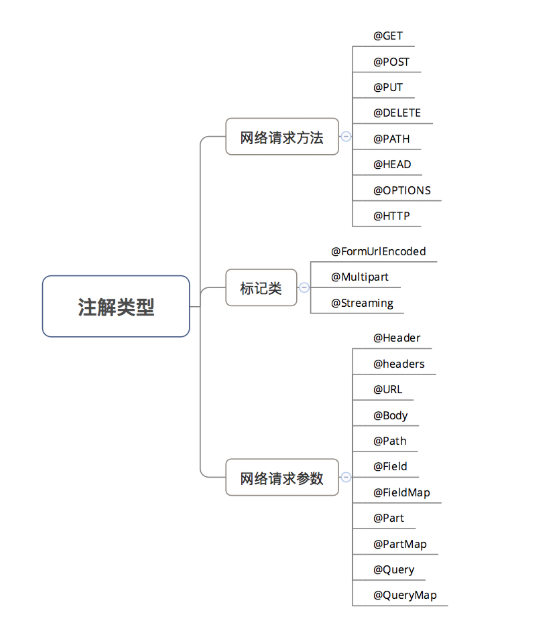
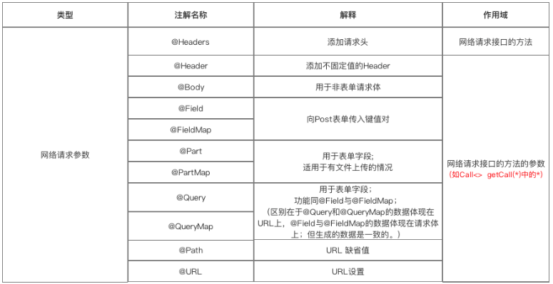

&emsp;&emsp;Retrofit是一个基于OkHttp的遵循RESTful API设计风格的网络请求框架。通过注解配置网络请求参数，支持同步异步请求，支持多种数据解析和序列化格式（Gson、Json、XML、Protobuf），提供对RxJava支持。    


## 1、使用步骤

### 1.1 添加依赖

```
dependencies {
    compile 'com.squareup.retrofit2:retrofit:2.0.2'
    compile 'com.squareup.okhttp3:okhttp:3.1.2'
  }
```

```
//权限
<uses-permission android:name="android.permission.INTERNET"/>
```

### 1.2 创建接受服务器返回数据 的类

```Java
class OneSentence {
    var sid: String = "" // 'sid':'' #每日一句ID
    var tts: String = "" // 'tts': '' #音频地址
    var content: String = "" // 'content':'' #英文内容
    var note: String = "" // 'note': '' #中文内容
    var love: String = "" // 'love': '' #每日一句喜欢个数
    var translation: String = "" // 'translation':'' #词霸小编
    var picture2: String = "" // 'picture2': '' #大图片地址
    var dateline: String = "" // 'dateline':'' #时间
    var s_pv: String = "" // 's_pv':'' #浏览数
}
```

### 1.3 创建描述网络请求的接口
&emsp;&emsp;Retrofit将 Http请求 抽象成 Java接口，采用 注解 描述网络请求参数 和配置网络请求参数。用 动态代理 动态 将该接口的注解“翻译”成一个 Http 请求，最后再执行 Http 请求。接口中的每个方法的参数都需要使用注解标注，否则会报错。

```Java
public interface TestService {
    /*
     * http://open.iciba.com/dsapi/?date=2019-02-15
     * @Query 用于@GET方法的查询参数 key-value
     */
    @GET("dsapi/")
    Call<OneSentence> getSentence1(@Query("date") String date);
}
```

### 1.4 创建 Retrofit 实例

```JAVA 
//1. 创建 Retrofit 实例 http://open.iciba.com/dsapi/?date=2019-02-15
val retrofit = Retrofit.Builder()
    .baseUrl("http://open.iciba.com/") // 设置网络请求的Url地址
    .addConverterFactory(GsonConverterFactory.create()) // 设置数据解析器
    .addCallAdapterFactory(RxJavaCallAdapterFactory.create()) // 支持RxJava平台
    .build()
```


#### 关于数据解析器（Converter）

&emsp;&emsp;Retrofit支持多种数据解析方式，使用时需要在Gradle添加依赖：

* **Gson**	com.squareup.retrofit2:converter-gson:2.0.2
* **Jackson**	com.squareup.retrofit2:converter-jackson:2.0.2
* **Simple XML**	com.squareup.retrofit2:converter-simplexml:2.0.2
* **Protobuf**	com.squareup.retrofit2:converter-protobuf:2.0.2
* **Moshi**	com.squareup.retrofit2:converter-moshi:2.0.2
* **Wire**	com.squareup.retrofit2:converter-wire:2.0.2
* **Scalars**	com.squareup.retrofit2:converter-scalars:2.0.2

#### 关于网络请求适配器（CallAdapter）

&emsp;&emsp;Retrofit支持多种网络请求适配器方式：guava、Java8和rxjava。使用时如使用的是 Android 默认的 CallAdapter，则不需要添加网络请求适配器的依赖，否则则需要按照需求进行添加 Retrofit 提供的 CallAdapter
* **guava**	com.squareup.retrofit2:adapter-guava:2.0.2
* **Java8**	com.squareup.retrofit2:adapter-java8:2.0.2
* **rxjava**	com.squareup.retrofit2:adapter-rxjava:2.0.2


### 1.5 创建 网络请求接口实例

```JAVA
//2. 创建 网络请求接口 的实例
val request = retrofit.create<TestService>(TestService::class.java!!)
//3. 对 发送请求 进行封装
val call = request.getSentence1(date)
```

### 1.6 发送网络请求（异步 / 同步）

```JAVA
//4. 发送网络请求(异步)
call.enqueue(object : Callback<OneSentence> {
    //请求成功时回调
    override fun onResponse(call: Call<OneSentence>, response: Response<OneSentence>) {
        callback.onSeccuce(response.body()!!)
    }
    //请求失败时候的回调
    override fun onFailure(call: Call<OneSentence>, throwable: Throwable) {
        callback.onFaild("获取数据失败:" + throwable.message)
    }
})

// 发送网络请求（同步）
/* try {
    Response<OneSentence> response = call.execute();
} catch (IOException e) {
    e.printStackTrace();
}*/
```


## 2、注解说明



### 2.1 网络请求方法

```Java
public interface TestService {
    /*
     * http://open.iciba.com/dsapi/?date=2019-02-15
     * @Query 用于@GET方法的查询参数 key-value
     */
    @GET("dsapi/")
    Call<OneSentence> getSentence1(@Query("date") String date);
}
```
&emsp;&emsp;**@GET、@POST、@PUT、@DELETE、@HEAD** 以上方法分别对应 HTTP中的网络请求方式。网络请求的完整 Url =在创建Retrofit实例时通过.baseUrl()设置 +网络请求接口的注解设置（下面称 “path“ ），具体整合规则如下（推荐采用第三种方式配置）：


http://open.iciba.com/dsapi/?date=2019-02-15

| path |整合说明  |
| --- | --- |
| path=完整Url |  path=http://open.iciba.com/dsapi/  baseUrl=不设置 (如果接口中url是完整地址，在创建Retrofit实例时可以不设置URL) Url = http://open.iciba.com/dsapi/|
|path = 绝对路径  | path=/dsapi/ baseUrl=http://open.iciba.com/xxx/  Url = http://open.iciba.com/dsapi/|
| path=相对路径  baseUrl=目录形式 | path=dsapi/ baseUrl=http://open.iciba.com/xxx/  Url = http://open.iciba.com/xxx/dsapi/ |
| path=相对路径  baseUrl=文件形式  | path=dsapi/ baseUrl=http://open.iciba.com/xxx  Url = http://open.iciba.com/dsapi/ |

**@HTTP** 

&emsp;&emsp;替换以上五种注解的作用以及更多功能拓展，通常使用属性method、path、hasBody等配置，下面的接口等同于上面示例：

```JAVA
public interface TestService {
    @HTTP(method = "GET", path = "dsapi/", hasBody = false)
    Call<OneSentence> getSentence1(@Query("date") String date);
}
```

### 2.2 标记

**@FormUrlEncoded**

&emsp;&emsp;表示发送form-encoded的数据，每个键值对需要用@Filed来注解键名，随后的对象需要提供值。

```JAVA
/*
* 键值对POST提交
* FormUrlEncoded表明是一个表单格式的请求（Content-Type:application/x-www-form-urlencoded）
* @Field("username") String name 表示将name的取值作为username键的值
*/
@POST("/form")
@FormUrlEncoded
Call<User> insertUser(@Field("username") String name, @Field("psw") String psw);


// 具体使用    
GetRequesInterface service = retrofit.create(GetRequesInterface.class);  
Call<User> call1 = service.insertUser("openXu", "xxx");

```

**@Multipart**

&emsp;&emsp;表示发送form-encoded的数据（适用于 有文件 上传的场景）。每个键值对需要用@Part来注解键名，随后的对象需要提供值。  

```JAVA
/**
* 键值对 & 带文件上传 的 POST提交
* {@link Part} 后面支持三种类型，{@link RequestBody}、{@link okhttp3.MultipartBody.Part} 、任意类型
* 除 {@link okhttp3.MultipartBody.Part} 以外，其它类型都必须带上表单字段({@link okhttp3.MultipartBody.Part} 中已经包含了表单字段的信息)，
*/
@POST("/form")
@Multipart
Call<ResponseBody> insertUser(@Part("name") RequestBody name, @Part("age") RequestBody age, @Part MultipartBody.Part file);


// 具体使用    
MediaType textType = MediaType.parse("text/plain");
RequestBody name = RequestBody.create(textType, "openXu");
RequestBody age = RequestBody.create(textType, "26");
MultipartBody.Part filePart = MultipartBody.Part.createFormData("file", "test.txt", file);
Call<ResponseBody> call3 = service.insertUser(name, age, filePart);
```


### 2.3 网络请求参数



**@Header 、 @Headers**

&emsp;&emsp;添加不固定请求头、添加请求头。使用如下（效果一样）：

```Java
// @Header 添加不固定请求头（请求头的值为参数）
@GET("user")
Call<User> getUser(@Header("Authorization") String authorization)

// @Headers 添加固定的请求头
@Headers("Authorization: authorization")
@GET("user")
Call<User> getUser()
```

**@Body**

&emsp;&emsp;以POST方式传递自定义数据类型给服务器。特别注意，如果提交的是一个Map，作用相当于@Field，不过Map要经过 FormBody.Builder 类处理成为符合 Okhttp 格式的表单
```JAVA
FormBody.Builder builder = new FormBody.Builder(); 
builder.add("key","value");
```

**@Field、@FieldMap**

&emsp;&emsp;发送POST请求 时提交请求的表单字段，与 **@FormUrlEncoded**配合使用

```JAVA
@POST("/form")
@FormUrlEncoded
Call<ResponseBody> testFormUrlEncoded1(@Field("username") String name, @Field("age") int age);

@POST("/form")
@FormUrlEncoded
Call<ResponseBody> testFormUrlEncoded2(@FieldMap Map<String, Object> map);
```
**@Part、@PartMap**

&emsp;&emsp;发送POST请求 时提交请求的表单字段。与 **@Field**的区别：功能相同，但携带的参数类型更加丰富，包括数据流，所以适用于 有文件上传 的场景

```JAVA
@POST("/form")
@Multipart
Call<ResponseBody> testFileUpload1(@Part("name") RequestBody name,
@Part("age") RequestBody age, @Part MultipartBody.Part file);

/*
 * PartMap 注解支持一个Map作为参数，支持 {@link RequestBody } 类型，
 * 如果有其它的类型，会被{@link retrofit2.Converter}转换，如后面会介绍的 使用{@link com.google.gson.Gson} 的 {@link   retrofit2.converter.gson.GsonRequestBodyConverter}
 * 所以{@link MultipartBody.Part} 就不适用了,所以文件只能用<b> @Part MultipartBody.Part </b>
*/
@POST("/form")
@Multipart
Call<ResponseBody> testFileUpload2(@PartMap Map<String, RequestBody> args, @Part MultipartBody.Part file);

@POST("/form")
@Multipart
Call<ResponseBody> testFileUpload3(@PartMap Map<String, RequestBody> args);


/**具体使用*/
MediaType textType = MediaType.parse("text/plain");
RequestBody name = RequestBody.create(textType, "Carson");
RequestBody age = RequestBody.create(textType, "24");
RequestBody file = RequestBody.create(MediaType.parse("application/octet-stream"), "这里是模拟文件的内容");

// @Part
MultipartBody.Part filePart = MultipartBody.Part.createFormData("file", "test.txt", file);
Call<ResponseBody> call3 = service.testFileUpload1(name, age, filePart);
ResponseBodyPrinter.printResponseBody(call3);

// @PartMap
// 实现和上面同样的效果
Map<String, RequestBody> fileUpload2Args = new HashMap<>();
fileUpload2Args.put("name", name);
fileUpload2Args.put("age", age);
//这里并不会被当成文件，因为没有文件名(包含在Content-Disposition请求头中)，但上面的 filePart 有
//fileUpload2Args.put("file", file);
Call<ResponseBody> call4 = service.testFileUpload2(fileUpload2Args, filePart); //单独处理文件
ResponseBodyPrinter.printResponseBody(call4);
```

**@Query、@QueryMap**

&emsp;&emsp;用于 @GET 方法的查询参数（Query = Url 中 ‘?’ 后面的 key-value）
```Java
public interface TestService {
    /*
     * http://open.iciba.com/dsapi/?date=2019-02-15
     * @Query 用于@GET方法的查询参数 key-value
     */
    @GET("dsapi/")
    Call<OneSentence> getSentence1(@Query("date") String date);
}
```

**@Path**

&emsp;&emsp;URL地址的缺省值（动态替换）
```JAVA
//{user} 会被替换为方法的第一个参数 user（被@Path注解作用）@GET("users/{user}/repos")
Call<ResponseBody>  getBlog(@Path("user") String user);
```

**@URL**

&emsp;&emsp;直接传入一个请求的 URL变量 用于URL设置
```JAVA

// 当有URL注解时，@GET传入的URL就可以省略。当GET、POST...HTTP等方法中没有设置Url时，则必须使用 @Url提供
@GET
Call<ResponseBody> testUrlAndQuery(@Url String url, @Query("showAll") boolean showAll);
```

