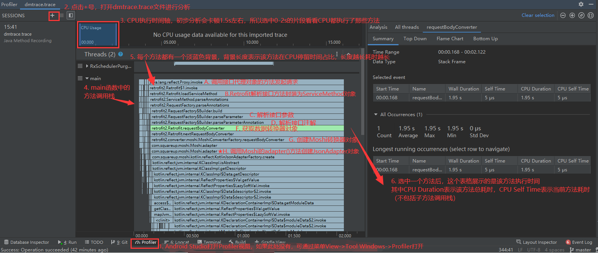
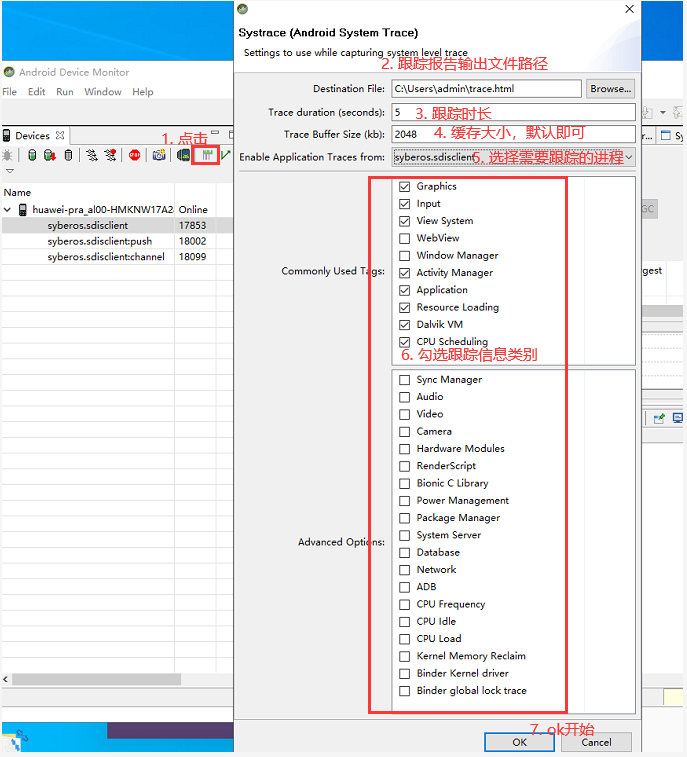

> 版权声明：本文为openXu原创文章[【openXu的博客】](http://blog.csdn.net/xmxkf)，未经博主允许不得以任何形式转载

@[toc]

本文章主要记录在项目中使用Retrofit+协程时遇到的问题，当然有关问题不局限于使用协程，可能使用RxJava或者原始Call也会遇到，所以算是对Retrofit相关问题的解决和优化。文章第一个问题讲的比较啰嗦，主要介绍了当我们遇到问题时应该怎样去分析，并学会使用相关工具定位问题产生的根本原因，这样才能更好的解决问题，而后面的就直接简单的描述问题、阐述原因和解决办法。

# 1. (优化)Retrofit+协程第一次请求时卡顿现象

## 1.1 背景

```kotlin
/**1. 接口定义*/
@POST("jeecg-boot/.../phoneLogin")
suspend fun login(@Body body: LoginBody): ApiResult<LoginInfo>

/**2. Retrofit配置*/
private val retrofit = Retrofit.Builder()
    .client(okHttpClient)
    .baseUrl(PublicApiService.TEST_URL)
    .addConverterFactory(MoshiConverterFactory.create()) 
    .build()

/**Retrofit+协程发起请求*/
viewModelScope.launch {
    showDialog.value = true   //显示dialog
    var startTime = System.currentTimeMillis()
    FLog.w("开始获取动态代理对象${startTime}")
    val service = RetrofitClient.getService(ApiService::class.java)
    FLog.w("1. 获取动态代理对象耗时${System.currentTimeMillis() - startTime}")  //25ms
    startTime = System.currentTimeMillis()
    val loginBody = LoginBody(account,
            Base64.encodeToString(
                    FEncryptUtils.encryptAES2Base64(
                            password.toByteArray(),
                            LoginBody.key.toByteArray(),
                            "AES/CBC/PKCS5Padding",
                            LoginBody.iv.toByteArray()
                    ), Base64.NO_WRAP),
            AppConfig.productAppId,
            getDeviceToken(),
            "1")
    FLog.w("2. 组织参数耗时${System.currentTimeMillis() - startTime}") //10ms
    val loginInfo = service.login(loginBody).data()
    FLog.w("3. 登录完成")
    showDialog.value = false
}
```

上述代码中通过Retrofit定义了一个接口`login()`，它是一个挂起函数，在ViewModel中直接获取接口代理对象并调用`login()`登录。出现的问题**程序运行后第一次登录会有明显的卡顿现象(dialog延迟了差不多1.5s才能显示出来)**，后面再调用登录接口就不会卡顿了。

## 1.2 初步解决方案

原因可能是Retrofit在第一次请求调用动态代理方法时会反射创建代理对象、解析接口方法注解、参数等操作都是在主线程进行的，只有真正的OkHttp请求call.enqueue()发起异步请求的时候才会切到子线程，Call的扩展挂起函数如下：

```java
//ServiceMethod的adapt()中调用call的扩展函数await()，并传入continuation作为参数
//这种调用方式看起来有些奇怪，其实就是java调用kotlin代码
KotlinExtensions.await(call, continuation);

/**Call的扩展方法，被定义在retrofit2.KotlinExtensions.kt文件中*/
suspend fun <T : Any> Call<T>.await(): T {
    return suspendCancellableCoroutine { continuation ->
        ...
        //发起请求：相当于this.enqueue，而扩展方法中的this就是被扩展的类也就是call对象
        enqueue(object : Callback<T> {
            override fun onResponse(call: Call<T>, response: Response<T>) {
                if (response.isSuccessful) {
                    val body = response.body()
                    //恢复协程执行，返回响应结果
                    continuation.resume(body)
                } else {
                	//恢复协程执行，抛出一个异常
                    continuation.resumeWithException(HttpException(response))
                }
            }
            ...
        })
    }
}
```

为了使Retrofit的操作全部切到子线程，应该在调用接口的时候就切线程，这样就不会卡顿了：

```kotlin
viewModelScope.launch {
	val category : ApiResult<MutableList<Category>> = withContext(Dispatchers.IO){
                    RetrofitClient.apiService.login()
                }
}
```

## 1.3 问题探索(使用工具对应用进行监测剖析)

问题虽然解决了，还是希望搞清楚究竟是哪个步骤导致的卡顿。launch{}中的代码可分为3个部分：创建接口代理对象、组织接口参数、调用接口发起请求，前两个步骤通过日志打印发现耗时总共也就20几毫秒，那就是调用登录接口时初次解析接口方法耗时的？以前我们直接调用Retrofit接口得到一个Call对象，然后发起请求，调用接口的代码也是在主线程中完成的为什么没有发现明显卡顿？可以怀疑卡顿并不是Retrofit解析接口方法造成的。为了准确的找出原因，决定对launch{}中的代码使用工具进行监测追踪

### 1.3.1 Android Studio CPU性能剖析器

#### ①. 通过代码插桩生成跟踪日志

在代码中我们通过`FLog.w("${System.currentTimeMillis() - startTime}")`的方式打印了主要步骤的耗时时间，但是调用login()接口的时间却没办法打印（一部分在主线程执行、另一部分在子线程）。其实Android系统为我们提供了[**Method Tracing**](https://developer.android.google.cn/studio/profile/generate-trace-logs?hl=zh_cn)用于检查CPU活动，跟踪App某段时间内调用过的所有方法以及它们花费的时间，在需要跟踪的代码开头和结尾插入`android.os.Debug.startMethodTracing()`和`stopMethodTracing()`后运行程序，系统会把追踪结果保存到手机的`Android\data\包名\files\dmtrace.trace`文件中（不同系统版本保存位置可能不一样，查看startMethodTracing()方法源码说明），将该文件导出并使用Android Studio的Profiler打开：



分析过程截图中已经标记出来了，根据方法调用栈，Retrofit在解析接口方法创建`ServiceMethod`对象时，会调用`RequestFactory.parseParameterAnnotation()`解析接口方法的参数和注解，解析参数和注解时，需要为每个参数创建都创建一个请求数据转换器`Converter`对象。通过`Converter.Factory`的`requestBodyConverter()`创建请求数据转换器（作用是将接口方法中的参数转换为RequestBody对象），而我在配置Retrofit时添加了Moshi适配器工厂`MoshiConverterFactory`，该工厂的`requestBodyConverter()`实现中调用了`moshi.adapter()`来创建`JsonAdapter`对象，其实跟踪到这里我们就已经知道了主要就是`moshi.adapter()`耗时的。所以**Retrofit创建代理对象、解析接口方法等操作并不是耗时的根本原因，虽然这些操作会消耗一些时间(不到50ms)，但不会造成肉眼可见的卡顿，真正耗时的操作是`moshi.adapter()`。**

**为什么`moshi.adapter()`会那么耗时？** 上面截图中方法调用栈不完整，我根据方法栈发现moshi在创建`JsonAdapter`对象时会通过`InputStream`读取清单文件Manifest中的相关配置，所以才会这么耗时。

**那为什么只有第一次请求会明显卡顿，而后面再次调用该接口就不会卡顿了？** 查看源码发现`Moshi`中维护了一个`Map<Object, JsonAdapter<?>> adapterCache`，用于缓存已经创建的`JsonAdapter`对象，其key是接口方法的参数类型和注解类型组成的数组，同一种参数就只需要创建一次JsonAdapter，下次是直接取的缓存。所以参数类型相同的接口方法(包括同一个接口 和 需要json转换的参数类型相同的接口)只有第一次请求时会卡顿，如果接口方法没有参数，或者所有参数类型都是String和基本类型，这种接口第一次请求不会卡顿，因为不需要参数序列化

```java
public final class Moshi {
  ...
  //缓存
  private final Map<Object, JsonAdapter<?>> adapterCache = new LinkedHashMap<>();
  ...
  //根据Retrofit定义的接口方法的参数和注解，获取JsonAdapter对象
  public <T> JsonAdapter<T> adapter(
      Type type, Set<? extends Annotation> annotations, @Nullable String fieldName) {
    ...

    // 获取key = Arrays.asList(type, annotations);
    Object cacheKey = cacheKey(type, annotations);
    synchronized (adapterCache) {
      //从缓存中获取
      JsonAdapter<?> result = adapterCache.get(cacheKey);
      if (result != null) return (JsonAdapter<T>) result;
    }
    ...
      for (int i = 0, size = factories.size(); i < size; i++) {
        //缓存中没有则创建
        JsonAdapter<T> result = (JsonAdapter<T>) factories.get(i).create(type, annotations, this);
        if (result == null) continue;
        lookupChain.adapterFound(result);
        success = true;
        return result;
      }
    ...

  }
  ...
}
```

要怎样优化它？现在看来有2种解决办法：

- 将耗时操作切换到子线程（上面已经通过`withContext(Dispatchers.IO)`解决了）。如果使用Retrofit+RxJava的话，可以使用二次动态代理将Retrofit的放到子线程中完成，参考[知乎安卓客户端启动优化：Retrofit 代理](https://www.infoq.cn/article/bl4trpybwadwjfaay1of)

```java
public final class Net {
    public static <T> createService(Class<T> service) {
        // ...
        return createWrapperService(mRetrofit, service);
    }
    private static <T> T createWrapperService(Retrofit retrofit, Class<T> service) {
        //创建Retrofit接口的二次动态代理对象，目的是当调用二次动态代理对象的接口方法时，让接口方法的解析切到子线程
        return (T) Proxy.newProxyInstance(service.getClassLoader(),
                new Class<?>[]{service}, new InvocationHandler() {
                    @Override
                    public Object invoke(Object proxy, Method method, Object[] args)throws Throwable {
                        //通过Retrofit对象创建接口原代理对象，这里需要添加缓存机制，要不然每次都会创建新的代理对象
                        final T originalService = retrofit.create(service);
                        if (method.getReturnType() == Observable.class) {
                            // 如果方法返回值是Observable的话，则包一层再返回
                            return Observable.defer(() -> {
                                // 调用原始代理对象的接口方法，获取原始Observable,然后在包裹一层subscribeOn(Schedulers.io()
                                return ((Observable) getRetrofitMethod(originalService, method)
                                        .invoke(originalService, args))
                                        .subscribeOn(Schedulers.io());   //将loadServiceMethod()操作切换到子线程
                            }).subscribeOn(Schedulers.single());
                        }
                        // 返回值不是Observable的话不处理，直接使用原代理对象执行方法
                        return getRetrofitMethod(originalService, method).invoke(originalService, args);
                    }
                    // ...
                });
    }
    private static <T> Method getRetrofitMethod(T serviceOne, Method method) throws NoSuchMethodException {
        return serviceOne.getClass().getDeclaredMethod(method.getName(), method.getParameterTypes());
    }
}
```

- 不要用Moshi，而用其他的数据转换器比如`GsonConverterFactory`，这种方式我也试过了，确实不会明显卡顿。但是GsonConverterFactory对kotlin的支持不是太好，最好还是继续使用Moshi，所以采用第一中解决办法最完美

#### ②. 直接使用Android Studio Profiler进行实时监测

上面是通过插入代码生成追踪结果文件来进行代码追踪分析，这种方式需要导出`dmtrace.trace`文件后在Profiler视图中打开，比较麻烦，其实可以直接通过Profiler窗口进行代码追踪。打开应用，进入到需要追踪的代码页面，在Profiler窗口中点击+号，选择你的测试设备->应用包名，这时候就开始对应用进程的CPU、内存、网络等进行实时监测了。由于我们需要追踪方法的耗时，也就是CPU执行时间，直接点击CPU那一栏，然后切换到只监测CPU，下方有一个**Record**按钮，点击一下该按钮就相当于在代码中插入了`Debug.startMethodTracing()`，这时候就开始对CPU进行监测记录了，对应用进行相关操作后，点击**Stop**按钮，则会停止监测记录，同时可以直接查看分析追踪结果，省去了对`dmtrace.trace`文件的导出和加载。

#### ③. 通过adb命令监测应用冷启动

上面我们都是对应用启动之后的某段时间内进行追踪，但有时候我们发现程序启动速度变慢了，要怎样对App冷启动进行监测呢？需要使用Android系统的am命令来启动App，然后导出.trace文件进行分析:

```xml

# 启动指定Activity，并同时进行采样跟踪
adb shell am start -n com.fpc.zs119/com.fpc.zs119.ui.activity.SplashActivity --start-profiler /data/local/tmp/zs119-startup.trace --sampling 1000

# 当App冷启动完毕，Activity已经绘制到屏幕后，停止追踪
adb shell am profile 

# 拉取 .trace 文件到本机当前目录
adb pull /data/local/tmp/zs119-startup.trace .
```

### 1.3.2 Systrace(系统跟踪)

上面都是通过**Android Studio CPU性能剖析器**对代码进行追踪，发现插入追踪代码后，程序运行速度严重变慢（因为需要将追踪日志写入文件中），所以最终监测结果和实际情况肯定是有一些偏差的，只能作为参考用于初步查找定位耗时方法。Google在2017年IO大会上推出了[**系统跟踪工具**](https://developer.android.google.cn/topic/performance/tracing)，它是一种可以将设备活动保存到跟踪文件的Android工具，是分析卡顿掉帧问题核心工具，只要能提供卡顿现场就能很好定位问题。其原理是在Android系统的一些关键链路(如System Service，Dalvik VM，Binder等)插入一些信息事件，通过事件的开始和结束来确定某个核心过程的执行时间，然后将这些事件信息收集起来生成html格式的报告。Android Framework层的重要模块都插入了事件(Java层的通过android.os.Trace类完成，native层通过ATrace宏完成)，我们也可以根据自己需求在自己的代码中添加自定义事件，请参考[🔗定义自定义事件](https://developer.android.google.cn/topic/performance/tracing/custom-events)。比如下面在自己的代码中插入自定义事件：

```kotlin
/**Retrofit+协程发起请求*/
viewModelScope.launch {
	showDialog.value = true
    //插入自定义事件名称的开始事件，注意beginSection()和endSection()必须成对出现
    Trace.beginSection("--------RetrofitStart")
    val service = RetrofitClient.getService(ApiService::class.java)
    val loginBody = LoginBody(...)
    val loginInfo = service.login(loginBody).data()
    //事件结束
    Trace.endSection()
    showDialog.value = false
}
```

在需要分析的代码前后插入事件对后运行代码，然后就可以开始抓取报告了。在Android10(API29)及以上版本的设备上，跟踪报告文件会以`Perfetto`格式保存，而低版本Android系统的设备上，跟踪文件会以`Systrace`格式保存。由于我测试机是8.0版本的，接下来我们生成Systrace报告，和上面CPU监测一样，Systrace报告也有多种方式获取：

#### ①. 通过systrace命令抓取

systrace命令在Android SDK工具软件包中提供，并且可以在`android-sdk/platform-tools/systrace/`中找到，命令是通过python脚本编写的，如果要运行systrace需要完成如下步骤：

1. 下载安装Android SDK工具（这个一般都不用了吧）
2. 将 `android-sdk/platform-tools/` 添加到 `PATH` 环境变量
3. 安装[python](https://www.python.org/downloads/)，并配置环境（不会的[看这里](https://www.runoob.com/python/python-install.html)）
4. 使用USB adb将Android4.3(API18)及以上设备连接到开发系统，然后在命令行运行如下命令：

```xml
// ★ 查看python版本，检查环境是否配置成功
> python -V 

// ★ cd到systrace.py所在目录
> cd F:\IDE\sdk\platform-tools\systrace

// ★ -l参数列出已连接设备可用的跟踪类别
> python systrace.py -l
	  //错误：Systrace不支持python3.x版本，请使用python2.7.x版本，fuck，重新找对应版本安装，注意我重新安装的是2.7.9版本
      Systrace does not support Python 3.9. Please use Python 2.7.

// 安装Python2.7.9版本完成后重复上面的命令
> python systrace.py -l
	  //错误：找不到win32con模块，安装python扩展模块
      ImportError: No module named win32con

// 安装python扩展模块，可以直接去网上搜相应模块包下载安装，比如从https://github.com/mhammond/pywin32/releases中下载安装win32con扩展
// 由于python有很多扩展模块，为了安装方便可以通过pip直接安装，如果你的python版本是2.7.9及以上版本已经自带pip，否则需要先去https://pip.pypa.io/en/latest/installing/下载安装pip
// 我的python是2.7.9版本的，直接通过下面命令安装需要的扩展
> py -m pip install pypiwin32
	   //安装pypiwin32失败，所以还是老老实实打开上面给出的链接下载安装win32con扩展
       Could not find any downloads that satisfy the requirement pywin32>=223 (from pypiwin32)
> py -m pip install six    //注意还需要安装six扩展

// ★ 再次列出可跟踪类别
> python systrace.py -l
        gfx - Graphics
        input - Input
        view - View System
        webview - WebView
        wm - Window Manager
        am - Activity Manager
        sm - Sync Manager
		...

// ★★★ 使用python执行systrace.py脚本记录设备活动,参数说明如下
// -o ：将HTML跟踪报告写入指定的文件,如未指定，将会保存为systrace.py所在的目录中的trace.html文件
// -a ：指定应用包名
// categories：后面的都是需要跟踪的类别，支持什么类别从上面列出的支持类别中查看
> python systrace.py -o mynewtrace.html -a syberos.sdisclient am pm sm app res
	//输入上面的命令回车会打印如下内容，这时候开始操作应用，需要结束追踪时再次回车即可
	Starting tracing (stop with enter)
    //操作完成，再次回车停止记录，输出记录报告，这里需要等一会儿
	Tracing completed. Collecting output...
```

更多systrace命令参数请参考[🔗在命令行上捕获系统跟踪记录](https://developer.android.google.cn/topic/performance/tracing/command-line)。通过命令的方式抓取报告是最方便的，当然可能有些同学感觉要去安装python好麻烦哦，其实下载安装配置环境也就几分钟的事，安装完就一劳永逸了。当然，实在觉得麻烦，还可以使用下面第三种方法通过DDMS抓取

#### ②. 捕获设备上的系统跟踪记录

Android9(API28)及以上版本的设备中包含一个名为System Tracing的系统级应用。此应用类似于systrace命令行实用工具，但可以直接从测试设备本身录制跟踪记录，无需插入设备并通过ADB连接到该设备。如果你的测试机是Android9以上，可以试试[🔗录制系统跟踪记录](https://developer.android.google.cn/topic/performance/tracing/on-device)

#### ③. 通过Android Device Monitor抓取

由于Android Studio3.0开始弃用了Android Device Monitor，因为它是一个独立的工具，我们需要自行进入`sdk/tools/lib/monitor-x86_64/monitor.exe`运行monitor.exe启动Android设备监视器，然后按照下图步骤抓取报告，抓取完就可以在第2步设置的文件位置找到报告文件了




#### ④. Systrace报告分析

不管使用上面三种方式中的哪一种，最终都会得到一个html格式的报告文件，打开**Chrome**浏览器，地址栏输入`chrome://tracing/`，然后将报告文件拖入浏览器中即可。


> 如需详细了解应用正在执行哪些方法及其占用了多少CPU资源，还是应该使用上述Android Studio CPU性能剖析器。


# 2. (优化)组件化中的Retrofit使用享元模式思想重用接口动态代理对象

享元模式尝试重用现有的同类对象，如果未找到匹配的对象，则创建新对象，用于减少创建对象的数量，以减少内存占用和提高性能，这种类型的设计模式属于结构型模式。说的简单一点就是，一段程序中经常需要创建某种类型的对象，而对象的数量是有限的，可以将已经创建的对象缓存起来，下次要创建这个对象时直接从缓存中拿，缓存中没有就去创建。Retrofit中创建接口方法`ServiceMethod`对象时就用到了享元模式：

```java
public final class Retrofit {
  private final Map<Method, ServiceMethod<?>> serviceMethodCache = new ConcurrentHashMap<>();
  //调用接口方法时，使用享元模式尝试从缓存中获取，这样避免一个接口被调用多次时每次都要解析接口方法的注解和参数
  ServiceMethod<?> loadServiceMethod(Method method) {
    //取缓存
    ServiceMethod<?> result = serviceMethodCache.get(method);
    if (result != null) return result;
    synchronized (serviceMethodCache) {
      result = serviceMethodCache.get(method);
      if (result == null) {
        //创建并缓存
        result = ServiceMethod.parseAnnotations(this, method);
        serviceMethodCache.put(method, result);
      }
    }
    return result;
  }
}
```

一个大项目根据业务划分为多个模块，不同模块中使用到的服务器接口不同，通常会将Retrofit接口定义到对应的module中，然后通过`RetrofitClient.retrofit.create(ModuleApiService::class.java)`获取接口动态代理对象，如果每次请求接口都创建一个接口代理对象肯定不合适，所以通过**享元模式**的思想对现有代理对象进行缓存重用：

```kotlin
object RetrofitClient {
    private val okHttpClient = OkHttpClient.Builder()
            .retryOnConnectionFailure(true)
            .connectTimeout(4000, TimeUnit.MILLISECONDS)       //IP连接超时
            .dns(TimeOutDns(4000, TimeUnit.MILLISECONDS))
            .readTimeout(20000, TimeUnit.MILLISECONDS)
            .writeTimeout(30000, TimeUnit.MILLISECONDS)
            .addInterceptor(TokenInterceptor()) //must call proceed() exactly once
            .addInterceptor(HttpUrlInterceptor())
            .addInterceptor(HttpLoggingInterceptor().apply {
                level = if(AppConfig.DEBUG)
                    HttpLoggingInterceptor.Level.BODY
                else HttpLoggingInterceptor.Level.BASIC
            })
            .build()


    /**Retrofit*/
    private val retrofit = Retrofit.Builder()
        .client(okHttpClient)
        .baseUrl(PublicApiService.TEST_URL)
        .addConverterFactory(MoshiConverterFactory.create())
        .addCallAdapterFactory(CoroutinesResponseCallAdapterFactory())
        .build()

    /**ApiService*/
    private val serviceMap = mutableMapOf<Class<out Any>, Any>()
    //获取动态代理对象
    fun <S> getService(javaClass : Class<out S>) : S{
        //享元模式重用现有对象
        if(!serviceMap.containsKey(javaClass)){
            serviceMap.put(javaClass, retrofit.create(javaClass)!!)
        }
        return serviceMap[javaClass] as S
    }
}
```

# 3. (优化)Retrofit+OkHttp下载、上传文件时进度条卡顿

## 3.1 问题

```kotlin
//1 文件上传
@Multipart
@POST("/jeecg-boot/cmds/attachment/uploadMultipleFile")
suspend fun uploadFile(@PartMap map:MutableMap<String, RequestBody>, @Part parts:MutableList<MultipartBody.Part>): ApiResult<String>

//2 文件下载
@Streaming
@GET
suspend fun downloadFile(@Url url: String): Response<ResponseBody>

fun downloadFile(path: String, build: IDownloadBuild) = flow {
        val response = getService(PublicApiService::class.java).downloadFile(path)
        response.body()?.let { body ->
            val allLength = body.contentLength()
            val contentType = body.contentType().toString()
            val inputStream = body.byteStream()
            val info = try {
                dowloadBuildToOutputStream(build, contentType)
            } catch(e:Exception){
                emit(DownloadStatus.DownloadErron(e))
                DownloadInfo(null)
                return@flow
            }
            val outputStream = info.ops
            if (outputStream == null) {
                emit(DownloadStatus.DownloadErron(RuntimeException("下载出错")))
                return@flow
            }
            //当前下载长度
            var currentLength = 0
            //写入文件，每次读取8kb
            val bufferSize = 1024 * 8
            val buffer = ByteArray(bufferSize)
            val bufferedInputStream = BufferedInputStream(inputStream, bufferSize)
            var readLength = 0
            FLog.e("文件总长度：$allLength")
            while (bufferedInputStream.read(buffer, 0, bufferSize).also { readLength = it } != -1) {
                outputStream.write(buffer, 0, readLength)
                outputStream.flush()
                currentLength += readLength
                //★ 发射下载进度，主线程中收到后更新进度条
                FLog.e("发射进度：${currentLength.toFloat() / allLength.toFloat()}")
                emit(
                        DownloadStatus.DownloadProcess(
                                currentLength.toLong(),
                                allLength,
                                currentLength.toFloat() / allLength.toFloat()
                        )
                )
            }
            bufferedInputStream.close()
            outputStream.close()
            inputStream.close()
            if (info.uri != null)
                emit(DownloadStatus.DownloadSuccess(info.uri))
            else
                emit(DownloadStatus.DownloadSuccess(Uri.fromFile(info.file)))
        } ?: kotlin.run {
            emit(DownloadStatus.DownloadErron(RuntimeException("下载出错")))
        }

    }.flowOn(Dispatchers.IO)
```

通过协程的`flow{}`调用Retrofit下载文件接口的时候，通过循环读取ResponseBody的`byteStream()`输入流将数据写入本地文件，每次读取8kb，然后发射进度给主线程更新下载进度条。现象是下载过程中，“发射进度”的log打印正常，但是页面上进度条不更新，直到下载成功的前一刻，进度条突然就变为100%。观察Logcat日志，发现这段时间只有GC日志，说明内存占用严重，通过Android Studio Profiler对内存进行监测可以证实在文件下载过程中，内存确实占用过高。通过排查，发现问题是**OkHttp日志拦截器中打印的Body内容太多造成内存占用严重造成的卡顿**。

```kotlin
private val okHttpClient = OkHttpClient.Builder()
    ...
    .addInterceptor(HttpLoggingInterceptor().apply {
        level = if(AppConfig.DEBUG)  //debug模式下打印请求和响应体
            HttpLoggingInterceptor.Level.BODY
        else HttpLoggingInterceptor.Level.BASIC
    })
    .build()

```

在测试版本中，通常设置level为body，从而打印完整的请求和返回体方便调试，但当请求为上传文件或者下载文件时，由于实体中数据量较大，将body中的数据写入缓冲区`requestBody!!.writeTo(buffer)` or `responseBody.source().buffer()`的操作会占用大量内存，造成程序卡顿，比如下载进度不更新等情况。

##  3.2 解决

解决办法可以粗暴的**将Level设置为BODY以上级别**，如`HEADERS`、`BASIC`、`NONE`，但是这样在开发时就看不到完整的请求内容了，比如我要看传递给后台的参数是什么，这些都是在实体中的。所以Debug模式下Level必须设置为BODY，这样就只能**通过自定义`HttpLoggingInterceptor`，判断实体的`Content-Type`内容类型，如果发现是`multipart/form-data`表单文件上传或者是`application/octet-stream`二进制流数据下载，则不进行将实体加载到缓冲区后转换为字符串打印的操作**，完整的日志拦截器如下（对于实体类型的判断，可结合项目根据实际情况进行改造）：

```kotlin
/**
 * Author: openXu
 * Time: 2021/4/28 10:09
 * class: HttpLoggingInterceptor
 * Description:
 */
class HttpLoggingInterceptor(private val logger: Logger) : Interceptor{
    private val UTF8 = Charset.forName("UTF-8")
    
    var level = Level.NONE

    enum class Level {
        NONE, BASIC, HEADERS, BODY
    }
    interface Logger {
        fun log(message: String?)
        companion object {
            val DEFAULT: Logger = object : Logger {
                override fun log(message: String?) {
                    Platform.get().log(Platform.INFO, message, null)
                }
            }
        }
    }
    constructor() : this(Logger.DEFAULT)

    override fun intercept(chain: Interceptor.Chain): Response {
        FLog.w("日志拦截器============")
        /**打印请求日志*/
        val request = chain.request()
        if (level == Level.NONE)  //不打印日志
            return chain.proceed(request)

        val logBody = level == Level.BODY
        val logHeaders = logBody || level == Level.HEADERS
        val requestBody = request.body()
        val hasRequestBody = requestBody != null
        val connection = chain.connection()
        val protocol = if (connection != null) connection.protocol() else Protocol.HTTP_1_1
        // --> GET http://39.98.164.162:8080/jeecg-boot/public/GetTaskCount http/1.1
        var requestStartMessage = "--> " + request.method() + ' ' + request.url() + ' ' + protocol
        if (!logHeaders && hasRequestBody) {
            requestStartMessage += " (" + requestBody!!.contentLength() + "-byte body)"
        }
        logger.log(requestStartMessage)
        if (logHeaders) {   //打印请求头  如：Connection: keep-alive ...
            requestBody?.let {
                if (requestBody.contentType() != null) logger.log("Content-Type: " + requestBody.contentType())
                if (requestBody.contentLength() != -1L) logger.log("Content-Length: " + requestBody.contentLength())
            }
            val headers = request.headers()
            var i = 0
            while (i < headers.size()) {
                val name = headers.name(i)
                if (!"Content-Type".equals(name, ignoreCase = true) && !"Content-Length".equals(name, ignoreCase = true))
                    logger.log(name + ": " + headers.value(i))
                i++
            }
            if (!logBody || !hasRequestBody) {
                logger.log("--> END " + request.method())
            } else if (bodyEncoded(request.headers())) {
                logger.log("--> END " + request.method() + " (encoded body omitted)")
            } else {
                val contentType = requestBody!!.contentType()
                /**★★★ 打印请求实体数据之前，判断是否为上传表单文件，如果是则拦截不进行打印*/
                if(!interceptLog(false, contentType, requestBody.contentLength())){
                    val buffer = Buffer()
                    requestBody.writeTo(buffer)   //★★★ 占用大量内存
                    logger.log("")
                    if (isPlaintext(buffer)) {
                        var charset = UTF8
                        if (contentType != null)
                            charset = contentType.charset(UTF8)
                        logger.log(buffer.readString(charset))   //打印请求实体body数据
                        logger.log("--> END ${request.method()} (${requestBody.contentLength()}-byte body)")
                    } else {
                        logger.log("--> END ${request.method()} (binary ${requestBody.contentLength()}-byte body omitted))")
                    }
                }
            }
        }
        /**打印响应日志*/
        val startNs = System.nanoTime()
        val response: Response
        response = try {
            chain.proceed(request)
        } catch (e: Exception) {
            logger.log("<-- HTTP FAILED: $e")  //请求失败
            throw e
        }
        val tookMs = TimeUnit.NANOSECONDS.toMillis(System.nanoTime() - startNs)

        val responseBody = response.body()
        val contentLength = responseBody!!.contentLength()
        val bodySize = if (contentLength != -1L) "$contentLength-byte" else "unknown-length"
        logger.log("<-- ${response.code()} ${response.message()} ${response.request().url()} (${tookMs}ms"
                + (if (!logHeaders) ", $bodySize body" else "") + ')')

        if (logHeaders) {
            val headers = response.headers()
            var i = 0
            while (i < headers.size()) {
                logger.log(headers.name(i) + ": " + headers.value(i))
                i++
            }
            if (!logBody || !HttpHeaders.hasBody(response)) {
                logger.log("<-- END HTTP")
            } else if (bodyEncoded(response.headers())) {
                logger.log("<-- END HTTP (encoded body omitted)")
            } else {
                val contentType = responseBody.contentType()
                /**★★★ 在打印实体数据之前，判断是否为下载二进制文件流，如果是则拦截不进行打印*/
                if(!interceptLog(false, contentType, responseBody.contentLength())){
                    val source = responseBody.source()
                    source.request(Long.MAX_VALUE) // Buffer the entire body.
                    val buffer = source.buffer()  //★★★ 占用大量内存
                    if (!isPlaintext(buffer)) {
                        logger.log("")
                        logger.log("<-- END HTTP (binary " + buffer.size() + "-byte body omitted)")
                        return response
                    }
                    var charset = UTF8
                    contentType?.let {
                        charset = try {  //获取响应体字符编码格式
                            contentType.charset(UTF8)
                        } catch (e: UnsupportedCharsetException) {
                            logger.log("")
                            logger.log("Couldn't decode the response body; charset is likely malformed.")
                            logger.log("<-- END HTTP")
                            return response
                        }
                    }
                    if (contentLength != 0L) {
                        logger.log("")
                        logger.log(buffer.clone().readString(charset))
                    }
                    logger.log("<-- END HTTP (" + buffer.size() + "-byte body)")
                }
            }
        }

        return response
    }

    private fun interceptLog(isResponse: Boolean, mediaType: MediaType?, contentLength: Long) :Boolean {
        if(mediaType==null)
            return false
        val mediaTypeStr = mediaType?.toString()  //application/json;charset=UTF-8
        val type = mediaType?.type()        //application
        val subtype = mediaType?.subtype()  ///json
        val requestOrReponse = if(isResponse) "响应返回" else "请求发送"
        /**★★★★★★ 当实体类型为上传表单文件 or 下载二进制流数据时 对其拦截，不打印实体数据*/
        when(type){
            "multipart" -> {logger.log(">>>>>${requestOrReponse}表单or上传文件，大小为${contentLength}"); return true}
            "application" -> when (subtype) {
                "octet-stream" -> {logger.log("<<<<<$requestOrReponse 二进制流数据（如常见的文件下载)，大小为${contentLength}"); return true}
            }
        }
        return false
    }

    private fun isPlaintext(buffer: Buffer): Boolean {
        return try {
            val prefix = Buffer()
            val byteCount = if (buffer.size() < 64) buffer.size() else 64
            buffer.copyTo(prefix, 0, byteCount)
            for (i in 0..15) {
                if (prefix.exhausted()) {
                    break
                }
                val codePoint = prefix.readUtf8CodePoint()
                if (Character.isISOControl(codePoint) && !Character.isWhitespace(codePoint)) {
                    return false
                }
            }
            true
        } catch (e: EOFException) {
            false
        }
    }

    private fun bodyEncoded(headers: Headers): Boolean {
        val contentEncoding = headers["Content-Encoding"]
        return contentEncoding != null && !contentEncoding.equals("identity", ignoreCase = true)
    }
}
```

# 4. (坑)动态拦截替换BaseUrl后下载不了文件

项目中需要动态选择服务器地址，将地址保存在本地，不需要重启达到实施更新BaseUrl的目的，通常会在拦截器中进行替换，这样所有的请求在发起之前都会被动态修改BaseUrl，测试阶段发现文件下载失败，原因是**文件地址是后台返回的全路径，在下载文件之前将全路径中的主机给动态修改了，造成访问不到文件。**解决办法是，在下载文件的接口定义上添加一个自定义Header，拦截器中判断如果带有这个header的请求都不进行主机替换：

```kotlin
/*2 文件下载*/
@Streaming
@Headers("isDownload: true")   //自定义header避免替换baseUrl
@GET
suspend fun downloadFile(@Url url: String): Response<ResponseBody>

class HttpUrlInterceptor : Interceptor {

    override fun intercept(chain: Interceptor.Chain): Response  {
        val oldRequest = chain.request()
        var httpUrl:HttpUrl = oldRequest.url()

        val isDownload = oldRequest.header("isDownload")
        FLog.w("★★★判断是否是文件下载请求（是否有自定义isDownload请求头）: $isDownload")
        if(!isDownload.isNullOrEmpty()){
            FLog.d("文件下载不需要替换BaseUrl，因为是后台返回的文件全路径")
        }else{
            try {
                val addr = MMKV.defaultMMKV()?.decodeString(Mmkv.KEY_ADDRESS)
                val port = MMKV.defaultMMKV()?.decodeInt(Mmkv.KEY_PORT)
                val baseUrl = HttpUrl.parse("http://$addr:$port")
                httpUrl = httpUrl
                        .newBuilder()
                        //动态修改BaseUrl
                        .scheme(baseUrl?.scheme())
                        .host(baseUrl?.host())
                        .port(baseUrl?.port()!!)
                        .build()
                FLog.w("动态替换BaseUrl后：$httpUrl")
                if(httpUrl==null)
                    throw IOException("替换域名失败:$httpUrl")
            }catch (e:Exception){
                throw IOException("替换域名失败:${e.message}")
            }
        }

        var token = MMKV.defaultMMKV()?.decodeString(Mmkv.KEY_TOKEN)
        val request = oldRequest.newBuilder()
                .url(httpUrl)
                .addHeader("Connection", "keep-alive")
                .addHeader("Content-Type","application/json;charset=UTF-8")
                //接受任何 MIME 类型的资源，支持采用 gzip、deflate 或 sdch 压缩过的资源
                .addHeader("Accept", "*/*")   //告知服务器发送何种媒体类型  对应响应头Content-Type
                //可以接受 zh-CN、en-US 和 en 三种语言，并且 zh-CN 的权重最高（q 取值 0 - 1，最高为 1，最低为 0，默认为 1），服务端应该优先返回语言等于 zh-CN 的版本。
                .addHeader("Accept-Language", "zh-CN,en-US;q=0.8,en;q=0.6")
                //告知服务器发送何种字符集   对应响应头Content
                .addHeader("Accept-Charset", "UTF-8")
                /**
                 * Accept-Encoding告知服务器采用何种压缩方式，如果没有设置，后台可能返回gzip格式
                 * 返回乱码的原因就是Okhttp没有正确解压Gzip的数据
                 * Okhttp不会帮你处理Gzip的解压，需要你自己去处理。
                 */
                .header("Accept-Encoding", "")
                .addHeader("X-Access-Token", token?:"")
                .build()

        return chain.proceed(request)
    }
}
```

# 5. (坑)Chain.proceed()只能被调用一次

```kotlin
class TokenInterceptor : Interceptor {
    override fun intercept(chain: Interceptor.Chain): Response  {
        val originalRequest = chain.request()
        val response = chain.proceed(originalRequest)
        //判断是否Token过期
        if(response.code()==500) {
            try {
                val responseBody = response.body()
                val source = responseBody?.source()  //解决response.body().string()只能打印一次
                source?.request(Long.MAX_VALUE) // Buffer the entire body.
                val buffer = source?.buffer
                var charset = Charset.forName("UTF-8")
                val responseStr = buffer?.clone()?.readString(charset)
                val tokenResponse = MoshiHelper.fromJson<TokenResponse>(responseStr!!)
                // {"timestamp":"2021-03-10 16:00:54",
                // "status":500,
                // "error":"Internal Server Error",
                // "message":"Token失效，请重新登录",
                // "path":"/jeecg-boot/sys/permission/getPhoneUserPermissionByToken"}
                tokenResponse?.let {
                    if(tokenResponse.status==500 && tokenResponse.message!!.contains("Token失效")){
                        return refreshToken(chain, response)
                    }
                }
            }catch (e:Exception){
                e.printStackTrace()
            }
        }
        return response
    }

    private fun refreshToken(chain: Interceptor.Chain, oldResponse: Response) : Response{
        FLog.w("检测到Token已经过期，需要刷新Token${Thread.currentThread()}")
        //同步请求，获取最新的Token
        val mmkv = MMKV.defaultMMKV()
        val oldToken = mmkv?.decodeString(Mmkv.KEY_TOKEN)
        val call = RetrofitClient.getService(PublicApiService::class.java)
                .changeToken(ChangeAppTokenBody(oldToken))
        val result : String? = call.execute().body()?.data()
        mmkv?.encode(Mmkv.KEY_TOKEN, result)    //将新token保存到本地
        FLog.v("老token:${oldToken}")
        FLog.v("新token:${mmkv?.decodeString(Mmkv.KEY_TOKEN)}")
        result?.let {
            //创建新的请求
            val newRequest = chain.request()
                    .newBuilder()
                    //这里不用添加，重新请求时HttpUrlInterceptor拦截器中会添加新token
//                                    .header("X-Access-Token", result)
                    .build()
            //★★★重新请求
            return chain.proceed(newRequest)
        }
        return oldResponse
    }
}
```

使用自定义拦截器实现Token过期自动刷新后自动重新发起请求，结果重新发起请求时报错**`must call proceed() exactly once`**，搜索后发现是添加拦截器的方式不对，`addNetworkInterceptor()`添加的拦截器不允许重试（`Chain.proceed()`调用多次），而应该使用`addInterceptor()`添加拦截器：

```kotlin
//    Okhttp 的addInterceptor 和 addNetworkInterceptor 的区别
//    addInterceptor（应用拦截器）：
//    1，不需要担心中间过程的响应,如重定向和重试.
//    2，总是只调用一次,即使HTTP响应是从缓存中获取.
//    3，观察应用程序的初衷. 不关心OkHttp注入的头信息如: If-None-Match.
//    4，允许短路而不调用 Chain.proceed(),即中止调用.
//    5，允许重试,使 Chain.proceed()调用多次.
//    addNetworkInterceptor（网络拦截器）：
//    1，能够操作中间过程的响应,如重定向和重试.
//    2，当网络短路而返回缓存响应时不被调用.
//    3，只观察在网络上传输的数据.
//    4，携带请求来访问连接.
    private val okHttpClient = OkHttpClient.Builder()
            ...
            .addInterceptor(TokenInterceptor()) 
            .addInterceptor(HttpUrlInterceptor())
            .addInterceptor(HttpLoggingInterceptor().apply {
                level = if(AppConfig.DEBUG)
                    HttpLoggingInterceptor.Level.BODY
                else HttpLoggingInterceptor.Level.BASIC
            })
            .build()
```

# 6. (坑)OkHttp只能将IO异常从拦截器发送到调用处

## 6.1 背景

项目中使用了token认证机制，用户调用登录接口登录成功后台返回如下数据:

- token ： token令牌，有效时间较短，比如1天
- tokenPeriodTime ： token令牌过期时间戳
- refreshToken ：当token过期后，提交refreshToken访问token刷新的接口获取新的token，有效期较长用于强制用户重新登录

token机制是为了服务器验证客户端身份的，一些接口只有登录用户才能访问服务器。为了提高token的安全性，通常会给token设置一个很短的有效时间，当token过期后就不能使用了，难道让用户重新登录？这样体验就很差，为了提升用户体验，出现了refreshToken，它的有效时间通常较长，比如一个月、一年，当token过期后可以提交refreshToken来获取新的token值（用户无感知），但是refreshToken也有过期的时候，当刷新token时后台如果返回错误“refreshToken已过期”，则需要强制用户重新登录。

> 有些需求是如果一切正常永不需要强制登录，那就不存在refreshToken和tokenPeriodTime，只需要一个token就可以了。每次请求时发送原始请求，当服务器返回token失效，那就提交老token获取新的token，如果刷新token成功则重新请求，只有刷新token失败的情况下才需要强制重新登录，刷新token失败一般情况下是非常少见的（因为既然后台返回了token失效说明网络通信正常，而立马刷新token失败只有可能是老token不合法或者服务器错误）

我们通过OkHttp拦截器来实现这个过程：

```kotlin
/**
 * Author: openXu
 * Time: 2020/3/9 11:28
 * class: TokenInterceptor
 * Description: 用于检测Token是否过期，如果过期自动刷新，如果refreshToken也过期则强制重新登录
 */
class TokenInterceptor : Interceptor {
    override fun intercept(chain: Interceptor.Chain): Response  {
        val originalRequest = chain.request()
        var token = MMKV.defaultMMKV()?.decodeString(Mmkv.KEY_TOKEN)
        var tokenPeriodTime = MMKV.defaultMMKV()?.decodeLong(Mmkv.KEY_TOKEN_TIME)

        if(tokenPeriodTime!=null && System.currentTimeMillis()>tokenPeriodTime){
            //1. token过期了，提交refreshToken刷新token
            var refreshToken = MMKV.defaultMMKV()?.decodeString(Mmkv.KEY_REFRESH_TOKEN)
            val call = RetrofitClient.getService(PublicApiService::class.java)
                    .changeToken(refreshToken)
            val response = call.execute()
            if(response.code()==200){  //网络正常
                when(response.body()?.code){
                    200 -> {
                        val newToken = response.body()?.data()
                        //2. 刷新token成功，将新token保存到本地
                        MMKV.defaultMMKV()?.encode(Mmkv.KEY_TOKEN, newToken)
                    }
                    else->{
                        //3. 刷新token失败，获取新token为空
                        //https://stackoverflow.com/questions/58697459/handle-exceptions-thrown-by-a-custom-okhttp-interceptor-in-kotlin-coroutines
                        //https://github.com/square/okhttp/issues/5992
                        //★★★ 抛出一个特殊的自定义异常，统一错误处理时检测到该异常会强制跳转到登录页
                        // throw RuntimeException("登录信息已过期，请重新登录")  ❌❌❌错误
                        // TODO OkHttp只能将IO异常从拦截器（子线程）发送到调用处的代码（调用处的线程），其他类型异常直接就崩溃了
                        //class LoginException(var code: Int?, override var message: String?) : IOException()
                        throw LoginException(-1001, "登录信息已过期，请重新登录")
                    }
                }
            }
        }
        //4. 继续发起请求
        return chain.proceed(originalRequest)
    }
}
```

## 6.2 问题

项目中使用的是Retrofit+协程，通过`viewModelScope`开启协程，并将通过`try`包裹协程代码块实现异常统一处理。上面代码第3步，当刷新token失败时通过抛出异常实现强制登录，刚开始我随便抛了一个`RuntimeException`类型的异常，结果异常被try住了，但是应用程序却崩溃了。然后在[okhttp Issues](https://github.com/square/okhttp/issues/5992)中找到了答案，是因为**OkHttp只能将IO异常从拦截器（子线程）发送到调用处的代码（调用处的线程），其他类型异常会导致程序崩溃**。所以我自定义了一个`LoginException`类型的异常，它继承自`IOException`，这样就可以捕获到这个异常实现强制登录了

将问题归纳一下：**拦截器中的所有类型异常在协程中都能被try住，但是非IOException异常会导致程序崩溃**

```kotlin
    protected fun launch(
            block: Block<Unit>,
            error: Error? = null,
            cancel: Cancel? = null,
            showErrorToast: Boolean = true
    ): Job {
        return viewModelScope.launch {
            try {
                block.invoke(this)
            } catch (e: Exception) {
                e.printStackTrace()
                FLog.e("block执行异常：$e")
                when (e) {
                    is CancellationException -> {
                        cancel?.invoke(e)
                    }
                    else -> {
                        //★★★ 统一错误处理
                        onError(e, showErrorToast)
                        error?.invoke(e)
                    }
                }
            }
        }
    }

    private fun onError(e: Exception, showErrorToast: Boolean) {
        when (e) {
            is LoginException ->{
                wToast.value="登录信息已过期，请重新登录"
                startActivity("/module_common/login", Bundle())
                finish()
            }
            is ApiException -> {
                if (showErrorToast) wToast.value = e.message
            }
            // 网络请求失败
            is ConnectException,
            ...
            is HttpException,
            is SSLHandshakeException ->
                if (showErrorToast) wToast.value="网络请求失败"
            // 数据解析错误
            is JsonDataException, is JsonEncodingException ->
                wToast.value="数据解析错误"
            else -> // 其他错误
                wToast.value=e.message
        }
    }

```

## 6.3 问题原因

查看okhttp源码，重点关注`AsyncCall`的`execute()`方法，该方法在子线程中执行，**将除了`IOException`类型的异常都抛出会导致程序崩溃，同时将所有类型异常都通过回调返回到调用处，所以可以try住异常（注意try住的异常是通过协程恢复切换到主线程再throw的而非子线程中throw的那个异常）**

```java
/**1 OkHttp的Call接口*/
public interface Call extends Cloneable {
    ...
    //发起同步请求
    Response execute() throws IOException;
    //异步请求
    void enqueue(Callback responseCallback);
    ...
}

/**2 异步请求回调*/
public interface Callback {
  //异步请求的失败回调中只回调IOException类型的异常
  void onFailure(Call call, IOException e);
  //成功回调方法只抛出IOException类型的异常
  void onResponse(Call call, Response response) throws IOException;
}

/**3 Call的实现类*/
final class RealCall implements Call {
    //3.1 同步请求实现
    @Override 
    public Response execute() throws IOException {
        ...
        try {
          client.dispatcher().executed(this);
          //同步请求:并没有处理异常只是将异常抛出去了
          return getResponseWithInterceptorChain();
        } finally {
          client.dispatcher().finished(this);
        }
    }
    //★3.1 异步请求实现
    @Override 
    public void enqueue(Callback responseCallback) {
        ...
        //将当前请求包装为一个AsyncCall类型的Runnable扔进线程池
        client.dispatcher().enqueue(new AsyncCall(responseCallback));
    }

    //内部类Runnable
    final class AsyncCall extends NamedRunnable {
        @Override 
        protected void execute() {
          //以下代码会在子线程中执行
          try {
            Response response = getResponseWithInterceptorChain();
            responseCallback.onResponse(RealCall.this, response);
          } catch (IOException e) {
            ...
            //★★★ IO异常通过回调返回
            responseCallback.onFailure(RealCall.this, e);
          } catch (Throwable t) {
            cancel();
            if (!signalledCallback) {
              IOException canceledException = new IOException("canceled due to " + t);
              canceledException.addSuppressed(t);
              //★★★ 其他类型异常通过回调返回
              responseCallback.onFailure(RealCall.this, canceledException);
            }
            //★★★★★★ 将其他异常原封不动的抛出去
            throw t;   
          } finally {
            client.dispatcher().finished(this);
          }
        }
    }

    //不管是同步请求还是异步请求都会调用到这里，拦截器抛出的异常
    Response getResponseWithInterceptorChain() throws IOException {
        // 创建完整的拦截器栈
        List<Interceptor> interceptors = new ArrayList<>();
        interceptors.addAll(client.interceptors());
        interceptors.add(new RetryAndFollowUpInterceptor(client));
        interceptors.add(new BridgeInterceptor(client.cookieJar()));
        interceptors.add(new CacheInterceptor(client.internalCache()));
        interceptors.add(new ConnectInterceptor(client));
        if (!forWebSocket) {
          interceptors.addAll(client.networkInterceptors());
        }
        interceptors.add(new CallServerInterceptor(forWebSocket));
        //创建一个拦截器链
        Interceptor.Chain chain = new RealInterceptorChain(interceptors, transmitter, null, 0,
            originalRequest, this, client.connectTimeoutMillis(),
            client.readTimeoutMillis(), client.writeTimeoutMillis());

        boolean calledNoMoreExchanges = false;
        try {
          //发起请求
          Response response = chain.proceed(originalRequest);
          if (transmitter.isCanceled()) {
            closeQuietly(response);
            throw new IOException("Canceled");
          }
          return response;
        } catch (IOException e) {
          //只拦截了IO异常，其实这里还是将IO异常抛出去了，只是做了一些重制工作
          calledNoMoreExchanges = true;
          throw transmitter.noMoreExchanges(e);
        } finally {
          if (!calledNoMoreExchanges) {
            transmitter.noMoreExchanges(null);
          }
        }
    }
}
```

不管是通过Retrofit还是直接使用OkHttp发起网络请求，最后都是由okhttp框架中的`okhttp3.Call`对象发起请求的，OkHttp中的`Call`的实现类为`RealCall`，发现不管是同步请求还是异步请求的实现，最终都调用了`getResponseWithInterceptorChain()`方法，该方法中并没有处理拦截器中的所有异常，而是将异常都抛出去了。文章开头第一个问题中我们知道Retrofit+协程最终是调用了`call.enqueue()`发起异步请求，我们重点关注RealCall的`enqueue()`，它将当前请求包装为一个Runnable类型`AsyncCall`扔到线程池(**子线程**)中，然后在子线程中执行`execute()`。

`execute()`中调用了`getResponseWithInterceptorChain()`并且将其用try包裹，catch分为两部分，第一部分是处理IO异常，将IO异常通过回调返回到调用处；第二部分是**其他类型的异常`Throwable`，同样通过回调返回，重点是最后通过`throw`又将异常抛了出去。**

我们再来看看协程相关的处理：

```java
//Retrofit的Call的扩展函数发起请求
KotlinExtensions.await(call, continuation);

/**Call的扩展方法，被定义在retrofit2.KotlinExtensions.kt文件中*/
suspend fun <T : Any> Call<T>.await(): T {
    return suspendCancellableCoroutine { continuation ->
        ...
        //1. 发起请求：相当于this.enqueue，而扩展方法中的this就是OkHttpCall类型对象
        enqueue(object : Callback<T> {
            override fun onResponse(call: Call<T>, response: Response<T>) {
                ...
                //返回响应结果，恢复协程执行
                continuation.resume(body)
            }
            //★★★ OkHttp拦截器的所以异常最终都会通过continuation抛给创建协程的线程（主线程）
            override fun onFailure(call: Call<T>, t: Throwable) {
                continuation.resumeWithException(t)
            }
        })
    }
}


//2. Retrofit的Call实现类OkHttpCall中的enqueue()
public void enqueue(final Callback<T> callback) {

    okhttp3.Call call;
    Throwable failure;
    //...省略okhttp3.Call对象的创建
    //调用okhttp的RealCall.enqueue()
    call.enqueue(
        //OkHttp层的回调
        new okhttp3.Callback() {
          @Override
          public void onResponse(okhttp3.Call call, okhttp3.Response rawResponse) {
            ...
            Response<T> response = parseResponse(rawResponse);
            ...
            callback.onResponse(OkHttpCall.this, response);
            ...
          }
          @Override
          //异常回调
          public void onFailure(okhttp3.Call call, IOException e) {
            callFailure(e);
          }
          private void callFailure(Throwable e) {
              //将OkHttp的异常通过回调返回到Retrofit层的回调中
              callback.onFailure(OkHttpCall.this, e);
              ...
          }
        });
  }

```

当我们调用Retrofit定义的挂起接口时，会调用到Retrofit的OkHttpCall类型的扩展函数`await()`；然后调用其`enqueue()`方法，创建okhttp3的`Call`对象，也就是OkHttp层的`RealCall`对象；然后调用`RealCall.enqueue()`。看起来调用链比较复杂，其实我们只需要关注头(发起调用处)和尾(异常抛出处)：

- 尾:`RealCall.enqueue()`在子线程执行的时候捕获了所有异常，并通过callback将异常回调到调用处；除此之外还将除了IO类型的异常都抛出去了
- 头：Retrofit的Call扩展函数`await()`中在`onFailure()`里拿到回调的异常后，通过续体`continuation`将异常对象带到了协程所在的线程(主线程)，然后在主线程throw出去。(这部分涉及到协程挂起和恢复的原理)

回到我们的问题：**拦截器中的所有类型异常在协程中都能被try住，但是非IOException异常会导致程序崩溃**

**通过`viewModelScope`在主线程中开启协程，并将接口请求代码块try住，虽然拦截器抛出的所有类型的异常都能被try住，是因为通过协程恢复将异常对象切换到主线程抛出的，所以主线程try住的异常对象并不是子线程中throw的那个异常对象。主线程并不能try住子线程抛出的异常，`execute()`中将除了`IOException`类型的异常都throw出去所以导致了程序崩溃。**


## 6.4 思考：为什么之前使用Retrofit+RxJava的时候没有遇到这个问题？

我们通常使用`addCallAdapterFactory(RxJava2CallAdapterFactory.create())`为Retrofit添加RxJava接口适配器，在创建适配器工厂的时候是通常是(默认)调用`create()`，它创建的工厂生产的适配器的`isAsync`为false，意思是适配器生产的`Observable`将以非异步(同步)的方式发起请求。`RxJava2CallAdapter`的`adapt()`方法判断isAsync为false是会将call转换为`CallExecuteObservable`类型，剩下的想能能想到了，在`CallExecuteObservable`的`subscribeActual()`中调用`call.execute()`发起同步请求，并将所有类型异常try住。OkHttp的同步请求并没有处理异常，而是抛给了RxJava，RxJava在子线程中try住了异常并将异常统一发射给下游`Observer`，通过`onErrorResumeNext(new NetErrorFunction())`操作符就可以拦截并统一处理所有类型的异常了。

如果我们通过`createAsync()`或者`createWithScheduler()`创建异步适配器工厂，那也会遇到拦截器抛出给IO异常导致程序崩溃的问题

```java
/**1. RxJava2适配器工厂*/
public final class RxJava2CallAdapterFactory extends CallAdapter.Factory {
  //1.1 创建返回同步步观察的接口适配器
  public static RxJava2CallAdapterFactory create() {
    return new RxJava2CallAdapterFactory(null, false);
  }

  //1.2 创建返回异步观察的接口适配器
  public static RxJava2CallAdapterFactory createAsync() {
    return new RxJava2CallAdapterFactory(null, true);
  }
  //1.3 自定义调度器
  public static RxJava2CallAdapterFactory createWithScheduler(Scheduler scheduler) {
    if (scheduler == null) throw new NullPointerException("scheduler == null");
    return new RxJava2CallAdapterFactory(scheduler, false);
  }

  private final @Nullable Scheduler scheduler;
  private final boolean isAsync;   //是否异步方式

  private RxJava2CallAdapterFactory(@Nullable Scheduler scheduler, boolean isAsync) {
    this.scheduler = scheduler;
    this.isAsync = isAsync;
  }

  @Override
  public @Nullable CallAdapter<?, ?> get(
      Type returnType, Annotation[] annotations, Retrofit retrofit) {
    ...
    //创建接口适配器对象
    return new RxJava2CallAdapter(
        responseType, scheduler, isAsync, isResult, isBody, isFlowable, isSingle, isMaybe, false);
  }
}

/**2. RxJava2适配器*/
final class RxJava2CallAdapter<R> implements CallAdapter<R, Object> {
  ...
  private final boolean isAsync;
  ...
  @Override
  public Object adapt(Call<R> call) {
    //★★★ 根据isAsync判断返回同步的Observable还是异步Observable
    Observable<Response<R>> responseObservable =
        isAsync ? new CallEnqueueObservable<>(call) : new CallExecuteObservable<>(call);

    Observable<?> observable;
    if (isResult) {
      observable = new ResultObservable<>(responseObservable);
    } else if (isBody) {
      observable = new BodyObservable<>(responseObservable);
    } else {
      observable = responseObservable;
    }
    ...
    return RxJavaPlugins.onAssembly(observable);
  }
}

/**3. 同步执行的观察者*/
final class CallExecuteObservable<T> extends Observable<Response<T>> {
  private final Call<T> originalCall;
  ...
  @Override //订阅后执行
  protected void subscribeActual(Observer<? super Response<T>> observer) {
    ...
    //将同步请求代码try住
    try {  
      //发起同步请求
      Response<T> response = call.execute();
      if (!disposable.isDisposed()) {
        observer.onNext(response);
      }
      if (!disposable.isDisposed()) {
        terminated = true;
        observer.onComplete();
      }
    } catch (Throwable t) {
      //try住所有类型的异常
      Exceptions.throwIfFatal(t);
      if (terminated) {
        RxJavaPlugins.onError(t);
      } else if (!disposable.isDisposed()) {
        try {
          observer.onError(t);  //发送给观察者
        } catch (Throwable inner) {
          Exceptions.throwIfFatal(inner);
          RxJavaPlugins.onError(new CompositeException(t, inner));
        }
      }
    }
  }
  ...
}
```

