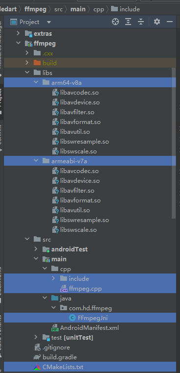

## 环境配置

NDK      https://developer.android.google.cn/ndk/downloads/    版本r14
[安装msys2](https://www.msys2.org/)  https://www.msys2.org/  
FFMPEG源码     https://ffmpeg.org/download.html#releases

### 1. 配置NDK

配置环境变量 `C:\Users\Admin\AppData\Local\Android\Sdk\ndk\21.0.6113669`

### 2. msys2

下载安装[msys2-x86_64-20230318.exe  提取码c2z0](https://pan.baidu.com/s/1JkYnz4mejSr-7x4zdvvoCA)，选择安装位置`D:\msys64`（最好不要空格、汉字），安装完成后运行`D:\msys64\msys2.exe`，执行`pacman -S gcc make nasm yasm diffutils`安装必要组件


### 3. 编译FFmpeg源码

E:\workspace\FFmpeg\ffmpeg-4.3.6

### 3.1 分析configure结构

在FFmpeg源码目录有个configure配置脚本，使用./configure --help进行查看，可以看到如下结构的编译选项：

```xml
Help options:
  --help                   print this message
  --quiet                  Suppress showing informative output
  --list-decoders          show all available decoders
  --list-encoders          show all available encoders
  --list-hwaccels          show all available hardware accelerators
  --list-demuxers          show all available demuxers
  --list-muxers        cumentation in DIR [PREFIX/share/doc/ffmpeg]
  --libdir=DIR             install libs in DIR [PREFIX/lib]
  --shlibdir=DIR           install shared libs in DIR [LIBDIR]
  --incdir=DIR  
  --enable-gray            enable full grayscale support (slower color) NAME
  --enable-muxer=NAME      enable muxer NAME
  --disable-muxers         disable all muxers
  --disable-demuxer=NAME   disable demuxer NAME
  --enable-demuxer=NAME    enable demuxer NAME
  --disable-demuxers       disable all demuxers
  --enable-parser=NAMEVapourSynth demuxer [no]
  --disable-xlib           dis
```


### 3.1 so库裁剪

ffmpeg强大之处在于支持按需编译，进行弹性剪裁。可以使用--disable-everything关闭所有模块，可以使用enable/disable来开启关闭某个模块，或者某个编解码器、某个封装器、某个协议。

- **encoders与decoders**

  > encoder和decoder在libavcodec模块，可以用./configure --list-encoders或者ffmpeg --encoders查看支持的编码器。同样地，可以用./configure --list-decoders或者ffmpeg --decoders查看支持的解码器。我们可以先--disable-encoders，--enable-encoder=aac,h264 其中lib开头的表示第三方库，encoders列表如下(有删减)：
  > 原文链接：https://blog.csdn.net/u011686167/article/details/120390739

- **muxers与demuxers**

  > muxer和demuxer在libavformat模块，可以用./configure --list-muxers或者ffmpeg --muxers查看支持的封装器。同样地，可以用./configure --list-demuxers或者ffmpeg --demuxers查看支持的解封装器。我们可以先--disable-muxers，--enable-muxer=mp3,matroska  列表如下：

- **protocols**

  > protocol也是在libavformat模块中，./configure --list-protocols或者ffmpeg --protocols查看支持的协议，包括http、https、hls、rtmp等，列表如下：

- **parsers**

  > parser在libavfilter模块中，提供各种filter，比如音频：amix、atempo，视频：rotate、hflip，我们可以根据需求--enable-parser来开启，具体列表如下(有删减)：

### 3.2 neon加速与硬件加速

- **开启neon**

  > 针对armeabbi-v7a平台可以开启neon。在CFLAGS设置-mfpu=neon，具体如下:
  >
  > `CFLAGS="-Os -fpic -march=armv7-a -mcpu=cortex-a8 -mfpu=neon -mfloat-abi=softfp"`
  >
  > 另外，开启neon与asm：
  >
  > --enable-neon \
  > --enable-asm \

- **硬件加速**

  > Android平台的硬解码使用mediacodec，并且需要开启jni：
  >
  > --enable-jni \
  > --enable-mediacodec \
  > --enable-decoder=h264_mediacodec \
  > --enable-decoder=hevc_mediacodec \
  > --enable-decoder=mpeg4_mediacodec \
  > --enable-decoder=vp9_mediacodec \


## 编译

- 修改configure

  >E:\workspace\FFmpeg\ffmpeg-4.3.6\configure

```xml
# 原来的配置内容
# SLIBNAME_WITH_MAJOR='$(SLIBNAME).$(LIBMAJOR)'
# LIB_INSTALL_EXTRA_CMD='$$(RANLIB) "$(LIBDIR)/$(LIBNAME)"'
# SLIB_INSTALL_NAME='$(SLIBNAME_WITH_VERSION)'
# SLIB_INSTALL_LINKS='$(SLIBNAME_WITH_MAJOR) $(SLIBNAME)'
# 替换后的内容
SLIBNAME_WITH_MAJOR='$(SLIBPREF)$(FULLNAME)-$(LIBMAJOR)$(SLIBSUF)'
LIB_INSTALL_EXTRA_CMD='$$(RANLIB)"$(LIBDIR)/$(LIBNAME)"'
SLIB_INSTALL_NAME='$(SLIBNAME_WITH_MAJOR)'
SLIB_INSTALL_LINKS='$(SLIBNAME)'
```

- 在ffmpege源码根目录下创建`build_android.sh`，脚本内容如下：[Windows编译和使用ffmpeg](https://zhuanlan.zhihu.com/p/640674311)

```xml
#!/bin/bash
make clean
#自己修改对应的路径,要配置到环境变量中去
export NDK=C:/Users/Admin/AppData/Local/Android/Sdk/ndk/21.0.6113669
#android4.9 对应的SDK在20左右,所以你的platforms应该选择小于20的，因为向前兼容，大于20的会有问题
export SYSROOT=$NDK/platforms/android-20/arch-arm
export TOOLCHAIN=$NDK/toolchains/arm-linux-androideabi-4.9/prebuilt/windows-x86_64

export CPU=arm
export PREFIX=$(pwd)/android/$CPU
export ADDI_CFLAGS="-marm"./configure --target-os=linux \
--prefix=$PREFIX --arch=arm \
--disable-doc \
--enable-shared \
--disable-static \
--disable-yasm \
--disable-symver \
--enable-gpl \
--disable-ffmpeg \
--disable-ffplay \
--disable-ffprobe \
--disable-ffserver \
--disable-doc \
--disable-symver \
--cross-prefix=$TOOLCHAIN/bin/arm-linux-androideabi- \
--enable-cross-compile \
--sysroot=$SYSROOT \
--extra-cflags="-Os -fpic $ADDI_CFLAGS" \
--extra-ldflags="$ADDI_LDFLAGS" \
$ADDITIONAL_CONFIGURE_FLAG
make clean
make
make install
```

- 执行脚本 

  > 运行`D:\msys64\msys2.exe`，cd到ffmpeg源码根目录`$ cd E:\\workspace\\FFmpeg\\ffmpeg-4.3.6`，执行**./build_android.sh**

  **报错：**
  
  > 在ffmpeg的根目录下执行**/configure --disable-x86asm  **，然后再次执行**./build_android.sh**
  
  ```xml
  Admin@PS2023YRCYJJQA /e/workspace/FFmpeg/ffmpeg-4.3.6
  $ ./build_android.sh
  Makefile:2: ffbuild/config.mak: No such file or directory
  Makefile:40: /tools/Makefile: No such file or directory
  Makefile:41: /ffbuild/common.mak: No such file or directory
  Makefile:97: /libavutil/Makefile: No such file or directory
  Makefile:97: /ffbuild/library.mak: No such file or directory
  Makefile:99: /fftools/Makefile: No such file or directory
  Makefile:100: /doc/Makefile: No such file or directory
  Makefile:101: /doc/examples/Makefile: No such file or directory
  Makefile:167: /tests/Makefile: No such file or directory
  make: *** No rule to make target `/tests/Makefile'.  Stop.
  ```
  
  **错误：**
  
  > 解决：打开libavformat/os_support.h 文件，在其中增加`#include <winerror.h>`。
  
  ```xml
  CC      libavformat/os_support.o
  In file included from libavformat/os_support.h:115:0,
                   from libavformat/os_support.c:29:
  libavformat/os_support.c: In function 'ff_gai_strerror':
  libavformat/os_support.c:194:10: error: 'ERROR_NOT_ENOUGH_MEMORY' undeclared (first use in this function)
       case EAI_MEMORY:
            ^
  libavformat/os_support.c:194:10: note: each undeclared identifier is reported only once for each function it appears in
  make: *** [libavformat/os_support.o] Error 1
  
  Admin@PS2023YRCYJJQA /e/workspace/FFmpeg/ffmpeg-4.3.6
  ```
  
  

## 4. 集成

编译成功后，在ffmpeg源码根目录下有一个Android文件夹，将so文件拷贝到libs中，include头文件也拷贝过来，结构如下：




修改：

```bash
cmake_minimum_required(VERSION 3.4.1)

project("ffmpeg")

add_library(
             ffmpeg
             SHARED
             src/main/cpp/ffmpeg.cpp)

find_library(log-lib
              log )

include_directories("src/main/cpp/include")
message(">>> SET DEFAULT TO BEFORE, include_dirs=${dirs}")
set(CMAKE_CXX_FLAGS "${CMAKE_CXX_FLAGS} -L${CMAKE_SOURCE_DIR}/libs/${ANDROID_ABI}")


target_link_libraries( # Specifies the target library.
                       ffmpeg
                        avcodec   # 音视频编解码核心库
                        avformat  #音视频容器格式的封装和解析
                        avutil    # 核心工具库
                        avdevice  # 输入输出设备库，提供设备数据的输入与输出
                        swresample # 音频重采样
                        avfilter   # 音视频滤镜库 如视频加水印、音频变声
                        swscale    # 图像格式转换的模块
                       # Links the target library to the log library
                       # included in the NDK.
                       ${log-lib} )
```

创建本地方法接口**FFmpegJni.java**

```java
public class FFmpegJni {
    public static native String getVersion();
}
```

实现本地方法**ffmpeg.cpp**

```C++
#include <jni.h>
#include <string>
extern "C" {
    // 导入ffmpeg工具包头文件，注意要用extern "C"包裹，否则会报错
    #include "include/libavutil/avutil.h"
}
extern "C"
JNIEXPORT jstring JNICALL
Java_com_hd_ffmpeg_FFmpegJni_getVersion(JNIEnv *env, jclass clazz) {
    return env->NewStringUTF(av_version_info());
}
```

调用：

```java
public class MainActivity extends AppCompatActivity {

    private ActivityMainBinding binding;
	
    static {
        //导入ffmpeg.so
        System.loadLibrary("ffmpeg");
    }
    @Override
    protected void onCreate(Bundle savedInstanceState) {
        super.onCreate(savedInstanceState);

        binding = ActivityMainBinding.inflate(getLayoutInflater());
        setContentView(binding.getRoot());
        binding.fab.setOnClickListener(new View.OnClickListener() {
            @Override
            public void onClick(View view) {
                //调用本地方法
                Log.e(getClass().getSimpleName(), "-================="+
                        FFmpegJni.getVersion()
                        +"-=-=-=-=-=-=-=-=-=-=-=-=-==-=-=-=-=-=-=-=");
            }
        });
    }
}
```


## 5. 集成命令程序

上面我们已经基本实现了ffmpeg的接入，并且调用了ffmpeg库打印了版本，但是这并没有用。我们要使用ffmpeg对音视频进行操作（就像在命令行执行ffmpeg命令），还需要导入ffmpeg的执行程序，并修改其源码：


`E:\workspace\FFmpeg\ffmpeg-4.3.6\fftools`


> FFmpge源码下有一个`fftools`目录，里面就是一些ffmpeg的命令行程序，我们将他们导入进来，进行一定的修改后再自行编译成我们的lib。
>
> 首先是对库文件进行相应的修改，因为**ffmpeg.c**在windows上的目的是编译成一个可执行的应用，所以它的入口是main 通过命令行传参，所以我们这里需要把main函数改一下，改成一个我们具体功能的名字，例如我喜欢叫它exc，然后再再头文件中声明我们刚改的函数名，这样它就变成了一个库文件。我们在jni的地方调用exc进行传参，就达到了电脑端命令行的效果。
>
> 还有一个地方，ffmpeg如果指令执行出错是执行的退出程序指令，我们在Android端肯定不行，那不然指令执行不成功就一个闪退这谁都顶不住，所以我们需要把exit_program函数的exit(ret);去掉，这里我们可以做我们自己的逻辑，进行自己的错误码回调。

```
E:\workspace\ledart\ffmpeg\src\main\cpp\fftools\cmdutils.c

原代码
void exit_program(int ret)
{
    if (program_exit)
        program_exit(ret);
    exit(ret);
}
修改后
void exit_program(int ret)  
{  
    if (program_exit)  
        program_exit(ret);  
}

```


build 一下，程序大量报错，不要害怕，这是头文件缺失引起的，找到报错说明，将报错的头文件从源码文件夹中找到，一个一个地复制进我们的 include 文件夹的相应目录内，这里记录我报错缺失之后复制的头文件：

config.h
libavutil/thread.h
compat/va_copy.h
libavutil/libm.h
libavutil/internal.h
libavutil/timer.h			//这里我直接把所有架构的文件夹都复制了进去
libavcodec/mathops.h
libavutil/reverse.h
libavformat/os_support.h


ffmpeg -i /storage/emulated/0/Android/data/com.yl.ffmpeg4android/files/video.mp4 -b:a 128K -ar 44100 -acodec aac -vcodec h264 -r 25 -s 320x176 -b:v 251k -y /storage/emulated/0/Android/data/com.yl.ffmpeg4android/files/generated_video_1648277243984C_320x176_convert.mp4

ffmpeg, -i, /storage/emulated/0/Movies/generated_video_1648277243984.mp4, -b:a,

128K, -ar, 44100, -acodec, aac, -vcodec, h264, -r, 25, -s, 320x176, -b:v, 251k, -y,

/storage/emulated/0/Android/data/com.onbonbx.ledmedia/cache/ledmedia/generated_video

_1648277243984C_320x176_convert.mp4


```
ffmpeg -i E:\workspace\FFmpeg\test.mp4 -r 25 -b:v 251k -s 320x176 -acodec aac -vcodec h264 E:\workspace\FFmpeg\test_320_173.mp
```


ffmpeg -i test.mp4 -r 25 -b:v 251k -s 320x176 -acodec aac -vcodec h263 video_320x176_h263.avi


ffmpeg -i C:\Users\Admin\Documents\WXWork\1688856114485660\Cache\File\2023-10\3.ts -acodec aac -vcodec h264 -s 640x480 -y C:\Users\Admin\Documents\WXWork\1688856114485660\Cache\File\2023-10\3_640x480_convert.mp4


 


