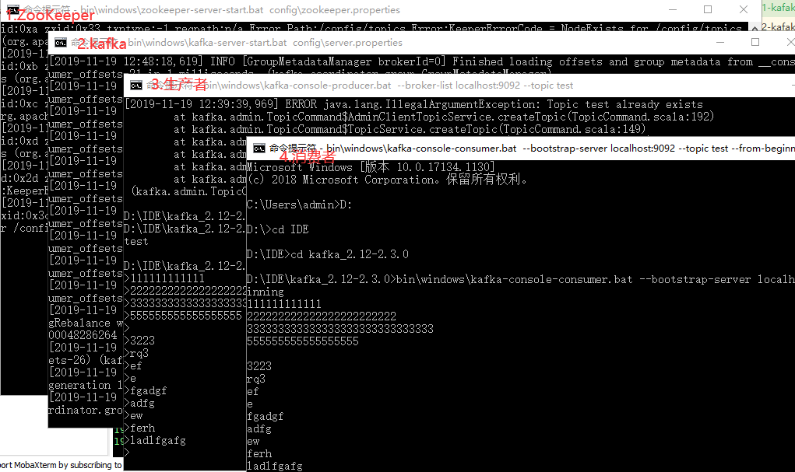

# 一. windows下环境配置

必须提前安装好jdk

[kafka官方文档](http://kafka.apache.org/documentation/)

下面步骤按照官方文档操作

[下载2.3.0版本](https://www.apache.org/dyn/closer.cgi?path=/kafka/2.3.0/kafka_2.12-2.3.0.tgz)

> **解压目录不应该有空格**。`\kafka_2.12-2.3.0\bin`目录下的`.sh`文件就是kafka的shell脚本，
> 我们会发现，bin目录下还有一个windows文件夹，里面包含很多.bat文件，这些是windows批处理命令，
> 也就是说我们下载的这个包可以在Linux和windows平台运行。在Windows平台上使用`bin\windows\`代替`bin/`，
> 并将脚本扩展名更改为`.bat`。下面的示例都是基于windows平台

**目录结构说明**
```xml
kafka_2.12-2.3.0
	|--bin (Linux平台使用的.sh脚本)
		|--windows (windows平台批处理文件.bat)
	|--config(程序运行配置文件，在后期自定义使用kafka的时候需要修改配置文件内容)
	|--libs(运行时jar包)
	|--logs(记录一些日志文件)
	|--site-docs(文档)
```

-------

# 二. kafka命令


## 命令行初试

```xml
### 步骤1
### cmd启动命令行，进入解压目录（注意一定要进入该目录，而不是下面的bin或者bin\windows目录，否则有些命令中使用配置文件找不到）
D:\IDE\kafka_2.12-2.3.0>

##### 步骤2：启动ZooKeeper.Kafka需要使用ZooKeeper，如果我们没有安装并启动ZooKeeper服务器，可以使用Kafka随附的便利脚本获取一个简陋的单节点ZooKeeper实例
### 在启动之前，我们需要修改config\zookeeper.properties配置文件，将dataDir目录重新指定一下，可以自行创建文件夹比如dataDir=D:/IDE/kafka_2.12-2.3.0/dataDir/zookeeper
>bin\windows\zookeeper-server-start.bat config\zookeeper.properties

### 步骤3：(新终端窗口)启动Kafka服务器，需要重新打开一个命令窗口（因为上一个窗口启动ZooKeeper后处于执行等待状态，不能关闭ZooKeeper）
### 启动前修改config\server.properties中log.dirs=D:/IDE/kafka_2.12-2.3.0/dataDir/kafka/broker
>bin\windows\kafka-server-start.bat config\server.properties

### 步骤4：(新终端窗口)创建主题，
>bin\windows\kafka-topics.bat --create --bootstrap-server localhost:9092 --replication-factor 1 --partitions 1 --topic test
### 查看主题
>bin\windows\kafka-topics.bat --list --bootstrap-server localhost:9092

### 步骤5：发送消息
>bin\windows\kafka-console-producer.bat --broker-list localhost:9092 --topic test

### 步骤6：(新终端窗口)启动消费者
>bin\windows\kafka-console-consumer.bat --bootstrap-server localhost:9092 --topic test --from-beginning

```

> 上述示例中总共要打开四个终端窗口，运行截图如下




-----------------

## 建立多broker集群

一个独立的Kafka服务器被称为broker。broker接收来自生产者的消息，为消息设置偏移量，
并提交消息到磁盘保存。broker为消费者提供服务，对读取分区的请求作出响应，返回已经
提交到磁盘上的消息。根据特定的硬件及其性能特征，单个broker可以轻松处理数千个分区
以及每秒百万级的消息量。

broker是集群的组成部分，每个集群都有一个broker同时充当了**集群控制器**的角色（自动
从集群的活跃成员中选举出来）。控制器负责管理工作，包括将分区分配给 broker和监控broker。
在集群中，一个分区从属于一个broker, broker被称为分区的**首领**。一个分可以分配给多个
broke，这个时候会发生分区复制。这种复制机制为分区提供了消息冗余，如果有一个broker失效，
其他 broker 可以接管领导权。不过，相关的消费者和生产者都要重新连接到新的首领。

在上面的示例中，我们一直在单一的broker上跑，对于kafka来说，单个broker只是一个大小为1的集群，
接下来我们将集群扩展到三个节点。

**1. 为每个broker创建一个配置文件**

将config目录下的`server.properties`文件复制两份，命名`server1.properties`、`server2.properties`。
修改配置文件内容如下：
```xml
# config/server-1.properties:
### 设置broker id，每个broker id必须是唯一的Integer
broker.id=1   
### 设置端口
listeners=PLAINTEXT://:9093  
### 设置文件夹
log.dirs=D:/IDE/kafka_2.12-2.3.0/dataDir/kafka/broker1

### config/server-2.properties:
broker.id=2   
listeners=PLAINTEXT://:9094  
log.dirs=D:/IDE/kafka_2.12-2.3.0/dataDir/kafka/broker2
```

**2. 启动多个broker**

在上述示例中我们已经启动了ZooKeeper，并且启动了单个broker。然后分别在三个终端窗口启动这三个broker:

```xml
### 窗口1
>bin\windows\kafka-server-start.bat config\server.properties

### 窗口2
>bin\windows\kafka-server-start.bat config\server1.properties

### 窗口3
>bin\windows\kafka-server-start.bat config\server2.properties
```

如果出现错误：
```xml
D:\IDE\kafka_2.12-2.3.0>bin\windows\kafka-server-start.bat config\server2.properties
Java HotSpot(TM) 64-Bit Server VM warning: INFO: os::commit_memory(0x00000000c0000000, 1073741824, 0) failed; error='页面文件太小，无法完成操作。' (DOS error/errno=1455)
###
### There is insufficient memory for the Java Runtime Environment to continue.
### Native memory allocation (mmap) failed to map 1073741824 bytes for Failed to commit area from 0x00000000c0000000 to 0x0000000100000000 of length 1073741824.
### An error report file with more information is saved as:
### D:\IDE\kafka_2.12-2.3.0\hs_err_pid434684.log
```
原因是每开启一个broker就会占用一些内存，默认64位系统是每个broker占用1G，我们打开3个broker就会导致内存不足，
这个可以根据自己需求配置，由于我们只做测试，对内存要求不高，可以改为256M。

用编辑文件打开`D:\IDE\kafka_2.12-2.3.0\bin\windows\kafka-server-start.bat`，
按照下面注释修改后重新启动broker(如果还报错，那就关闭之前开启的broker全部重新开启)：

```Java
SetLocal
IF ["%KAFKA_LOG4J_OPTS%"] EQU [""] (
    set KAFKA_LOG4J_OPTS=-Dlog4j.configuration=file:%~dp0../../config/log4j.properties
)
IF ["%KAFKA_HEAP_OPTS%"] EQU [""] (
    rem detect OS architecture
    wmic os get osarchitecture | find /i "32-bit" >nul 2>&1
    IF NOT ERRORLEVEL 1 (
        rem 32-bit OS
        set KAFKA_HEAP_OPTS=-Xmx512M -Xms512M
    ) ELSE (
        rem 64-bit OS    //64位系统默认-Xmx1G -Xms1G，修改为-Xmx256M -Xms256M
        //set KAFKA_HEAP_OPTS=-Xmx1G -Xms1G
		set KAFKA_HEAP_OPTS=-Xmx256M -Xms256M
    )
)
```

**3. 创建主题**

```xml
# 新窗口中：创建主题
>bin\windows\kafka-topics.bat --create --bootstrap-server localhost:9092 --replication-factor 2 --partitions 3 --topic openxu_topic
```

上面的命令执行成功之后，我们可以去`config/server.properties`配置文件中配置的目录下查看有些什么东西：
```
--kafka
	|--broker    # broker id = 0的节点
		|--openxu_topic-0   # ★分区0首领副本（leader）
		|--openxu_topic-2   # 分区2跟随着副本(follower)
	|--broker1   # broker id = 1的节点
		|--openxu_topic-1   # 分区1跟随着副本(follower)
		|--openxu_topic-2   # ★分区2首领副本（leader）
	|--broker2   # broker id = 2的节点
		|--openxu_topic-0   # 分区0跟随着副本(follower)
		|--openxu_topic-1   # ★分区1首领副本（leader）
```

为什么会产生这样的目录结构？我们分析上面命令代表什么意思，更多参数可执行`bin\windows\kafka-topics.bat`查看：
- `kafka-topics.bat`: 是执行批处理文件，也就是命令
- `--create`:参数, 表示创建主题
- `--bootstrap-server localhost:9092`: 参数, 设置要连接的kafka服务器，后面紧跟服务器地址和端口。`--zookeeper`参数过时了，使用--bootstrap-server代替
- `--partitions 3`: 参数，设置分区，为该主题设置3个分区，主题的分区会均匀的分布在每个broker上，三个分区正好每个broker分布一个分区。
但是为什么每个broker下有两个分区目录呢？这就是下面复制因子的作用
- `--replication-factor 2`: 参数, 设置复制因子，意思是每个分区需要复制几个副本(理解为每个分区在整个集群的数量)，这里设置2表示每个分区出了首领副本（均匀分布）外，还需要复制1份跟随着副本，这
些跟随着副本也会均匀的分布在每个broker节点上，至于是怎么分布，是kafka控制器决定的。
- `--topic openxu_topic`: 参数，设置主题名称

**4. 查看主题描述**

上面我们创建了具有3个分区，复制因子为2的名为openxu_topic的主题，也对着broker目录分析了相关参数的作用，我们还可以
通过`--describe`查看主题相关信息。输出数据的含义已经在每一行都标记出来了，这正好和上面kafka配置目录中分区的分布结构
对应上：

```xml
>bin\windows\kafka-topics.bat --describe --bootstrap-server localhost:9092 --topic openxu_topic

### 输出如下
### 第一行:给出了Topic的摘要，包括主题名称openxu_topic、该主题有3个分区、复制因子为2
Topic:openxu_topic      PartitionCount:3        ReplicationFactor:2     Configs:segment.bytes=1073741824

### 第二行:Partition-给出分区0的相关信息，
###       Leader-分区0的首领副本位于broker id为0的节点中
###       Replicas-分区0的两个副本分别位于broker id为0、2的节点中
###       Isr-是“同步”副本的集合，这是副本列表Replicas的子集
        Topic: openxu_topic     Partition: 0    Leader: 0       Replicas: 0,2   Isr: 0,2
		
### 第三行:Partition-给出分区1的相关信息，
###       Leader-分区1的首领副本位于broker id为2的节点中
###       Replicas-分区1的两个副本分别位于broker id为2、1的节点中
###       Isr-是“同步”副本的集合，这是副本列表Replicas的子集		
        Topic: openxu_topic     Partition: 1    Leader: 2       Replicas: 2,1   Isr: 2,1
		
### 第三行:Partition-给出分区2的相关信息，
###       Leader-分区2的首领副本位于broker id为1的节点中
###       Replicas-分区2的两个副本分别位于broker id为1、0的节点中
###       Isr-是“同步”副本的集合，这是副本列表Replicas的子集	
        Topic: openxu_topic     Partition: 2    Leader: 1       Replicas: 1,0   Isr: 1,0
```

**5. 向主题发布和消费消息**

开启两个命令终端，分别执行下面的命令，一个发布消息，一个消费消息：

```xml
### 消费消息
>bin\windows\kafka-console-consumer.bat --bootstrap-server localhost:9092 --from-beginning --topic openxu_topic

### 发布消息
>bin\windows\kafka-console-producer.bat --broker-list localhost:9092 --topic openxu_topic
```

**6. 关闭节点**

- 关闭节点0

分区0首领副本断开，分区2跟随副本也没有了，但是很快broker2成了分区0的首领。现在broker1是分区2的首领，
broker2是分区0和分区1的首领

- 继续关闭节点2

这会导致分区0和分区1首领副本断开，broker1中还有分区1的副本，所以，broker1成为分区1的新首领，同时他还是分区2的首领，但是分区0没有首领了。
发布消息和消费消息的窗口开始不断报错。

- 开启节点2

发布和消费消息正常


